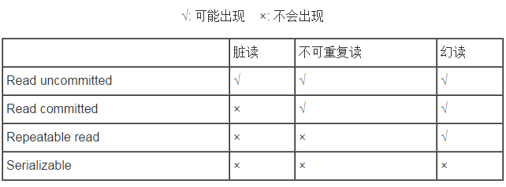

## [原文](https://www.jianshu.com/p/0399a22c4ed3)

# 什么是事务？

```
4大特性
4种隔离级别
7种传播行为
```

事务（Transaction）是并发控制的基本单位。
所谓的事务，它是一个操作序列，这些操作要么都执行，要么都不执行，
它是一个不可分割的工作单位。
事务是数据库维护数据一致性的单位，在每个事务结束时，都能保持数据一致性。

## 一个事务是有下列属性的一个工作单元: 
> 原子性，一致性，隔离性，持久性

## 事务的ACID属性,事务具有以下4个基本特征。

● Atomic（原子性）：事务中包含的操作被看做一个逻辑单元，这个逻辑单元中的操作要么全部成功，要么全部失败。

● Consistency（一致性）：只有合法的数据可以被写入数据库，否则事务应该将其回滚到最初状态。

● Isolation（隔离性）：事务允许多个用户对同一个数据进行并发访问，而不破坏数据的正确性和完整性。同时，并行事务的修改必须与其他并行事务的修改相互独立。

● Durability（持久性）：事务结束后，事务处理的结果必须能够得到固化。


## 数据库事务4种隔离级别

 数据库事务的隔离级别有4个，由低到高依次为Read uncommitted、Read committed、Repeatable read、Serializable，
 这四个级别可以逐个解决脏读、不可重复读、幻读这几类问题。
 
 两个并发事务同时访问数据库表相同的行时，可能存在以下三个问题：
- 1 脏读  
 　　脏读是指在一个事务处理过程里读取了另一个未提交的事务中的数据。
 　　当一个事务正在多次修改某个数据，而在这个事务中这多次的修改都还未提交，这时一个并发的事务来访问该数据，就会造成两个事务得到的数据不一致。
 
> 例如：用户A向用户B转账100元，对应SQL命令如下
```mysql
   
 update account set money=money+100 where name=’B’;  (此时A通知B)
 update account set money=money - 100 where name=’A’;
```
当只执行第一条SQL时，A通知B查看账户，B发现确实钱已到账（此时即发生了脏读），
而之后无论第二条SQL是否执行，只要该事务不提交，则所有操作都将回滚，
那么当B以后再次查看账户时就会发现钱其实并没有转。

- 2 不可重复读  
 　　不可重复读是指在对于数据库中的某个数据，一个事务范围内多次查询却返回了不同的数据值，
 这是由于在查询间隔，被另一个事务修改并提交了。

 > 例如事务T1读取一行记录，紧接着事务T2修改了T1刚刚读取的记录，然后T1再次查询，发现与第一次读取的记录不同。

不可重复读和脏读的区别是，脏读是某一事务读取了另一个事务未提交的脏数据，而不可重复读则是读取了前一事务提交的数据。

- 3 幻读
 　　幻读是事务非独立执行时发生的一种现象。
> 例如事务T1读取一条指定where条件的语句，返回结果集。此时事务T2插入一行新记录，恰好满足T1的where条件。
然后T1使用相同的条件再次查询，结果集中可以看到T2插入的记录，这条新纪录就是幻想。

 幻读和不可重复读都是读取了另一条已经提交的事务（这点就脏读不同），所不同的是不可重复读查询的都是同一个数据项，
 而幻读针对的是一批数据整体（比如数据的个数）。
 



### １. ISOLATION_READ_UNCOMMITTED(读取未提交内容)：
这是事务最低的隔离级别，它充许令外一个事务可以看到这个事务未提交的数据。
这种隔离级别会产生脏读，不可重复读和幻像读。

- (1)所有事务都可以看到其他未提交事务的执行结果
- (2)本隔离级别很少用于实际应用，因为它的性能也不比其他级别好多少
- (3)该级别引发的问题是——脏读(Dirty Read)：读取到了未提交的数据

### ２. ISOLATION_READ_COMMITTED(读取提交内容)：
保证一个事务修改的数据提交后才能被另外一个事务读取。另外一个事务不能读取该事务未提交的数据

- (1)这是大多数数据库系统的默认隔离级别（但不是MySQL默认的）
- (2)它满足了隔离的简单定义：一个事务只能看见已经提交事务所做的改变
- (3)这种隔离级别出现的问题是——不可重复读(Nonrepeatable Read)：不可重复读意味着我们在同一个事务中执行完全相同的select语句时可能看到不一样的结果。

导致这种情况的原因可能有：

- 1).有一个交叉的事务有新的commit，导致了数据的改变;
- 2).一个数据库被多个实例操作时,同一事务的其他实例在该实例处理其间可能会有新的commit

### ３. ISOLATION_REPEATABLE_READ(可重读)：
这种事务隔离级别可以防止脏读，不可重复读。但是可能出现幻像读。
它除了保证一个事务不能读取另一个事务未提交的数据外，还保证了避免下面的情况产生(不可重复读)。

- (1)这是MySQL的默认事务隔离级别
- (2)它确保同一事务的多个实例在并发读取数据时，会看到同样的数据行
- (3)此级别可能出现的问题——幻读(Phantom Read)：当用户读取某一范围的数据行时，另一个事务又在该范围内插入了新行，
当用户再读取该范围的数据行时，会发现有新的“幻影” 行
- (4)InnoDB和Falcon存储引擎通过多版本并发控制(MVCC，Multiversion Concurrency Control)机制解决了该问题

### ４. ISOLATION_SERIALIZABLE(可串行化)：
这是花费最高代价但是最可靠的事务隔离级别。事务被处理为顺序执行。

除了防止脏读，不可重复读外，还避免了幻像读。

- (1)这是最高的隔离级别
- (2)它通过强制事务排序，使之不可能相互冲突，从而解决幻读问题。简言之,它是在每个读的数据行上加上共享锁。
- (3)在这个级别，可能导致大量的超时现象和锁竞争


## 7种传播行为

- 1、PROPAGATION_REQUIRED：如果当前没有事务，就创建一个新事务，如果当前存在事务，就加入该事务，该设置是最常用的设置。

- 2、PROPAGATION_SUPPORTS：支持当前事务，如果当前存在事务，就加入该事务，如果当前不存在事务，就以非事务执行。‘

- 3、PROPAGATION_MANDATORY：支持当前事务，如果当前存在事务，就加入该事务，如果当前不存在事务，就抛出异常。

- 4、PROPAGATION_REQUIRES_NEW：创建新事务，无论当前存不存在事务，都创建新事务。

- 5、PROPAGATION_NOT_SUPPORTED：以非事务方式执行操作，如果当前存在事务，就把当前事务挂起。

- 6、PROPAGATION_NEVER：以非事务方式执行，如果当前存在事务，则抛出异常。

- 7、PROPAGATION_NESTED：如果当前存在事务，则在嵌套事务内执行。如果当前没有事务，则执行与PROPAGATION_REQUIRED类似的操作。

 


 
