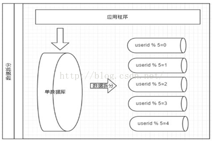

# 数据库垂直拆分和水平拆分

当我们使用读写分离、缓存后，数据库的压力还是很大的时候，这就需要使用到数据库拆分了。

数据库拆分简单来说，就是指通过某种特定的条件，按照某个维度，
将我们存放在同一个数据库中的数据分散存放到多个数据库（主机）上面以达到分散单库（主机）负载的效果。 

切分模式： 垂直（纵向）拆分、水平拆分。

垂直(纵向)拆分：是指按功能模块拆分，比如分为订单库、商品库、用户库...这种方式多个数据库之间的表结构不同。

水平(横向)拆分：将同一个表的数据进行分块保存到不同的数据库中，这些数据库中的表结构完全相同。

## 垂直拆分

专库专用

一个数据库由很多表的构成，每个表对应着不同的业务，垂直切分是指按照业务将表进行分类，
分布到不同的数据库上面，这样也就将数据或者说压力分担到不同的库上面，如下图：

        
### 优点：
1. 拆分后业务清晰，拆分规则明确。
2. 系统之间整合或扩展容易。
3. 数据维护简单。

### 缺点：
1. 部分业务表无法join，只能通过接口方式解决，提高了系统复杂度。
2. 受每种业务不同的限制存在单库性能瓶颈，不易数据扩展跟性能提高。
3. 事务处理复杂。

## 水平拆分

垂直拆分后遇到单机瓶颈，可以使用水平拆分。相对于垂直拆分的区别是：垂直拆分是把不同的表拆到不同的数据库中，而水平拆分是把同一个表拆到不同的数据库中。

相对于垂直拆分，水平拆分不是将表的数据做分类，而是按照某个字段的某种规则来分散到多个库之中，
每个表中包含一部分数据。简单来说，我们可以将数据的水平切分理解为是按照数据行的切分，
就是将表中 的某些行切分到一个数据库，而另外的某些行又切分到其他的数据库中，主要有分表，分库两种模式，如图：
                

        
### 优点：
1. 不存在单库大数据，高并发的性能瓶颈。
2. 对应用透明，应用端改造较少。     
3. 按照合理拆分规则拆分，join操作基本避免跨库。
4. 提高了系统的稳定性跟负载能力。

### 缺点：
1. 拆分规则难以抽象。
2. 分片事务一致性难以解决。
3. 数据多次扩展难度跟维护量极大。
4. 跨库join性能较差。

## 拆分的处理难点

### 两张方式共同缺点
 
1. 引入分布式事务的问题。
2. 跨节点Join 的问题。
3. 跨节点合并排序分页问题。

### 针对数据源管理，目前主要有两种思路：

A. 客户端模式，在每个应用程序模块中配置管理自己需要的一个（或者多个）数据源，直接访问各个 数据库，在模块内完成数据的整合。 

优点：相对简单，无性能损耗。   

缺点：不够通用，数据库连接的处理复杂，对业务不够透明，处理复杂。

B. 通过中间代理层来统一管理所有的数据源，后端数据库集群对前端应用程序透明；   

优点：通用，对应用透明，改造少。   

缺点：实现难度大，有二次转发性能损失。

### 拆分原则
    
1. 尽量不拆分，架构是进化而来，不是一蹴而就。(SOA)

2. 最大可能的找到最合适的切分维度。

3. 由于数据库中间件对数据Join 实现的优劣难以把握，而且实现高性能难度极大，
业务读取  尽量少使用多表Join -尽量通过数据冗余，分组避免数据垮库多表join。

4. 尽量避免分布式事务。

5. 单表拆分到数据1000万以内。

## 切分方案

范围、枚举、时间、取模、哈希、指定等

## 案例分析

### 场景一
建立一个历史his系统，将公司的一些历史个人游戏数据保存到这个his系统中，主要是写入，还有部分查询，
读写比约为1:4；由于是所有数据的历史存取，所以并发要求比较高； 

#### 分析：
历史数据   
写多都少   
越近日期查询越频繁？   
什么业务数据？用户游戏数据   
有没有大规模分析查询？   
数据量多大？   
保留多久？   
机器资源有多少？   

- 方案1：按照日期每月一个分片   
带来的问题：1.数据热点问题（压力不均匀）

- 方案2：按照用户/或者id 取模   
带来的问题：[后续扩容问题](06、数据库秒级平滑扩容架构方案.md)

- 方案3：按用户ID范围分片（1-1000万=分片1，xxx）   
带来的问题：用户活跃度无法掌握，可能存在热点问题

### 场景二
建立一个商城订单系统，保存用户订单信息。

#### 分析： 
电商系统       
一号店或京东类？淘宝或天猫？      
实时性要求高      
存在瞬时压力   
基本不存在大规模分析   
数据规模？      
机器资源有多少？     
维度？商品？用户？商户？   

- 方案1：按照用户取模，
带来的问题：后续扩容困难

- 方案2：按用户ID范围分片（1-1000万=分片1，xxx）
带来的问题：用户活跃度无法掌握，可能存在热点问题

- 方案3：按省份地区或者商户取模
数据分配不一定均匀

### 场景3
上海公积金，养老金，社保系统

分析：   
社保系统   
实时性要求不高   
不存在瞬时压力   
大规模分析？   
数据规模大   
数据重要不可丢失   
偏于查询？   

- 方案1：按照用户取模，   
带来的问题：[后续扩容]()

- 方案2：按用户ID范围分片（1-1000万=分片1，xxx）   
带来的问题：用户活跃度无法掌握，可能存在热点问题

- 方案3：按省份区县地区枚举   
数据分配不一定均匀

