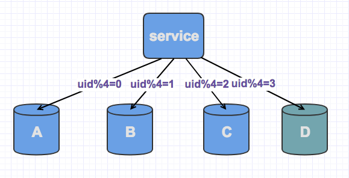
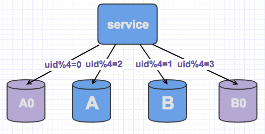
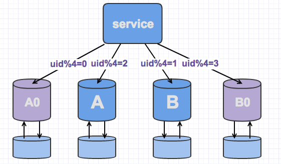
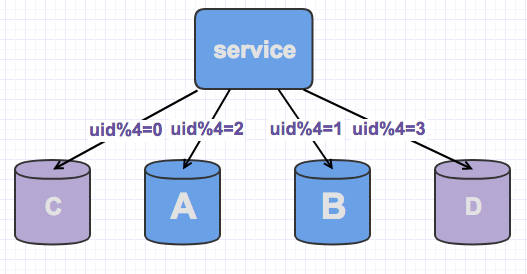

## [原文](https://mp.weixin.qq.com/s/djwurNvlgf_55-lZWxJzpw)

# 水平分库如何做到平滑扩展

上一篇关于DynamoDB的介绍中，有一个特别亮点，就是它无需停机就可以动态扩容。

这个对于我们常用的分库分表方案来说，有很大的优势，分库分表的扩容是一件头疼的问题，
如果采用对db层做一致性hash，或是中间价的支持，它的成本过于高昂了，如果不如此，只能停机维护来处理，对高可用性会产生影响。

那是否有方案，既可以快速扩展，又不降低可用性？这一篇，我们聊聊分库分表的扩展方案，供大家一起探讨。


## 一、水平分库扩展问题
为了增加db的并发能力，常见的方案就是对数据进行sharding，也就是常说的分库分表，
这个需要在初期对数据规划有一个预期，从而预先分配出足够的库来处理。

比如目前规划了3个数据库，基于uid进行取余分片，那么每个库上的划分规则如下:


如上我们可以看到，数据可以均衡的分配到3个数据库里面。

但是，如果后续业务发展的速度很快，用户量数据大量上升，当前容量不足以支撑，应该怎么办？

> 需要对数据库进行水平扩容，再增加新库来分解。新库加入之后，原先sharding到3个库的数据，就可以sharding到四个库里面了



不过此时由于分片规则进行了变化(uid%3 变为uid%4)，大部分的数据，无法命中在原有的数据库上了，需要重新分配，大量数据需要迁移。

比如之前uid1通过uid1%3 分配在A库上，新加入库D之后，算法改为uid1%4 了，此时有可能就分配在B库上面了。

如果你有看到之前《一致性哈希的原理与实践》，就会发现新增一个节点，大概会有90%的数据需要迁移，
这个对DB同学的压力还是蛮大的，那么如何应对？

一般有以下几种方式。


## 二、停服迁移
停服迁移是最常见的一种方案了，一般如下流程:
```
1. 预估停服时间，发布停服公告

2. 停服，通过事先做好的数据迁移工具，按照新的分片规则，进行迁移

3. 修改分片规则

4. 启动服务
```

我们看到这种方式比较安全，停服之后没有数据写入，能够保证迁移工作的正常进行，没有一致性的问题。唯一的问题，就是停服了和时间压力了。
```
1. 停服，伤害用户体验，同时也降低了服务器的可用性

2. 必须在制定时间内完成迁移，如果失败，需要择日再次进行。同时增加了开发人员的压力，容易发生大的事故

3. 数据量的巨大的时候，迁移需要大量时间
```

那有没有其他方式来改进一下，我们看下以下两种方案。


## 三、升级从库

线上数据库，我们为了保持其高可用，一般都会每台主库配一台从库，读写在主库，然后主从同步到从库。如下，A，B是主库，A0和B0是从库。


此时，当需要扩容的时候，我们把A0和B0升级为新的主库节点，如此由2个分库变为4个分库。同时在上层的分片配置，做好映射，规则如下:
```
uid%4=0和uid%4=2的分别指向A和A0，也就是之前指向uid%2=0的数据，分裂为uid%4=0和uid%4=2

uid%4=1和uid%4=3的指向B和B0，也就是之前指向uid%2=1的数据，分裂为uid%4=1和uid%4=3
```
因为A和A0库的数据相同，B和B0数据相同，所以此时无需做数据迁移即可。只需要变更一下分片配置即可，通过配置中心更新，无需重启。



由于之前uid%2的数据分配在2个库里面，此时分散到4个库中，由于老数据还存在（uid%4=0,还有一半uid%4=2的数据），
所以需要对冗余数据做一次清理。

而这个清理，不会影响线上数据的一致性，可是随时随地进行。

处理完成以后，为保证高可用，以及下一步扩容需求。可以为现有的主库再次分配一个从库。



总结一下此方案步骤如下：
```
1. 修改分片配置，做好新库和老库的映射。

2. 同步配置，从库升级为主库

3. 解除主从关系

4. 冗余数据清理

5. 为新的数据节点搭建新的从库
```

## 四、双写迁移
双写的方案，更多的是针对线上数据库迁移来用的，当然了，对于分库的扩展来说也是要迁移数据的，因此，也可以来协助分库扩容的问题。

原理和上述相同，做分裂扩容，只是数据的同步方式不同了。


### 1. 增加新库写链接
双写的核心原理，就是对需要扩容的数据库上，增加新库，并对现有的分片上增加写链接，同时写两份数据。


因为新库的数据为空，所以数据的CRUD对其没有影响，在上层的逻辑层，还是以老库的数据为主。


### 2. 新老库数据迁移
通过工具，把老库的数据迁移到新库里面，此时可以选择同步分裂后的数据（1/2）来同步，也可以全同步，一般建议全同步，最终做数据校检的时候好处理。


### 3. 数据校检
按照理想环境情况下，数据迁移之后，因为是双写操作，所以两边的数据是一致的，特别是insert和update，
一致性情况很高。但真实环境中会有网络延迟等情况，对于delete情况并不是很理想，比如：

A库删除数据a的时候，数据a正在迁移，还没有写入到C库中，此时C库的删除操作已经执行了，C库会多出一条数据。

此时就需要做好数据校检了，数据校检可以多做几遍，直到数据几乎一致，尽量以旧库的数据为准。


### 4. 分片配置修改
数据同步完毕，就可以把新库的分片映射重新处理了，还是按照老库分裂的方式来进行，

``` 
u之前uid%2=0,变为uid%4=0和uid%4=2的

uid%2=1，变为uid%4=1和uid%4=3的。
```



引用:

<https://mp.weixin.qq.com/s/BLOneOs-cPxP_9b5eH8oQA>