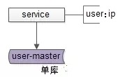
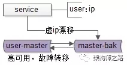

## [原文](http://zhuanlan.51cto.com/art/201702/530555.htm)

# 数据库秒级平滑扩容架构方案

## 一、缘起

(1)并发量大，流量大的互联网架构，一般来说，数据库上层都有一个服务层，
服务层记录了“业务库名”与“数据库实例”的映射关系，通过数据库连接池向数据库路由sql语句以执行：

如上图：服务层配置用户库user对应的数据库实例物理位置为ip(其实是一个内网域名)。

(2)随着数据量的增大，数据要进行水平切分，分库后将数据分布到不同的数据库实例(甚至物理机器)上，以达到降低数据量，增强性能的扩容目的：

如上图：用户库user分布在两个实例上，ip0和ip1，服务层通过用户标识uid取模的方式进行寻库路由，
模2余0的访问ip0上的user库，模2余1的访问ip1上的user库。

关于数据库水平切分，垂直切分的更多细节，详见《一分钟掌握数据库垂直拆分》 。

(3)互联网架构需要保证数据库高可用，常见的一种方式，使用双主同步+keepalived+虚ip的方式保证数据库的可用性：

如上图：两个相互同步的主库使用相同的虚ip。

主库挂掉的时候，虚ip自动漂移到另一个主库
> 添加一个主库，同步原来的数据到另外一个新增的库

如上图：当主库挂掉的时候，虚ip自动漂移到另一个主库，整个过程对调用方透明，通过这种方式保证数据库的高可用。

关于高可用的更多细节，详见《究竟啥才是互联网架构“高可用”》。

(4)综合上文的(2)和(3)，线上实际的架构，既有水平切分，又有高可用保证，所以实际的数据库架构是这样的：

提问：如果数据量持续增大，分2个库性能扛不住了，该怎么办呢?

回答：继续水平拆分，拆成更多的库，降低单库数据量，增加库主库实例(机器)数量，提高性能。

最终问题抛出：分成x个库后，随着数据量的增加，要增加到y个库，数据库扩容的过程中，
能否平滑，持续对外提供服务，保证服务的可用性，是本文要讨论的问题。

## 二、停服务方案

在讨论平滑方案之前，先简要说明下“x库拆y库”停服务的方案：

(1)站点挂一个公告“为了为广大用户提供更好的服务，本站点/游戏将在今晚00:00-2:00之间升级，届时将不能登录，用户周知”

(2)停服务

(3)新建y个库，做好高可用

(4)数据迁移，重新分布，写一个数据迁移程序，从x个库里导入到y个库里，路由规则由%x升级为%y

(5)修改服务配置，原来x行配置升级为y行

(6)重启服务，连接新库重新对外提供服务

整个过程中，最耗时的是第四步数据迁移。

回滚方案：

如果数据迁移失败，或者迁移后测试失败，则将配置改回x库，恢复服务，改天再挂公告。

方案优点：简单

方案缺点：

(1)停服务，不高可用

(2)技术同学压力大，所有工作要在规定时间内做完，根据经验，压力越大约容易出错(这一点很致命)

(3)如果有问题第一时间没检查出来，启动了服务，运行一段时间后再发现有问题，难以回滚，需要回档，可能会丢失一部分数据

有没有更平滑的方案呢?

## 三、秒级、平滑、帅气方案

再次看一眼扩容前的架构，分两个库，假设每个库1亿数据量，如何平滑扩容，增加实例数，降低单库数据量呢?三个简单步骤搞定。

(1)修改配置

修改配置

主要修改两处：

a)数据库实例所在的机器做双虚ip，原来%2=0的库是虚ip0，现在增加一个虚ip00，%2=1的另一个库同理

b)修改服务的配置(不管是在配置文件里，还是在配置中心)，将2个库的数据库配置，
改为4个库的数据库配置，修改的时候要注意旧库与辛苦的映射关系：

%2=0的库，会变为%4=0与%4=2;

%2=1的部分，会变为%4=1与%4=3;

这样修改是为了保证，拆分后依然能够路由到正确的数据。

(2)reload配置，实例扩容

服务层reload配置，reload可能是这么几种方式：

a)比较原始的，重启服务，读新的配置文件

b)高级一点的，配置中心给服务发信号，重读配置文件，重新初始化数据库连接池

不管哪种方式，reload之后，数据库的实例扩容就完成了，原来是2个数据库实例提供服务，现在变为4个数据库实例提供服务，这个过程一般可以在秒级完成。

整个过程可以逐步重启，对服务的正确性和可用性完全没有影响：

a)即使%2寻库和%4寻库同时存在，也不影响数据的正确性，因为此时仍然是双主数据同步的

b)服务reload之前是不对外提供服务的，冗余的服务能够保证高可用

完成了实例的扩展，会发现每个数据库的数据量依然没有下降，所以第三个步骤还要做一些收尾工作。

(3)收尾工作，数据收缩

有这些一些收尾工作：

a)把双虚ip修改回单虚ip

b)解除旧的双主同步，让成对库的数据不再同步增加

c)增加新的双主同步，保证高可用

d)删除掉冗余数据，例如：ip0里%4=2的数据全部干掉，只为%4=0的数据提供服务啦

这样下来，每个库的数据量就降为原来的一半，数据收缩完成。

## 四、总结

n库扩2n库的秒级、平滑扩容

该帅气方案能够实现n库扩2n库的秒级、平滑扩容，增加数据库服务能力，降低单库一半的数据量，其核心原理是：成倍扩容，避免数据迁移。

迁移步骤：

(1)修改配置

(2)reload配置，实例扩容完成

(3)删除冗余数据等收尾工作，数据量收缩完成