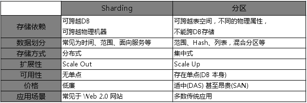

## [原文](https://www.blogme.club/2019/02/01/mysql%E4%B9%8B%E5%88%86%E7%89%87%E5%87%86%E5%88%99/)

# mysql之分片准则

当数据库无法承担我们的写负载的时候,通过分表分库都无法解决的时候,就需要使用mysql的终极大招--分片。
有这样一个准则,在能分表分库时,就不要使用mysql的分片，使用mysql分片的时候,会对维护造成难以估计的麻烦.
所以为了维护方便,就有了以下的准则.

## 分片（Sharding）和分区（Partition）

sharding和partition的区别：

