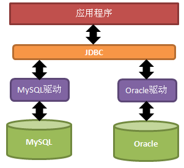

# JDBC 

### 1. 什么是JDBC
JDBC（Java DataBase Connectivity）就是Java数据库连接，说白了就是用Java语言来操作数据库。
原来我们操作数据库是在控制台使用SQL语句来操作数据库，JDBC是用Java语言向数据库发送SQL语句。

### 2. JDBC 原理

早期SUN公司的天才们想编写一套可以连接天下所有数据库的API，但是当他们刚刚开始时就发现这是不可完成的任务，
因为各个厂商的数据库服务器差异太大了。
后来SUN开始与数据库厂商们讨论，最终得出的结论是，由SUN提供一套访问数据库的规范（就是一组接口），
并提供连接数据库的协议标准，然后各个数据库厂商会遵循SUN的规范提供一套访问自己公司的数据库服务器的API出现。
SUN提供的规范命名为JDBC，而各个厂商提供的，遵循了JDBC规范的，可以访问自己数据库的API被称之为驱动！



JDBC是接口，而JDBC驱动才是接口的实现，没有驱动无法完成数据库连接！每个数据库厂商都有自己的驱动，用来连接自己公司的数据库。
当然还有第三方公司专门为某一数据库提供驱动，这样的驱动往往不是开源免费的！

### 3. JDBC核心类（接口）介绍

JDBC中的核心类有：DriverManager、Connection、Statement，和ResultSet！

DriverManger（驱动管理器）的作用有两个：
- 注册驱动：这可以让JDBC知道要使用的是哪个驱动
- 获取Connection：如果可以获取到Connection，那么说明已经与数据库连接上了

Connection对象表示连接，与数据库的通讯都是通过这个对象展开的：
- Connection最为重要的一个方法就是用来获取Statement对象；

Statement是用来向数据库发送SQL语句的，这样数据库就会执行发送过来的SQL语句：
- void executeUpdate(String sql)：执行更新操作（insert、update、delete等）
- ResultSet executeQuery(String sql)：执行查询操作，数据库在执行查询后会把查询结果放入ResultSet

ResultSet对象表示查询结果集，只有在执行查询操作后才会有结果集的产生。
结果集是一个二维的表格，有行有列。操作结果集要学习移动ResultSet内部的“行光标”，以及获取当前行上的每一列上的数据：
- boolean next()：使“行光标”移动到下一行，并返回移动后的行是否存在
- XXX getXXX(int col)：获取当前行指定列上的值，参数就是列数，列数从1开始，而不是0


[转载](https://jackchan1999.github.io/2017/05/01/javaweb/%E7%94%A8JDBC%E6%93%8D%E4%BD%9C%E6%95%B0%E6%8D%AE%E5%BA%93/)


---- 

[转载](http://871421448.iteye.com/blog/1546016) 


### 一、JDBC原理概述

1，JDBC是一套协议，是JAVA开发人员和数据库厂商达成的协议，也就是由Sun定义一组接口，由数据库厂商来实现，
并规定了JAVA开发人员访问数据库所使用方法的调用规范。

2，JDBC的实现是由数据库厂商提供，以驱动程序形式提供。

3，JDBC在使用前要先加载驱动（不加载驱动依然正常可以连接，mysql-connector-java 已经优化）。 


JDBC对于使用者要有一致性，对不同的数据库其使用方法都是相同的。

驱动开发必须要 实现 Driver 接口。 

mysql 驱动实现Driver

```java
public class Driver extends NonRegisteringDriver implements java.sql.Driver {
    ...
}
```


#### 数据库驱动的实现方式 

JDBC-ODBC桥接式 

JDBC网络驱动，这种方式是通过中间服务器的协议转换来实现的 

JDBC+本地驱动，这种方式的安全性比较差。 

JDBC驱动，由数据库厂商实现。

 
### 二.JDBC的API


java.sql包和javax.sql包 

Driver接口(驱动),在加载某一 Driver 类时，它应该创建自己的实例并向 DriverManager 注册该实例。
这意味着用户可以通过调用以下程序加载和注册一个驱动程序 

Class.forName("com.mysql.cj.jdbc.Driver") 

DriverManager类（驱动管理器），它可以创建连接，它本身就是一个创建Connection的工厂(Factory)。 

Connection接口，会根据不同的驱动产生不同的连接 

Statement接口，发送sql语句 

ResultSet接口（结果集），是用来接收select语句返回的查询结果的。其实质类似于集合。

 
### 三.JDBC应用步骤 

1，注册加载一个driver驱动 

2，创建数据库连接（Connection） 

3，创建一个Statement（发送sql） 

4，执行sql语句 

5，处理sql结果(select语句)

6，关闭Statement 

7，关闭连接Connection。

 

注意：6，7两个步骤是必须要做的，因为这些资源是不会自动释放的，必须要自己关闭


一.事务（Transaction） 

原子操作:不可再分的操作,一个操作不能再分成比它更细小的操作. 

事务是针对原子操作的，要求原子操作不可再分，并且必须同时成功同时失败。 

事务就是把一些非原子操作,变成原子操作,由应用服务器来提出要求,由数据库服务器来执行操作.

 

在JDBC中默认是自动提交的,如果要想使用事务,需要按以下步骤执行: 

//注: connection 是 Connection 对象

1.要调用connection.setAutoCommit(false)方法，把自动提交（commit）置为false。 

2.进行正常的数据库操作 

3.如果操作成功了可以选择connection.commit(),或者操作失败时选择connection.rollback() 回滚; 

注意:打开事务就要关闭自动提交,当不需要再使用事务的时候调用setAutoCommit(true).  // 自动提交

 

二.事务并发产生的问题 

三种并发产生的后果: 

1，脏读:一个事务读取到了另外一个事务没有提交的数据。 

2，重复读:一个事务读取到了另外一个事务提交的数据。它是要保持在同一时间点上读取到的数据相同，希望在一段时间内的数据是不变的（更新）。 

3，幻读:一个事务读取到了另外一个事务提交的数据。用同样的操作读取两次,得到的记录数不相同(新增)。


三.事务隔离级别 

五种控制级别: 

TRANSACTION_NONE 不使用事务。 

TRANSACTION_READ_UNCOMMITTED 允许脏读。 

TRANSACTION_READ_COMMITTED 防止脏读，最常用的隔离级别,并且是大多数数据库的默认隔离级别 

TRANSACTION_REPEATABLE_READ 可以防止脏读和不可重复读， 

TRANSACTION_SERIALIZABLE 可以防止脏读，不可重复读取和幻读，（事务串行化）会降低数据库的效率

 

以上的五个事务隔离级别都是在Connection类中定义的静态常量，使用setTransactionIsolation(int level) 方法可以设置事务隔离级别。 

如:con.setTransactionIsolation(Connection.REPEATABLE_READ);

mysql 驱动  ConnectionImpl 类 实现 Connection 的方法

简化代码

```java

/**
     * @param level
     * @throws SQLException
     */
    public void setTransactionIsolation(int level) throws SQLException {
        synchronized (getConnectionMutex()) {
           
                switch (level) {
                    case java.sql.Connection.TRANSACTION_NONE:
                        throw SQLError.createSQLException(Messages.getString("Connection.24"), getExceptionInterceptor());

                    case java.sql.Connection.TRANSACTION_READ_COMMITTED:
                        sql = "SET SESSION TRANSACTION ISOLATION LEVEL READ COMMITTED";

                        break;

                    case java.sql.Connection.TRANSACTION_READ_UNCOMMITTED:
                        sql = "SET SESSION TRANSACTION ISOLATION LEVEL READ UNCOMMITTED";

                        break;

                    case java.sql.Connection.TRANSACTION_REPEATABLE_READ:
                        sql = "SET SESSION TRANSACTION ISOLATION LEVEL REPEATABLE READ";

                        break;

                    case java.sql.Connection.TRANSACTION_SERIALIZABLE:
                        sql = "SET SESSION TRANSACTION ISOLATION LEVEL SERIALIZABLE";

                        break;

                    default:
                        throw SQLError.createSQLException(Messages.getString("Connection.25", new Object[] { level }),
                                MysqlErrorNumbers.SQL_STATE_DRIVER_NOT_CAPABLE, getExceptionInterceptor());
                }

                this.session.execSQL(null, sql, -1, null, false, this.nullStatementResultSetFactory, this.database, null, false);

                this.isolationLevel = level;
        }
    }

```

 

四.JDBC2.0新特性 

1.可滚动特性和可更新特性 

JDBC1.0中是指游标的移动的方向和方式是单向,单步(相对)移动,功能比较简单. 

JDBC2.0中游标可以双向,相对或者绝对移动. 

可滚动结果集:这种结果集不但可以双向滚动，相对定位，绝对定位，并且还可以修改数据信息。

 
### 1 引言 

本文主要讲解JDBC怎么演变到Mybatis的渐变过程，
重点讲解了为什么要将JDBC封装成Mybatis这样一个持久层框架。
再而论述Mybatis作为一个数据持久层框架本身有待改进之处。

### 2 JDBC实现查询分析

我们先看看我们最熟悉也是最基础的通过JDBC查询数据库数据，一般需要以下七个步骤：

- 加载JDBC驱动；

- 建立并获取数据库连接；

- 创建 JDBC Statements 对象；

- 设置SQL语句的传入参数；

- 执行SQL语句并获得查询结果；

- 对查询结果进行转换处理并将处理结果返回；

- 释放相关资源（关闭Connection，关闭Statement，关闭ResultSet）；

以下是具体的实现代码：


```java

public static List<Map<String,Object>> queryForList(){  

    Connection connection = null;  
    ResultSet rs = null;  
    PreparedStatement stmt = null;  
    List<Map<String,Object>> resultList = new ArrayList<Map<String,Object>>();  
          
    try {  
        // 加载JDBC驱动  
        Class.forName("com.mysql.cj.jdbc.Driver").newInstance();  
        String url = "jdbc:mysql://host:port/mysql";  
              
        String user = "root";   
        String password = "root";   
              
        // 获取数据库连接  
        connection = DriverManager.getConnection(url,user,password);   
              
        String sql = "select * from userinfo where user_id = ? ";  
        // 创建Statement对象（每一个Statement为一次数据库执行请求）  
        stmt = connection.prepareStatement(sql);  
              
        // 设置传入参数  
        stmt.setString(1, "zhangsan");  
              
        // 执行SQL语句  
        rs = stmt.executeQuery();  
              
        // 处理查询结果（将查询结果转换成List<Map>格式）  
        ResultSetMetaData rsmd = rs.getMetaData();  
        int num = rsmd.getColumnCount();  
              
        while(rs.next()){  
            Map map = new HashMap();  
            for(int i = 0;i < num;i++){  
                String columnName = rsmd.getColumnName(i+1);  
                map.put(columnName,rs.getString(columnName));  
            }  
            resultList.add(map);  
        }  
              
    } catch (Exception e) {  
        e.printStackTrace();  
    } finally {  
        try {  
            // 关闭结果集  
            if (rs != null) {  
                rs.close();  
                rs = null;  
            }  
            // 关闭执行  
            if (stmt != null) {  
                stmt.close();  
                stmt = null;  
            }  
            if (connection != null) {  
                connection.close();  
                connection = null;  
            }  
        } catch (SQLException e) {  
            e.printStackTrace();  
        }  
    }        
    return resultList;  
}

```


### 3 JDBC演变到Mybatis过程

上面我们看到了实现JDBC有七个步骤，哪些步骤是可以进一步封装的，减少我们开发的代码量。

#### 3.1 第一步优化：连接获取和释放

- 问题描述：

数据库连接频繁的开启和关闭本身就造成了资源的浪费，影响系统的性能。

- 解决问题：

数据库连接的获取和关闭我们可以使用数据库连接池来解决资源浪费的问题。

通过连接池就可以反复利用已经建立的连接去访问数据库了。

减少连接的开启和关闭的时间。


- 问题描述：

但是现在连接池多种多样，可能存在变化，有可能采用DBCP的连接池，也有可能采用容器本身的JNDI数据库连接池。

- 解决问题：

我们可以通过DataSource进行隔离解耦，我们统一从DataSource里面获取数据库连接，
DataSource具体由DBCP实现还是由容器的JNDI实现都可以，所以我们将DataSource的具体实现通过让用户配置来应对变化。

#### 3.2 第二步优化：SQL统一存取

- 问题描述：

我们使用JDBC进行操作数据库时，SQL语句基本都散落在各个JAVA类中，这样有三个不足之处：

第一，可读性很差，不利于维护以及做性能调优。

第二，改动Java代码需要重新编译、打包部署。

第三，不利于取出SQL在数据库客户端执行（取出后还得删掉中间的Java代码，编写好的SQL语句写好后还得通过＋号在Java进行拼凑）。

- 解决问题：

我们可以考虑不把SQL语句写到Java代码中，那么把SQL语句放到哪里呢？
首先需要有一个统一存放的地方，我们可以将这些SQL语句统一集中放到配置文件或者数据库里面（以key-value的格式存放）。
然后通过SQL语句的key值去获取对应的SQL语句。

既然我们将SQL语句都统一放在配置文件或者数据库中，那么这里就涉及一个SQL语句的加载问题。

#### 3.3 第三步优化：传入参数映射和动态SQL

- 问题描述：

很多情况下，我们都可以通过在SQL语句中设置占位符来达到使用传入参数的目的，
这种方式本身就有一定局限性，它是按照一定顺序传入参数的，要与占位符一一匹配。

但是，如果我们传入的参数是不确定的（比如列表查询，根据用户填写的查询条件不同，
传入查询的参数也是不同的，有时是一个参数、有时可能是三个参数），
那么我们就得在后台代码中自己根据请求的传入参数去拼凑相应的SQL语句，
这样的话还是避免不了在Java代码里面写SQL语句的命运。
既然我们已经把SQL语句统一存放在配置文件或者数据库中了，怎么做到能够根据前台传入参数的不同，动态生成对应的SQL语句呢？

- 解决问题：

第一，我们先解决这个动态问题，按照我们正常的程序员思维是，
通过if和else这类的判断来进行是最直观的，
这个时候我们想到了JSTL中的<if test=””></if>这样的标签，

那么，能不能将这类的标签引入到SQL语句中呢？
假设可以，那么我们这里就需要一个专门的SQL解析器来解析这样的SQL语句，
但是，if判断的变量来自于哪里呢？传入的值本身是可变的，
那么我们得为这个值定义一个不变的变量名称，而且这个变量名称必须和对应的值要有对应关系，
可以通过这个变量名称找到对应的值，这个时候我们想到了key-value的Map。解析的时候根据变量名的具体值来判断。

假如前面可以判断没有问题，那么假如判断的结果是true，那么就需要输出的标签里面的SQL片段，
但是怎么解决在标签里面使用变量名称的问题呢？
这里我们需要使用一种有别于SQL的语法来嵌入变量（比如使用＃变量名＃）。
这样，SQL语句经过解析后就可以动态的生成符合上下文的SQL语句。

还有，怎么区分开占位符变量和非占位变量？有时候我们单单使用占位符是满足不了的，
占位符只能为查询条件占位，SQL语句其他地方使用不了。
这里我们可以使用#变量名#表示占位符变量，使用$变量名$表示非占位符变量。

#### 3.4 第四步优化：结果映射和结果缓存

- 问题描述：

执行SQL语句、获取执行结果、对执行结果进行转换处理、释放相关资源是一整套下来的。
假如是执行查询语句，那么执行SQL语句后，返回的是一个ResultSet结果集，
这个时候我们就需要将ResultSet对象的数据取出来，不然等到释放资源时就取不到这些结果信息了。
我们从前面的优化来看，以及将获取连接、设置传入参数、执行SQL语句、释放资源这些都封装起来了，
只剩下结果处理这块还没有进行封装，如果能封装起来，每个数据库操作都不用自己写那么一大堆Java代码，
直接调用一个封装的方法就可以搞定了。

- 解决问题：

我们分析一下，一般对执行结果的有哪些处理，有可能将结果不做任何处理就直接返回，
也有可能将结果转换成一个JavaBean对象返回、一个Map返回、一个List返回等等，结果处理可能是多种多样的。
从这里看，我们必须告诉SQL处理器两点：

第一，需要返回什么类型的对象； \
第二，需要返回的对象的数据结构怎么跟执行的结果映射，这样才能将具体的值copy到对应的数据结构上。

接下来，我们可以进而考虑对SQL执行结果的缓存来提升性能。
缓存数据都是key-value的格式，那么这个key怎么来呢？怎么保证唯一呢？
即使同一条SQL语句几次访问的过程中由于传入参数的不同，得到的执行SQL语句也是不同的。
那么缓存起来的时候是多对。但是SQL语句和传入参数两部分合起来可以作为数据缓存的key值。

#### 3.5 第五步优化：解决重复SQL语句问题

问题描述：
由于我们将所有SQL语句都放到配置文件中，这个时候会遇到一个SQL重复的问题，几个功能的SQL语句其实都差不多，
有些可能是SELECT后面那段不同、有些可能是WHERE语句不同。有时候表结构改了，那么我们就需要改多个地方，不利于维护。

解决问题：

当我们的代码程序出现重复代码时怎么办？
将重复的代码抽离出来成为独立的一个类，然后在各个需要使用的地方进行引用。
对于SQL重复的问题，我们也可以采用这种方式，通过将SQL片段模块化，
将重复的SQL片段独立成一个SQL块，然后在各个SQL语句引用重复的SQL块，这样需要修改时只需要修改一处即可。

### 4 Mybatis有待改进之处

- 问题描述：

Mybatis所有的数据库操作都是基于SQL语句，导致什么样的数据库操作都要写SQL语句。一个应用系统要写的SQL语句实在太多了。

- 改进方法：

我们对数据库进行的操作大部分都是对表数据的增删改查，很多都是对单表的数据进行操作，
由这点我们可以想到一个问题：单表操作可不可以不写SQL语句，
通过JavaBean的默认映射器生成对应的SQL语句，
比如：一个类UserInfo对应于USER_INFO表， userId属性对应于USER_ID字段。
这样我们就可以通过反射可以获取到对应的表结构了，拼凑成对应的SQL语句显然不是问题。

 
### [5 MyBatis框架整体设计](mybatis/mybatis.md)


--- 

---


---

## JDBC层次结构和基本构成

想要很好地理解和学习Mybatis，必须要对JDBC有较深入的了解。
所以便把JDBC 这个东东翻出来

主要梳理一下JDBC的层次结构和基本构成。


### JDBC的层次结构

总体而言，JDBC包含以下几大角色 : Driver、DriverManager、Connection、Statement、ResultSet。
这几大角色之间的层次关系如下图所示：


其中，DriverManager 和 Driver 这两个角色上面已经说过. 

Connection：Driver 或者 DriverManager根据连接的url 和参数信息创建Connection实例，
用来维持和数据库的数据通信，如果没有销毁或者调用close()对象，此对象和数据库的对象会一直保持连接；


Statement：Connection创建Statement对象，表示需要执行的sql语句或者存储过程；

ResultSet： 表示Statement执行完SQL语句后返回的结果集。

### 基本构成分析

#### Connection角色

Connection表示与特定数据库的连接，可以获取到数据库的一些信息，
这些信息包括：其表信息，应该支持的SQL语法，数据库内有什么存储过程，此链接功能的信息等等。


在一般实际使用情况下，我们关注的Connection的功能有以下几点：

- 1.创建可以执行sql语句或者存储过程的对象statement，用来和数据库进行交互；

比如，以下代码创建了几种不同类型的Statement：


```java

//加载mysql数据库驱动
Class.forName("com.mysql.cj.jdbc.Driver");  
  
//根据特定的URL，返回可以接受此URL的数据库驱动对象  
Driver driver = DriverManager.getDriver(URL);  
  
//使用数据库驱动创建数据库连接Connection会话  
Connection connection = driver.connect(URL, props);  
     
//创建静态的sql语句  Statement 对象来将 SQL 语句发送到数据库。  
Statement staticStatement= connection.createStatement();  
  
//创建CallableStatement 对象来调用数据库存储过程。  
CallableStatement callableStatement = connection.prepareCall(sqlString);  
  
//创建参数化的Statement对象  
PreparedStatement preparedStatement = connection.prepareStatement(sqlString);  

```

- 2. 控制sql语句的事务；

Connection默认情况下，对于创建的statement执行的sql语句都是自动提交的，
即在statement语句执行完后，自动执行commit操作，将结果影响到物理数据库。
为了满足更好地事务控制需求，我们也可以手动地控制事务，
手动地对statement 的sql语句执行进行提交(commit)或者回滚(rollback)。

下面通过一个简单的例子演示connection的事务控制：


```java

String sqlString="insert into tableName(column1,column2) values(value1,value2)";
//加载mysql数据库驱动
Class.forName("com.mysql.cj.jdbc.Driver");  
  
//根据特定的URL，返回可以接受此URL的数据库驱动对象  
Driver driver = DriverManager.getDriver(URL);
  
//使用数据库驱动创建数据库连接Connection会话  
   connection = driver.connect(URL, props);  
   //使用自定义的事务，要设置connection不自动提交  
   connection.setAutoCommit(false);  
     
//创建静态的sql语句  Statement 对象来将 SQL 语句发送到数据库。  
Statement staticStatement= connection.createStatement();  

try{  
    //执行插入操作  
    staticStatement.execute(sqlString);  
    //和上面的connection等价，statement只有一个创建自身的connection的引用
    staticStatement.getConnection().commit();  
    
}catch(Exception e)  {  
    //有异常，则rollback  
    staticStatement.getConnection().rollback();  
}  

```


- 3.获取数据库连接的元数据，即数据库的整体综合信息。
   
连接的数据库整体信息被封装在了一个 DatabaseMetaData类型的对象上，可以通过以下代码获得：

```java
DatabaseMetaData databaseMetaData = connection.getMetaData(); 

```
 
具体DatabaseMetaData内包含了什么信息，请查看 JDK 的API对DatabaseMetaData的描述。

#### Statement角色

Statement 的功能在于根据传入的sql语句，
将传入sql经过整理组合成数据库能够识别的sql语句(对于静态的sql语句，不需要整理组合；
而对于预编译sql语句和批量语句，则需要整理)，然后传递sql请求，之后会得到返回的结果。
对于查询sql，结果会以ResultSet的形式返回。


SQL语句可以分为增删改查（CRUD，Create，Read，Update，Delete）四种形式，
JDBC 从对数据更新与否的角度上看，将上面的四种形式分为两类：查询类别和更新类别。即：

查询类别：select 语句

更新类别：Insert 、update、delete语句

对应地，Statement执行sql的几种形式：

- 1. 对sql语句类型不进行区分，执行sql语句的方法

statement提供了execute(String sql)方法支持此种形式，定义如下：

``` 
// 执行给定的 SQL 语句，该语句可能返回多个结果。
execute(String sql) 
          
```

如果是执行的sql是查询类型的select语句，此方法会返回true，
需要自己再调用 statement.getResultSet() 方法来获取 ResultSet结果集；
如果是执行的更新类的sql语句如 update，delete，insert语句，此方法会返回false，
自己调用statement.getUpdateCount()  返回sql语句影响的行数。

- 2. 对查询类型的sql语句的执行方法

statement提供了executeQuery(String sql)方法支持此形式，定义如下：

``` 
// 执行给定的 SQL 语句，该语句返回单个 ResultSet 对象。
executeQuery(String sql) 
          
```

- 3. 对更新类的sql语句 的执行方法

statement提供了executeQuery(String sql)方法支持此形式，定义如下：

```

//  执行给定 SQL 语句，该语句可能为 INSERT、UPDATE 或 DELETE 语句，
//  或者不返回任何内容的 SQL 语句（如 SQL DDL 语句）。 
executeUpdate(String sql) 

```

- 4.批量sql的执行方法

有时候需要将一些sql语句一起提交给数据库，批量执行，statement提供了一些方法，对批量sql的支持：

``` 

// 将给定的 SQL 命令添加到此 Statement 对象的当前命令列表中。
addBatch(String sql) 
          
``` 

``` 
// 将一批命令提交给数据库来执行，如果全部命令执行成功，则返回更新计数组成的数组。
executeBatch() 
          
``` 
 
#### 6. PreparedStatement

- 它是Statement接口的子接口；

- 强大之处：
- 防SQL攻击；
- 提高代码的可读性、可维护性；
- 提高效率！
- 学习PreparedStatement的用法：
- 如何得到PreparedStatement对象：
- 给出SQL模板！

   - 调用Connection的PreparedStatement prepareStatement(String sql模板)
   - 调用pstmt的setXxx()系列方法sql模板中的?赋值！
   - 调用pstmt的executeUpdate()或executeQuery()，但它的方法都没有参数
 
##### 6.1 预处理的原理

服务器的工作：

- 校验sql语句的语法！
- 编译：一个与函数相似的东西！
- 执行：调用函数

PreparedStatement：

- 前提：连接的数据库必须支持预处理！几乎没有不支持的！
- 每个pstmt都与一个sql模板绑定在一起，先把sql模板给数据库，数据库先进行校验，再进行编译。执行时只是把参数传递过去而已！
- 若二次执行时，就不用再次校验语法，也不用再次编译！直接执行！


##### 6.2 什么是SQL攻击

在需要用户输入的地方，用户输入的是SQL语句的片段，最终用户输入的SQL片段与我们DAO中写的SQL语句合成一个完整的SQL语句！例如用户在登录时输入的用户名和密码都是为SQL语句的片段！

##### 6.3 演示SQL攻击

首先我们需要创建一张用户表，用来存储用户的信息。

```sql
CREATE TABLE user(
	uid	CHAR(32) PRIMARY KEY,
	username	VARCHAR(30) UNIQUE KEY NOT NULL,
	PASSWORD 	VARCHAR(30)
);
INSERT INTO user VALUES('U_1001', 'zs', 'zs');
SELECT * FROM user;
```
现在用户表中只有一行记录，就是zs。
下面我们写一个login()方法！

```java
public void login(String username, String password) {
		Connection con = null;
		Statement stmt = null;
		ResultSet rs = null;
		try {
			con = JdbcUtils.getConnection();
			stmt = con.createStatement();
			String sql = "SELECT * FROM user WHERE " +
					"username='" + username +
					"' and password='" + password + "'";
			rs = stmt.executeQuery(sql);
			if(rs.next()) {
				System.out.println("欢迎" + rs.getString("username"));
			} else {
				System.out.println("用户名或密码错误！");
			}
		} catch (Exception e) {
			throw new RuntimeException(e);
		} finally {
			JdbcUtils.close(con, stmt, rs);
		}		
	}

```
	
下面是调用这个方法的代码：

> login("a' or 'a'='a", "a' or 'a'='a");

这行当前会使我们登录成功！因为是输入的用户名和密码是SQL语句片段，
最终与我们的login()方法中的SQL语句组合在一起！我们来看看组合在一起的SQL语句：

> SELECT * FROM tab_user WHERE username='a' or 'a'='a' and password='a' or 'a'='a'

##### 6.4 防止SQL攻击

- 过滤用户输入的数据中是否包含非法字符
- 分步交验！先使用用户名来查询用户，如果查找到了，再比较密码
- 使用PreparedStatement

##### 6.5 PreparedStatement是什么？

PreparedStatement叫预编译声明！

PreparedStatement是Statement的子接口，你可以使用PreparedStatement来替换Statement。

PreparedStatement的好处：
- 防止SQL攻击
- 提高代码的可读性，以可维护性
- 提高效率


6.6 PreparedStatement的使用

- 使用Connection的prepareStatement(String sql)：即创建它时就让它与一条SQL模板绑定
- 调用PreparedStatement的setXXX()系列方法为问号设置值
- 调用executeUpdate()或executeQuery()方法，但要注意，调用没有参数的方法

```java
String sql = “select * from tab_student where s_number=?”;
PreparedStatement pstmt = con.prepareStatement(sql);
pstmt.setString(1, “S_1001”);
ResultSet rs = pstmt.executeQuery();
rs.close();
pstmt.clearParameters();
pstmt.setString(1, “S_1002”);
rs = pstmt.executeQuery();
```

在使用Connection创建PreparedStatement对象时需要给出一个SQL模板，所谓SQL模板就是有“?”的SQL语句，其中“?”就是参数

在得到PreparedStatement对象后，调用它的setXXX()方法为“?”赋值，
这样就可以得到把模板变成一条完整的SQL语句，然后再调用PreparedStatement对象的executeQuery()方法获取ResultSet对象

注意PreparedStatement对象独有的executeQuery()方法是没有参数的，
而Statement的executeQuery()是需要参数（SQL语句）的。
因为在创建PreparedStatement对象时已经让它与一条SQL模板绑定在一起了，
所以在调用它的executeQuery()和executeUpdate()方法时就不再需要参数了

PreparedStatement最大的好处就是在于重复使用同一模板，给予其不同的参数来重复的使用它。这才是真正提高效率的原因

所以，建议大家在今后的开发中，无论什么情况，都去需要PreparedStatement，而不是使用Statement


###### 6.7 MySQL的预编译功能

###### 6.7.1 预编译的好处
大家平时都使用过JDBC中的PreparedStatement接口，它有预编译功能。什么是预编译功能呢？它有什么好处呢？

当客户发送一条SQL语句给服务器后，服务器总是需要校验SQL语句的语法格式是否正确，
然后把SQL语句编译成可执行的函数，最后才是执行SQL语句。其中校验语法，和编译所花的时间可能比执行SQL语句花的时间还要多。

如果我们需要执行多次insert语句，但只是每次插入的值不同，
MySQL服务器也是需要每次都去校验SQL语句的语法格式，以及编译，这就浪费了太多的时间。
如果使用预编译功能，那么只对SQL语句进行一次语法校验和编译，所以效率要高。

###### 6.7.2 MySQL执行预编译

MySQL执行预编译分为如三步：

- 执行预编译语句，例如：prepare myfun from ‘select * from t_book where bid=?’
- 设置变量，例如：set @str=’b1’
- 执行语句，例如：execute myfun using @str

如果需要再次执行myfun，那么就不再需要第一步，即不需要再编译语句了：

- 设置变量，例如：set @str=’b2’
- 执行语句，例如：execute myfun using @str

通过查看MySQL日志可以看到执行的过程：

使用Statement执行预编译

使用Statement执行预编译就是把上面的SQL语句执行一次。

```java

    Connection con = JdbcUtils.getConnection();
    Statement stmt = con.createStatement();
    stmt.executeUpdate("prepare myfun from 'select * from t_book where bid=?'");
    stmt.executeUpdate("set @str='b1'");
    ResultSet rs = stmt.executeQuery("execute myfun using @str");
    while(rs.next()) {
        System.out.print(rs.getString(1) + ", ");
        System.out.print(rs.getString(2) + ", ");
        System.out.print(rs.getString(3) + ", ");
        System.out.println(rs.getString(4));
    }
    stmt.executeUpdate("set @str='b2'");
    rs = stmt.executeQuery("execute myfun using @str");
    while(rs.next()) {
        System.out.print(rs.getString(1) + ", ");
        System.out.print(rs.getString(2) + ", ");
        System.out.print(rs.getString(3) + ", ");
        System.out.println(rs.getString(4));
    }
    rs.close();
    stmt.close();
    con.close();
		
```

 
#### ResultSet角色

当Statement查询sql执行后，会得到ResultSet对象，ResultSet对象是sql语句查询的结果，
作为数据库结果的映射，其映射关系如下图所示。ResultSet对从数据库返回的结果进行了封装，
使用迭代器的模式逐条取出结果集中的记录。其遍历结果集的基本形式如下：

``` 
while(resultSet.next()) {  
    //传入列明或者列索引获取记录中对应列的值  
    resultSet.getXXX(param);  
}  
```

##### ResultSet游标的移动和定位

ResultSet 提供了很多游标定位的方法，部分方法已经在下面列出：

```
// 将光标移动到此 ResultSet 对象的给定行编号。

absolute(int row) 
                    
```

result set 其他方法省略


##### 11. 批处理

1、Statement批处理

批处理就是一批一批的处理，而不是一个一个的处理！

当你有10条SQL语句要执行时，一次向服务器发送一条SQL语句，这么做效率上很差！
处理的方案是使用批处理，即一次向服务器发送多条SQL语句，然后由服务器一次性处理。

批处理只针对更新（增、删、改）语句，批处理没有查询什么事儿！

可以多次调用Statement类的addBatch(String sql)方法，把需要执行的所有SQL语句添加到一个“批”中，
然后调用Statement类的executeBatch()方法来执行当前“批”中的语句。

- void addBatch(String sql)：添加一条语句到“批”中
- int[] executeBatch()：执行“批”中所有语句。返回值表示每条语句所影响的行数据
- void clearBatch()：清空“批”中的所有语句

```java
for(int i = 0; i < 10; i++) {
     String number = "S_10" + i;
     String name = "stu" + i;
     int age = 20 + i;
     String gender = i % 2 == 0 ? "male" : "female";
     String sql = "insert into stu values('" + number + "', '" + name + "', " + age + ", '" + gender + "')";
     stmt.addBatch(sql);
}
```

stmt.executeBatch();
当执行了“批”之后，“批”中的SQL语句就会被清空！
也就是说，连续两次调用executeBatch()相当于调用一次！因为第二次调用时，“批”中已经没有SQL语句了。

还可以在执行“批”之前，调用Statement的clearBatch()方法来清空“批”！

2、PreparedStatement批处理

PreparedStatement的批处理有所不同，因为每个PreparedStatement对象都绑定一条SQL模板。
所以向PreparedStatement中添加的不是SQL语句，而是给“?”赋值


```java
con = JdbcUtils.getConnection();
String sql = "insert into stu values(?,?,?,?)";
pstmt = con.prepareStatement(sql);
for(int i = 0; i < 10; i++) {
        pstmt.setString(1, "S_10" + i);
        pstmt.setString(2, "stu" + i);
        pstmt.setInt(3, 20 + i);
        pstmt.setString(4, i % 2 == 0 ? "male" : "female");
        pstmt.addBatch();
}
pstmt.executeBatch();

```


### JDBC工作的基本流程

一个基本的JDBC工作流程，分为以下几步：

1.加载特定数据库驱动器实现类，并注册驱动器（Driver会注册到DriverManager中）；

2. 根据特定的URL，返回可以接受此URL的数据库驱动对象Driver；

3.使用数据库驱动 Driver 创建数据库连接Connection会话；

4. 使用 Connection对象创建 用于操作sql的Statement对象；

5.  statement对象 .执行 sql语句，返回结果ResultSet 对象；

6. 处理ResultSet中的结果；

7. 关闭连接，释放资源。


### JDBC工作时序图


[转载](https://blog.csdn.net/luanlouis/article/details/29850811)


JDBC2.0扩展

 

1、JDBC DataSource 

DataSourse（数据源），包含了连接数据库所需的信息，可以通过数据源或的数据库连接，有时由于某些连接数据库的信息会变更， 

所以经常使用包含数据库连接信息的数据源。 

 

JDBC取连接有2种方式：Driver Manager 和 数据源 

 

2、JNDI和DataSourse 

主要功能：定位服务 

JNDI，（命名路径服务）也用于存储数据，但是他所存储的是一写零散的信息。 

JNDI的方法是在javax.naming包下

 

InitialContext 连接，初始化上下文，这个类的提供者一般也是服务器的提供者 

查找和绑定 

查找由我们做，绑定我们并不关心，只配制数据源就好了 

 

代替DriverManager定位数据源 

遍布式企业的数据源的属性可以存储在同一个目录（JNDI）中 

以这种方式集中管理用户名、密码、数据库名和JDBC URL 

创建连接： 

Context jndiContext = new InitialContext(); 

DataSource source = (DataSource)jndiContext.lookup(" "); 

Connection con = source.getConnection(); 

 

3、连接池 

要提供连接池数据源，带缓存的连接 

带缓存的连接，即可池化的连接，其close()方法，在物理上并没有被关闭，而是保留在一个队列中并被反复使用。 

 

4、分布式事务 

事务分为JDBC事务和JTA 

JDBC事务，由容器管理 

JTA，分布式事务，由容器管理


## JDBC是怎么和数据库建立连接的

MysqlIO构造器中与数据库建立了一个socket连接，doHandshake方法验证一些信息握手


```java
/**
 * A Connection represents a session with a specific database. Within the context of a Connection, 
 * SQL statements are executed and results are returned.
 * 
 * <P>
 * A Connection's database is able to provide information describing its tables,
 * its supported SQL grammar, its stored procedures, the capabilities of this
 * connection, etc. This information is obtained with the getMetaData method.
 * </p>
 */
public class ConnectionImpl implements JdbcConnection, SessionEventListener, Serializable {
    ...
}
```

```java

package com.mysql.cj.protocol;

import java.io.Closeable;
import java.io.IOException;
import java.util.Properties;

/**
 * Interface to allow pluggable socket creation in the driver
 */
public interface SocketFactory extends SocketMetadata {
    ... 
}
```
/**
 * Socket factory for vanilla TCP/IP sockets (the standard)
 */
public class StandardSocketFactory implements SocketFactory


```java

 // Need to loop through all possible addresses. Name lookup may return multiple addresses 
 // including IPv4 and IPv6 addresses. Some versions of
                // MySQL don't listen on the IPv6 address so we try all addresses.
for (int i = 0; i < possibleAddresses.length; i++) {
    try {
        this.rawSocket = createSocket(props);

        configureSocket(this.rawSocket, props);

        InetSocketAddress sockAddr = new InetSocketAddress(possibleAddresses[i], this.port);
        // bind to the local port if not using the ephemeral port
        if (localSockAddr != null) {
            this.rawSocket.bind(localSockAddr);
        }

        this.rawSocket.connect(sockAddr, getRealTimeout(connectTimeout));

        break;
    } catch (SocketException ex) {
        lastException = ex;
        resetLoginTimeCountdown();
        this.rawSocket = null;
    }
}
                
                
```
 
1.驱动怎么与数据库服务器建立连接

2.驱动怎么传输数据与接收数据

3.数据库服务器验证客户端

<>


socket 编程
 
<https://github.com/seaswalker/mysql-driver/blob/master/note/connect.md>

<https://www.oschina.net/question/2551725_2265553>

--- 

https://jackchan1999.github.io/2017/05/01/javaweb/JDBC%E4%B9%8B%E4%BA%8B%E5%8A%A1/


看spring mvc 的时候，最后到了 servlet ，
看mybatis 的时候，最后到了jdbc,
看人类的时候,最后到了宇宙大爆炸奇点。


