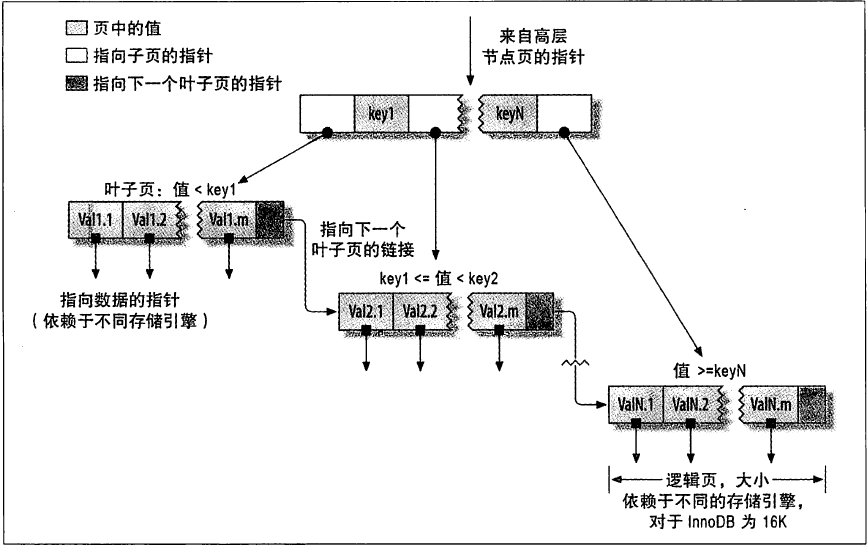
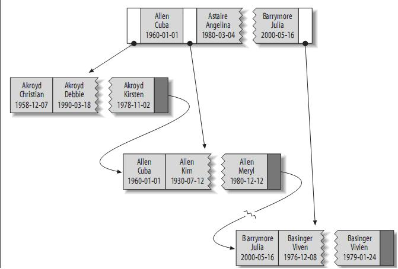

## [原文](https://blog.csdn.net/u010425776/article/details/60968248)


# 索引的类型的详解-从数据结构角度

## 3.2、索引的类型（从数据结构角度）

索引是在存储引擎中实现的，而不是在服务器层中实现的。
所以，每种存储引擎的索引都不一定完全相同，
并不是所有的存储引擎都支持所有的索引类型。


### 3.2.1、B-Tree索引

B－Tree：每一个叶子节点都包含指向下一个叶子节点的指针，从而方便叶子节点的范围遍历。
B－Tree通常意味着所有的值都是按顺序存储的，并且每一个叶子页到根的距离相同，很适合查找范围数据。

B+树是一个平衡的多叉树，从根节点到每个叶子节点的高度差值不超过1，而且同层级的节点间有指针相互链接。

在B+树上的常规检索，从根节点到叶子节点的搜索效率基本相当，不会出现大幅波动，
而且基于索引的顺序扫描时，也可以利用双向指针快速左右移动，效率非常高。

因此，B+树索引被广泛应用于数据库、文件系统等场景。

顺便说一下，xfs文件系统比ext3/ext4效率高很多的原因之一就是，
它的文件及目录索引结构全部采用B+树索引，而ext3/ext4的文件目录结构则采用Linked list,
 hashed B-tree、Extents/Bitmap等索引数据结构，因此在高I/O压力下，其IOPS能力不如xfs。



假设有如下一个表：

```mysql

CREATE TABLE People (
   last_name varchar(50)    not null,
   first_name varchar(50)    not null,
   dob        date           not null,
   gender     enum('m', 'f') not null,
   key(last_name, first_name, dob)
);

```
其索引包含表中每一行的last_name、first_name和dob列。其结构大致如下：

  

 索引存储的值按索引列中的顺序排列。
 可以利用B-Tree索引进行全关键字、关键字范围和关键字前缀查询，
 当然，如果想使用索引，你必须保证按索引的最左边前缀(leftmost prefix of the index)来进行查询。
 
- (1)匹配全值(Match the full value)：对索引中的所有列都指定具体的值。
例如，上图中索引可以帮助你查找出生于1960-01-01的Cuba Allen。

- (2)匹配最左前缀(Match a leftmost prefix)：你可以利用索引查找last name为Allen的人，仅仅使用索引中的第1列。

- (3)匹配列前缀(Match a column prefix)：例如，你可以利用索引查找last name以J开始的人，这仅仅使用索引中的第1列。

- (4)匹配值的范围查询(Match a range of values)：可以利用索引查找last name在Allen和Barrymore之间的人，仅仅使用索引中第1列。

- (5)匹配部分精确而其它部分进行范围匹配(Match one part exactly and match a range on another part)：
可以利用索引查找last name为Allen，而first name以字母K开始的人。

- (6)仅对索引进行查询(Index-only queries)：如果查询的列都位于索引中，则不需要读取元组的值。(覆盖索引)

由于B-树中的节点都是顺序存储的，所以可以利用索引进行查找(找某些值)，也可以对查询结果进行ORDER BY。

当然，使用B-tree索引有以下一些限制：

- (1) 查询必须从索引的最左边的列开始，否则无法使用索引。关于这点已经提了很多遍了。例如你不能利用索引查找在某一天出生的人。

- (2) 不能跳过某一索引列。例如，你不能利用索引查找last name为Smith且出生于某一天的人。

- (3) 存储引擎不能使用索引中范围条件右边的列。例如，如果你的查询语句为
```mysql
WHERE last_name="Smith" AND first_name LIKE 'J%' AND dob='1976-12-23'
```
则该查询只会使用索引中的前两列，因为LIKE是范围查询。

### 通过 使用 EXPLAIN 查看执行计划ql ，如果有extra 一列
Extra 列多了一行 Using index 的提示，证明这次查询直接查的是二级索引，免去了回表。

## 3.2.2、Hash索引

哈希索引基于哈希表实现，只有精确索引所有列的查询才有效。对于每一行数据，
存储引擎都会对所有的索引列计算一个哈希码，哈希码是一个较小的值，并且不同键值的行计算出来的哈希码也不一样。
哈希索引将所有的哈希存储在索引中，同时在哈希表中保存指向每个数据的指针。

MySQL中，只有Memory存储引擎显示支持hash索引，是Memory表的默认索引类型，
尽管Memory表也可以使用B-Tree索引。Memory存储引擎支持非唯一hash索引，这在数据库领域是罕见的，
如果多个值有相同的hash code，索引把它们的行指针用链表保存到同一个hash表项中。

假设创建如下一个表：

```mysql
CREATE TABLE testhash (
   fname VARCHAR(50) NOT NULL,
   lname VARCHAR(50) NOT NULL,
   KEY USING HASH(fname)
) ENGINE=MEMORY;

```
包含的数据如下：

fname|lname
|---|---
Arjen | abc
Baron | abc
Peter | abc
Vadim | abc

假设索引使用hash函数f( )，如下：

f('Arjen') = 2323
f('Baron') = 7437
f('Peter') = 8784
f('Vadim') = 2458
 

此时，索引的结构大概如下：

Slot|Vaule
|---|---
2323 | Point to row 1
2458 | Point to row 4
7437 | Point to row 2
8784 | Point to row 3

哈希索引中存储的是：哈希值+数据行指针 

Slots是有序的，但是记录不是有序的。当你执行
```mysql

mysql> SELECT lname FROM testhash WHERE fname='Peter';

```
MySQL会计算’Peter’的hash值，然后通过它来查询索引的行指针。
因为f('Peter') = 8784，MySQL会在索引中查找8784，得到指向记录3的指针。
因为索引自己仅仅存储很短的值，所以，索引非常紧凑。

Hash值不取决于列的数据类型，一个TINYINT列的索引与一个长字符串列的索引一样大。
 
Hash索引有以下一些限制：

- (1)由于索引仅包含hash code和记录指针，所以，MySQL不能通过使用索引避免读取记录。
但是访问内存中的记录是非常迅速的，不会对性造成太大的影响。

- (2)哈希索引数据并不是按照索引值顺序存储的，所以不能使用hash索引排序。

- (3)Hash索引不支持键的部分匹配，因为是通过整个索引值来计算hash值的。
例如，在数据列（A,B）上建立哈希索引，如果查询只有数据列A，则无法使用该索引。

- (4)Hash索引只支持等值比较，例如使用=，IN( )和<=>。对于WHERE price>100并不能加速查询。

- (5)访问Hash索引的速度非常快，除非有很多哈希冲突（不同的索引列值却有相同的哈希值）。
当出现哈希冲突的时候，存储引擎必须遍历链表中所有的行指针，逐行进行比较，直到找到所有符合条件的行。

- (6)如果哈希冲突很多的话，一些索引维护操作的代价也会很高。
当从表中删除一行时，存储引擎要遍历对应哈希值的链表中的每一行，找到并删除对应行的引用，冲突越多，代价越大。

 

InnoDB引擎有一个特殊的功能叫做“自适应哈希索引”。
当InnoDB注意到某些索引值被使用得非常频繁时，它会在内存中基于B-Tree索引上再创建一个哈希索引，
这样就像B-Tree索引也具有哈希索引的一些优点，比如快速的哈希查找。

创建哈希索引：如果存储引擎不支持哈希索引，则可以模拟像InnoDB一样创建哈希索引，
这可以享受一些哈希索引的便利，例如只需要很小的索引就可以为超长的键创建索引。

思路很简单：在B-Tree基础上创建一个伪哈希索引。这和真正的哈希索引不是一回事，
因为还是使用B-Tree进行查找，但是它使用哈希值而不是键本身进行索引查找。
你需要做的就是在查询的where子句中手动指定使用哈希函数。这样实现的缺陷是需要维护哈希值。
可以手动维护，也可以使用触发器实现。

如果采用这种方式，记住不要使用SHA1和MD5作为哈希函数。因为这两个函数计算出来的哈希值是非常长的字符串，
会浪费大量空间，比较时也会更慢。SHA1和MD5是强加密函数，设计目标是最大限度消除冲突，
但这里并不需要这样高的要求。简单哈希函数的冲突在一个可以接受的范围，同时又能够提供更好的性能。

如果数据表非常大，CRC32会出现大量的哈希冲突，CRC32返回的是32位的整数，
当索引有93000条记录时出现冲突的概率是1%。

处理哈希冲突：当使用哈希索引进行查询时，必须在where子句中包含常量值。


## 3.2.3、空间(R-Tree)索引

MyISAM支持空间索引，主要用于地理空间数据类型，例如GEOMETRY。
和B-TREE索引不同，这类索引无须前缀查询。空间索引会从所有到维度来索引数据。
查询时，可以有效地使用任意维度来组合查询。必须使用MySQL的GIS相关函数如MBRCONTAINS()等来维护数据。
MySQL的GIS支持并不完善，所以大部分人都不会使用这个特性。
开源关系数据库系统中对GIS的解决方案做得比较好的是PostgreSQL的PostGIS。


## 3.2.4、全文(Full-text)索引
全文索引是MyISAM的一个特殊索引类型，innodb的5.6以上版本也支持，它查找的是文本中的关键词主要用于全文检索。

全文索引是一种特殊类型的索引，它查找都是文本中的关键词，而不是直接比较索引中的值。
全文搜索和其他几类索引匹配方式完全不一样。

它有许多需要注意的细节，如停用词、词干和复数、布尔搜索等。
全文索引更类似于搜索引擎做的事情，而不是简单的WHERE条件匹配。

在相同的列上同时创建全文索引和基于值对B-Tree索引不会有冲突，
全文索引适用于MATCH AGAINST操作，而不是普通的WHERE条件操作。

> 全文索引最好限制索引的长度
