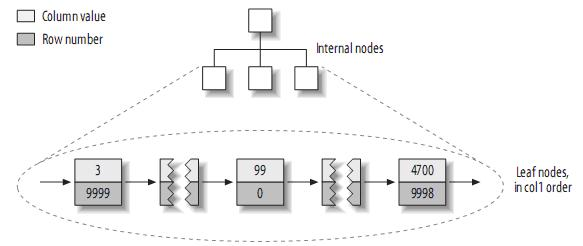

## [原文](https://blog.csdn.net/u010425776/article/details/60968248)


# 索引的类型详解-从物理存储角度索引分类


## 3.3、从物理存储角度索引分类

### 3.3.1、聚簇索引(Clustered Indexes)

聚簇索引保证关键字的值相近的元组存储的物理位置也相同（所以字符串类型不宜建立聚簇索引，
特别是随机字符串，会使得系统进行大量的移动操作），且一个表只能有一个聚簇索引。
因为由存储引擎实现索引，所以，并不是所有的引擎都支持聚簇索引。目前，只有solidDB和InnoDB支持。

## 3.3.2、非聚簇索引

## 3.3.3、聚簇索引的结构大致如下：

叶子页包含了行的全部数据，但是节点页只包含了索引列。

二级索引叶子节点保存的不是指行的物理位置的指针，而是行的主键值。
这意味着通过二级索引查找行，存储引擎需要找到二级索引的叶子节点获取对应的主键值，
然后根据这个值去聚簇索引中查找到对应的行。这里做了重复的工作：两次B－TREE查找而不是一次。


> 数据范围被分在每块磁盘里面.
 
> 注：叶子页面包含完整的元组，而内节点页面仅包含索引的列(索引的列为整型)。
 一些DBMS允许用户指定聚簇索引，但是MySQL的存储引擎到目前为止都不支持。InnoDB对主键建立聚簇索引。
 如果你不指定主键，InnoDB会用一个具有唯一且非空值的索引来代替。
 如果不存在这样的索引，InnoDB会定义一个隐藏的主键，然后对其建立聚簇索引。
 一般来说，DBMS都会以聚簇索引的形式来存储实际的数据，它是其它二级索引的基础。

## 3.3.4、InnoDB和MyISAM的数据布局的比较

为了更加理解聚簇索引和非聚簇索引，或者primary索引和second索引(MyISAM不支持聚簇索引)，
来比较一下InnoDB和MyISAM的数据布局，对于如下表：

```mysql

CREATE TABLE layout_test (
   col1 int NOT NULL,
   col2 int NOT NULL,
   PRIMARY KEY(col1),
   KEY(col2)
);

```
假设主键的值位于1---10,000之间，且按随机顺序插入，然后用OPTIMIZE TABLE进行优化。
col2随机赋予1---100之间的值，所以会存在许多重复的值。

(1)    MyISAM的数据布局
其布局十分简单，MyISAM按照插入的顺序在磁盘上存储数据，如下：


 注：左边为行号(row number)，从0开始。因为元组的大小固定，所以MyISAM可以很容易的从表的开始位置找到某一字节的位置。
MyISAM建立的primary key的索引结构大致如下：



 注：MyISAM不支持聚簇索引，索引中每一个叶子节点仅仅包含行号(row number)，且叶子节点按照col1的顺序存储。
来看看col2的索引结构：


 实际上，在MyISAM中，primary key和其它索引没有什么区别。
 Primary key仅仅只是一个叫做PRIMARY的唯一，非空的索引而已，叶子节点按照col2的顺序存储。

(2)    InnoDB的数据布局
InnoDB按聚簇索引的形式存储数据，所以它的数据布局有着很大的不同。它存储表的结构大致如下：


 注：聚簇索引中的每个叶子节点包含primary key的值，事务ID和回滚指针(rollback pointer)——用于事务和MVCC，和余下的列(如col2)。

相对于MyISAM，InnoDB的二级索引与聚簇索引有很大的不同。
InnoDB的二级索引的叶子包含primary key的值，而不是行指针(row pointers)，
这样的策略减小了移动数据或者数据页面分裂时维护二级索引的开销，因为InnoDB不需要更新索引的行指针。
其结构大致如下：


 聚簇索引和非聚簇索引表的对比：

 


 
## 3.3.4、按primary key的顺序插入行(InnoDB)

如果你用InnoDB，而且不需要特殊的聚簇索引，
一个好的做法就是使用代理主键(surrogate key)——独立于你的应用中的数据。
最简单的做法就是使用一个AUTO_INCREMENT的列，这会保证记录按照顺序插入，
而且能提高使用primary key进行连接的查询的性能。
应该尽量避免随机的聚簇主键，例如，字符串主键就是一个不好的选择，它使得插入操作变得随机。


