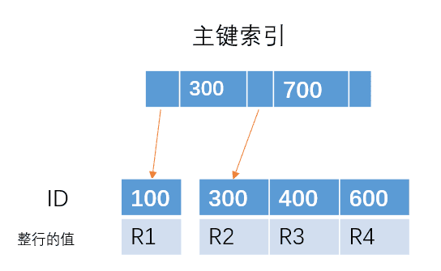
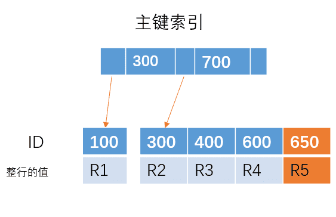

## [原文](https://www.jianshu.com/p/f3a1e17a4df6)

# 为什么建议使用主键自增的索引？

对于这棵主键索引的树：

如果插入 ID = 650 的一行数据，那么直接在最右边插入就可以了

但是如果插入的是 ID = 350 的一行数据，由于 B+ 树是有序的，那么需要将下面的叶子节点进行移动，
腾出位置来插入 ID = 350 的数据，这样就会比较消耗时间。如果刚好 R4 所在的数据页已经满了，
需要进行`页分裂`操作，这样会更加糟糕。

但是，如果主键是自增的，每次插入的 ID 都会比前面的大，那么`每次只需要在后面插入就行`， 
不需要移动位置、分裂等操作，这样可以提高性能。也就是为什么建议使用主键自增的索引。

