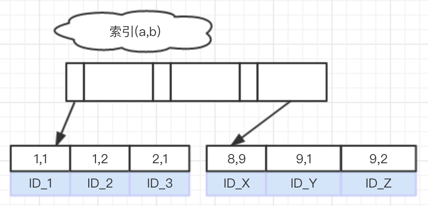

##### [原文1](https://www.infoq.cn/article/fD5ZV2urHCuhqlYvXRd0)

##### [原文2](https://zhuanlan.zhihu.com/p/79026015)

##### [原文3](https://blog.csdn.net/ryb7899/article/details/5580624)

### [order by”是怎么工作的](../07、相关原理实现/26、orderby”是怎么工作的.md)

# MySQL 索引存储顺序和 order by

## ORDER BY优化的核心原则

**`尽量减少额外的排序，通过索引直接返回有序数据`**
  
## MySQL中的两种排序方式

1. 通过`有序索引顺序`扫描`直接返回`有序数据

因为索引的结构是B+树，索引中的数据是按照一定顺序进行排列的，所以在排序查询中如果能利用索引，就能避免额外的排序操作。
EXPLAIN分析查询时，`Extra 显示为Using index`。

2. Filesort排序，对`返回的数据进行排序`

所有不是通过索引直接返回排序结果的操作都是Filesort排序，也就是说进行了`额外的排序操作`。
EXPLAIN分析查询时，`Extra显示或者包含为Using filesort`。

所谓`数据库排序`操作，是指数据库在执行过程中，先将`满足条件的数据全部读出来`，放入内存中，再执行快排，这个内存就是 `sort_buffer`。
如果临时数据量比 sort_buffer 大， 就要把数据放入`临时文件`，然后做`外部排序`，这个排序过程的消耗是比较大的。

**所谓`避免数据库排序`操作，是指`执行过程中不需要快排`或`外部排序`**。


## order by 查询过程

创建一个简单的表，包含主键索引 id 和一个联合索引 ab。

```mysql
CREATE TABLE `t` (
  `id` int(11) NOT NULL auto_increment,
  `a` int(11) NOT NULL,
  `b` int(11) NOT NULL,
  `c` int(11) NOT NULL,
  PRIMARY KEY (`id`),
  KEY `ab` (`a`,`b`)
) ENGINE=InnoDB;
insert into t(a,b,c) values (1,1,0),(1,2,0),(2,1,1),(8,9,3),(9,1,1),(9,2,2);
```

一个简单的需求是将这个表的数据，按照 a 的大小倒序返回。你的 SQL 语句可以这么写：
```mysql
select * from t order by a desc
```
我们来看看这个联合索引 ab 的结构。


可以看到，在这个索引上，数据存储顺序是：按照 a 值递增，对于 a 值相同的情况，按照 b 值递增。

因此上面这个语句的执行流程就是：

1. 从索引 ab 上，取`最右`的一个记录，取出主键值 ID_Z；
2. 根据 ID_Z 到`主键索引`上`取整行记录`，作为结果集的第一行(回表)；
3. 在索引 ab 上取上一个记录的`左边相邻`的记录；
4. 每次取到主键 id 值，再到主键索引上取到整行记录，添加到结果集的下一行；
5. 重复步骤 3、4，直到遍历完整个索引。

### 你需要了解 MYSQL 语句的`执行顺序`，否则到下面会疑惑 

[sql语句执行顺序](../01、sql语句执行顺序.md)

select 执行在 ORDER by 前面，因此如果SELECT 字段 包含条件只有索引列【联合索中某个字段或者全部字段】，那么可能就使用到索引！！！
```mysql
mysql> explain select * from t;
+----+-------------+-------+------------+------+---------------+------+---------+------+------+----------+-------+
| id | select_type | table | partitions | type | possible_keys | key  | key_len | ref  | rows | filtered | Extra |
+----+-------------+-------+------------+------+---------------+------+---------+------+------+----------+-------+
|  1 | SIMPLE      | t     | NULL       | ALL  | NULL          | NULL | NULL    | NULL |    6 |   100.00 | NULL  |
+----+-------------+-------+------------+------+---------------+------+---------+------+------+----------+-------+
1 row in set, 1 warning (0.01 sec)

mysql> explain select a,b from t;
+----+-------------+-------+------------+-------+---------------+------+---------+------+------+----------+-------------+
| id | select_type | table | partitions | type  | possible_keys | key  | key_len | ref  | rows | filtered | Extra       |
+----+-------------+-------+------------+-------+---------------+------+---------+------+------+----------+-------------+
|  1 | SIMPLE      | t     | NULL       | index | NULL          | ab   | 8       | NULL |    6 |   100.00 | Using index |
+----+-------------+-------+------------+-------+---------------+------+---------+------+------+----------+-------------+
1 row in set, 1 warning (0.00 sec)
```

### MySQL如何利用索引优化 ORDER BY 排序语句

MySQL一次查询只能使用一个索引，如果要对多个字段使用索引，建立复合索引。

当排序字段`不在同一个索引时`，无法满足在一颗B+树中完成排序，必须再进行一次`额外的排序`

#### 1. 查询的字段，应该只包含此次查询使用的`索引字段和主键`，其余的`非索引字段`和索引字段作为查询字段则`不会使用索引`。

- 查询用于排序的索引字段，可以利用索引排序 或者 查询用于`排序的索引字段和主键`，可以利用索引排序：
> 注意⚠️ 这，是select 这里查询字段先使用到索引
```mysql
mysql> explain select a,b,id from t order by a ,b;
+----+-------------+-------+------------+-------+---------------+------+---------+------+------+----------+-------------+
| id | select_type | table | partitions | type  | possible_keys | key  | key_len | ref  | rows | filtered | Extra       |
+----+-------------+-------+------------+-------+---------------+------+---------+------+------+----------+-------------+
|  1 | SIMPLE      | t     | NULL       | index | NULL          | ab   | 8       | NULL |    6 |   100.00 | Using index |
+----+-------------+-------+------------+-------+---------------+------+---------+------+------+----------+-------------+
1 row in set, 1 warning (0.00 sec)
```

- `非索引字段`和索引字段`作为查询字段`则不会使用索引 或者 查询用于排序的索引字段和主键`之外`的字段，`不会利用索引`排序
> c 是非索引字段 或者执行  explain select * from t  order by a ,b; 也是一样道理
```mysql
mysql> explain select a,b,c from t  order by a ,b;
+----+-------------+-------+------------+------+---------------+------+---------+------+------+----------+----------------+
| id | select_type | table | partitions | type | possible_keys | key  | key_len | ref  | rows | filtered | Extra          |
+----+-------------+-------+------------+------+---------------+------+---------+------+------+----------+----------------+
|  1 | SIMPLE      | t     | NULL       | ALL  | NULL          | NULL | NULL    | NULL |    6 |   100.00 | Using filesort |
+----+-------------+-------+------------+------+---------------+------+---------+------+------+----------+----------------+
1 row in set, 1 warning (0.00 sec)
```

- 同时使用了 ASC 和 DESC 排序 a 使用到索引，但是 b 再进行一次`额外的排序`
> 为什么需要使用 file sort 再次对 b 做排序？ 因为如果` a 出现相同的值，b 是没办法使用索引的`，因此只能使用 file sort排序
```mysql
mysql> explain select a,b from t  order by a asc ,b desc;
+----+-------------+-------+------------+-------+---------------+------+---------+------+------+----------+-----------------------------+
| id | select_type | table | partitions | type  | possible_keys | key  | key_len | ref  | rows | filtered | Extra                       |
+----+-------------+-------+------------+-------+---------------+------+---------+------+------+----------+-----------------------------+
|  1 | SIMPLE      | t     | NULL       | index | NULL          | ab   | 8       | NULL |    6 |   100.00 | Using index; Using filesort |
+----+-------------+-------+------------+-------+---------------+------+---------+------+------+----------+-----------------------------+
1 row in set, 1 warning (0.00 sec)
```

#### 2. WHERE + ORDER BY 优化

- 排序字段在一个索引中,并且WHERE条件和ORDER BY使用`相同的索引`,可以利用索引排序(type = ref,key = ab)
```mysql
mysql> explain select * from t  where a = 1 order by b;
+----+-------------+-------+------------+------+---------------+------+---------+-------+------+----------+-------+
| id | select_type | table | partitions | type | possible_keys | key  | key_len | ref   | rows | filtered | Extra |
+----+-------------+-------+------------+------+---------------+------+---------+-------+------+----------+-------+
|  1 | SIMPLE      | t     | NULL       | ref  | ab            | ab   | 4       | const |    2 |   100.00 | NULL  |
+----+-------------+-------+------------+------+---------------+------+---------+-------+------+----------+-------+
1 row in set, 1 warning (0.00 sec)
```
组合索引也可以利用索引排序(type = ref,key = ab)【这里MYSQL5.7 和8.0 的Extra值不一样】
```mysql
mysql> explain select * from t  where a = 1 order by a,b;
+----+-------------+-------+------------+------+---------------+------+---------+-------+------+----------+-------+
| id | select_type | table | partitions | type | possible_keys | key  | key_len | ref   | rows | filtered | Extra |
+----+-------------+-------+------------+------+---------------+------+---------+-------+------+----------+-------+
|  1 | SIMPLE      | t     | NULL       | ref  | ab            | ab   | 4       | const |    2 |   100.00 | NULL  |
+----+-------------+-------+------------+------+---------------+------+---------+-------+------+----------+-------+
1 row in set, 1 warning (0.00 sec)
```

- where`查询列`对应多个值，如下面语句就`无法利用索引`来实现order by的优化

> 索引 a,b 如果查询 where a = 1 order by a desc,b asc 是`可以使用到索引`的，
  但是 如果` a 是一个范围查询`，比如 where a in(1,2) 后面的排序包含 b 不管是什么排序，
  为什么需要使用 file sort 再次对 b 做排序？ 因为如果` a 出现相同的值，b 是没办法使用索引的`，因此只能使用 file sort排序

```mysql
mysql> explain select * from t  where a in(1,2)  order by a,b; // 这里8.0 和 5.7 执行结果 type 有点不一样
+----+-------------+-------+------------+-------+---------------+------+---------+------+------+----------+-------------+
| id | select_type | table | partitions | type  | possible_keys | key  | key_len | ref  | rows | filtered | Extra       |
+----+-------------+-------+------------+-------+---------------+------+---------+------+------+----------+-------------+
|  1 | SIMPLE      | t     | NULL       | range | ab            | ab   | 4       | NULL |    3 |   100.00 | Using where |
+----+-------------+-------+------------+-------+---------------+------+---------+------+------+----------+-------------+
1 row in set, 1 warning (0.00 sec)

mysql> explain select * from t  where a in(1,2)  order by b;
+----+-------------+-------+------------+-------+---------------+------+---------+------+------+----------+-----------------------------+
| id | select_type | table | partitions | type  | possible_keys | key  | key_len | ref  | rows | filtered | Extra                       |
+----+-------------+-------+------------+-------+---------------+------+---------+------+------+----------+-----------------------------+
|  1 | SIMPLE      | t     | NULL       | range | ab            | ab   | 4       | NULL |    3 |   100.00 | Using where; Using filesort |
+----+-------------+-------+------------+-------+---------------+------+---------+------+------+----------+-----------------------------+
1 row in set, 1 warning (0.00 sec)

mysql> explain select * from t  where a > 1 order by b;
+----+-------------+-------+------------+-------+---------------+------+---------+------+------+----------+-----------------------------+
| id | select_type | table | partitions | type  | possible_keys | key  | key_len | ref  | rows | filtered | Extra                       |
+----+-------------+-------+------------+-------+---------------+------+---------+------+------+----------+-----------------------------+
|  1 | SIMPLE      | t     | NULL       | range | ab            | ab   | 4       | NULL |    4 |   100.00 | Using where; Using filesort |
+----+-------------+-------+------------+-------+---------------+------+---------+------+------+----------+-----------------------------+
1 row in set, 1 warning (0.00 sec)

mysql> explain select * from t  where a between 1 and 2  order by b;
+----+-------------+-------+------------+-------+---------------+------+---------+------+------+----------+-----------------------------+
| id | select_type | table | partitions | type  | possible_keys | key  | key_len | ref  | rows | filtered | Extra                       |
+----+-------------+-------+------------+-------+---------------+------+---------+------+------+----------+-----------------------------+
|  1 | SIMPLE      | t     | NULL       | range | ab            | ab   | 4       | NULL |    3 |   100.00 | Using where; Using filesort |
+----+-------------+-------+------------+-------+---------------+------+---------+------+------+----------+-----------------------------+
1 row in set, 1 warning (0.00 sec)
```

- 如果在WHERE和ORDER BY的栏位上应用`表达式(函数`)时，则无法利用索引来实现order by的优化  `执行计划：【type = ALL 】`
```mysql
mysql>  explain select * from t  order by a,YEAR(b);
+----+-------------+-------+------------+------+---------------+------+---------+------+------+----------+----------------+
| id | select_type | table | partitions | type | possible_keys | key  | key_len | ref  | rows | filtered | Extra          |
+----+-------------+-------+------------+------+---------------+------+---------+------+------+----------+----------------+
|  1 | SIMPLE      | t     | NULL       | ALL  | NULL          | NULL | NULL    | NULL |    6 |   100.00 | Using filesort |
+----+-------------+-------+------------+------+---------------+------+---------+------+------+----------+----------------+
1 row in set, 1 warning (0.00 sec)
```

- 用于搜索记录的索引键和做 ORDER BY 的不是同一个【a,b 分别建立索引】
> 需要手动去删除和重新分别建立 a,b 索引
```mysql
mysql> explain select a,b from t where a = 1 order by b
```
- 在`非连续`的索引键部分上做 ORDER BY `执行计划：【type = ALL 】`
```mysql
mysql> explain select *  from t where b = 1 order by b;
+----+-------------+-------+------------+------+---------------+------+---------+------+------+----------+-------------+
| id | select_type | table | partitions | type | possible_keys | key  | key_len | ref  | rows | filtered | Extra       |
+----+-------------+-------+------------+------+---------------+------+---------+------+------+----------+-------------+
|  1 | SIMPLE      | t     | NULL       | ALL  | NULL          | NULL | NULL    | NULL |    6 |    16.67 | Using where |
+----+-------------+-------+------------+------+---------------+------+---------+------+------+----------+-------------+
1 row in set, 1 warning (0.00 sec)
```

### 特别提示
- mysql一次查询只能使用一个索引。如果要对多个字段使用索引，建立复合索引。

- 在ORDER BY操作中，MySQL只有在排序条件不是一个查询条件表达式的情况下才使用索引。
 
### Filesort优化

适当加大系统变量`max_length_for_sort_data`的值，能够让MySQL选择更优化的Filesort排序算法。
并且在书写SQL语句时，只使用`需要的字段`，而不是`SELECT * `所有的字段，这样可以`减少排序区的使用`，提高SQL性能。


 