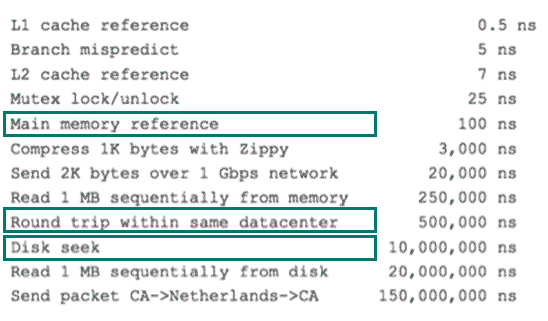

## [原文](https://tech.meituan.com/2014/06/30/mysql-index.html)

# MySQL索引原理

`因为 MYSQL 索引底层实现是 B+树，因此我们说下 B+树的实现原理就可以了`

## MySQL索引原理

### 索引目的
索引的目的在于提高查询效率，可以类比字典，如果要查“mysql”这个单词，
我们肯定需要定位到m字母，然后从下往下找到y字母，再找到剩下的sql。
如果没有索引，那么你可能需要把所有单词看一遍才能找到你想要的，如果我想找到m开头的单词呢？
或者ze开头的单词呢？是不是觉得如果没有索引，这个事情根本无法完成？

### 索引原理
除了词典，生活中随处可见索引的例子，如火车站的车次表、图书的目录等。
它们的原理都是一样的，通过不断的缩小想要获得数据的范围来筛选出最终想要的结果，
同时把随机的事件变成顺序的事件，也就是我们总是通过同一种查找方式来锁定数据。

   数据库也是一样，但显然要复杂许多，因为不仅面临着等值查询，
还有范围查询(>、<、between、in)、模糊查询(like)、并集查询(or)等等。
数据库应该选择怎么样的方式来应对所有的问题呢？我们回想字典的例子，能不能把数据分成段，
然后分段查询呢？最简单的如果1000条数据，1到100分成第一段，101到200分成第二段，
201到300分成第三段......这样查第250条数据，只要找第三段就可以了，一下子去除了90%的无效数据。
但如果是1千万的记录呢，分成几段比较好？稍有算法基础的同学会想到搜索树，其平均复杂度是lgN，
具有不错的查询性能。但这里我们忽略了一个关键的问题，
复杂度模型是基于每次相同的操作成本来考虑的，数据库实现比较复杂，数据保存在磁盘上，
而为了提高性能，每次又可以把部分数据读入内存来计算，
因为我们知道访问磁盘的成本大概是访问内存的十万倍左右，所以简单的搜索树难以满足复杂的应用场景。

### 磁盘IO与预读
前面提到了访问磁盘，那么这里先简单介绍一下磁盘IO和预读，磁盘读取数据靠的是机械运动，
每次读取数据花费的时间可以分为寻道时间、旋转延迟、传输时间三个部分，
寻道时间指的是磁臂移动到指定磁道所需要的时间，主流磁盘一般在5ms以下；
旋转延迟就是我们经常听说的磁盘转速，比如一个磁盘7200转，表示每分钟能转7200次，
也就是说1秒钟能转120次，旋转延迟就是1/120/2 = 4.17ms；
传输时间指的是从磁盘读出或将数据写入磁盘的时间，一般在零点几毫秒，相对于前两个时间可以忽略不计。
那么访问一次磁盘的时间，即一次磁盘IO的时间约等于5+4.17 = 9ms左右，听起来还挺不错的，
但要知道一台500 -MIPS的机器每秒可以执行5亿条指令，因为指令依靠的是电的性质，
换句话说执行一次IO的时间可以执行40万条指令，数据库动辄十万百万乃至千万级数据，
每次9毫秒的时间，显然是个灾难。下图是计算机硬件延迟的对比图，供大家参考：

考虑到磁盘IO是非常高昂的操作，计算机操作系统做了一些优化，
当一次IO时，不光把当前磁盘地址的数据，而是把相邻的数据也都读取到内存缓冲区内，
因为局部预读性原理告诉我们，当计算机访问一个地址的数据的时候，与其相邻的数据也会很快被访问到。
每一次IO读取的数据我们称之为一页(page)。具体一页有多大数据跟操作系统有关，一般为4k或8k，
也就是我们读取一页内的数据时候，实际上才发生了一次IO，这个理论对于索引的数据结构设计非常有帮助。

### 索引的数据结构
前面讲了生活中索引的例子，索引的基本原理，数据库的复杂性，又讲了操作系统的相关知识，
目的就是让大家了解，任何一种数据结构都不是凭空产生的，一定会有它的背景和使用场景，
我们现在总结一下，我们需要这种数据结构能够做些什么，
其实很简单，那就是：每次查找数据时把磁盘IO次数控制在一个很小的数量级，最好是常数数量级。
那么我们就想到如果一个高度可控的多路搜索树是否能满足需求呢？就这样，b+树应运而生。

### 详解b+树

如上图，是一颗b+树，关于b+树的定义可以参见B+树，这里只说一些重点，
浅蓝色的块我们称之为一个磁盘块，可以看到每个磁盘块包含几个数据项（深蓝色所示）和指针（黄色所示），
如磁盘块1包含数据项17和35，包含指针P1、P2、P3，P1表示小于17的磁盘块，
P2表示在17和35之间的磁盘块，P3表示大于35的磁盘块。
真实的数据存在于叶子节点即3、5、9、10、13、15、28、29、36、60、75、79、90、99。
非叶子节点只不存储真实的数据，只存储指引搜索方向的数据项，如17、35并不真实存在于数据表中。

### b+树的查找过程
如图所示，如果要查找数据项29，那么首先会把磁盘块1由磁盘`加载到内存`，此时发生一次IO，
在内存中用二分查找确定29在17和35之间，锁定磁盘块1的P2指针，
内存时间因为非常短（相比磁盘的IO）可以忽略不计，
通过磁盘块1的P2指针的磁盘地址把磁盘块3由磁盘加载到内存，发生第二次IO，29在26和30之间，
锁定磁盘块3的P2指针，通过指针加载磁盘块8到内存，发生第三次IO，同时内存中做二分查找找到29，
结束查询，总计三次IO。真实的情况是，3层的b+树可以表示上百万的数据，
如果上百万的数据查找只需要三次IO，性能提高将是巨大的，如果没有索引，
每个数据项都要发生一次IO，那么总共需要百万次的IO，显然成本非常非常高。

### b+树性质
1.通过上面的分析，我们知道IO次数取决于`b+数的高度h`，假设当前数据表的数据为N，
每个磁盘块的数据项的数量是m，则有h=㏒(m+1)N，当数据量N一定的情况下，m越大，h越小；
而m = 磁盘块的大小 / 数据项的大小，磁盘块的大小也就是一个数据页的大小，是固定的，
如果数据项占的空间越小，数据项的数量越多，树的高度越低。
这就是为什么每个数据项，即索引字段要尽量的小，比如int占4字节，要比bigint8字节少一半。
这也是为什么b+树要求把真实的数据放到叶子节点而不是内层节点，一旦放到内层节点，
磁盘块的数据项会大幅度下降，导致树增高。当数据项等于1时将会退化成线性表。

2.当b+树的数据项是复合的数据结构，比如(name,age,sex)的时候，
b+数是按照从左到右的顺序来建立搜索树的，比如当(张三,20,F)这样的数据来检索的时候，
b+树会优先比较name来确定下一步的所搜方向，如果name相同再依次比较age和sex，最后得到检索的数据；
但当(20,F)这样的没有name的数据来的时候，b+树就不知道下一步该查哪个节点，
因为建立搜索树的时候name就是第一个比较因子，必须要先根据name来搜索才能知道下一步去哪里查询。
比如当(张三,F)这样的数据来检索时，b+树可以用name来指定搜索方向，
但下一个字段age的缺失，所以只能把名字等于张三的数据都找到，然后再匹配性别是F的数据了，
 这个是非常重要的性质，即索引的最左匹配特性。