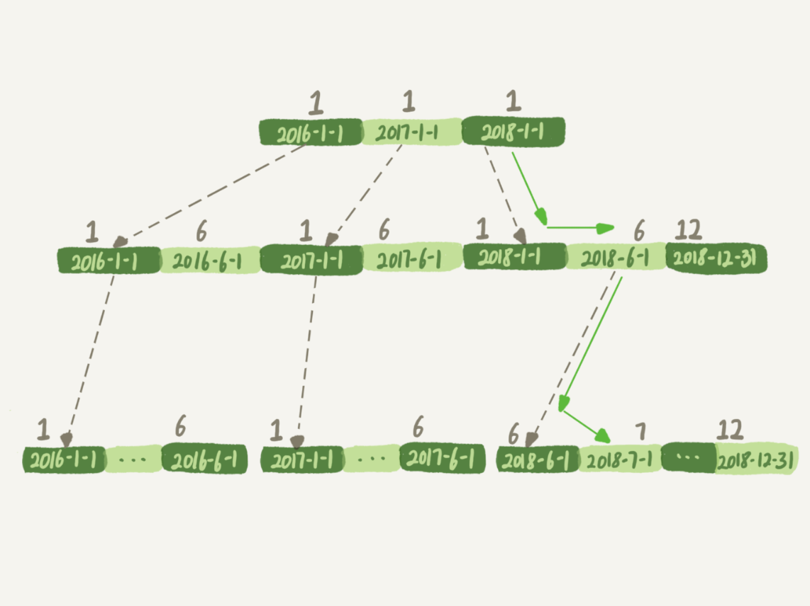

# 为什么这些SQL语句逻辑相同，性能却差异巨大

> 索引字段不能进行函数操作，但是索引字段的参数可以玩函数，一言以蔽之 


## 案例一：条件字段函数操作

```mysql
mysql> CREATE TABLE `tradelog` (
  `id` int(11) NOT NULL,
  `tradeid` varchar(32) DEFAULT NULL,
  `operator` int(11) DEFAULT NULL,
  `t_modified` datetime DEFAULT NULL,
  PRIMARY KEY (`id`),
  KEY `tradeid` (`tradeid`),
  KEY `t_modified` (`t_modified`)
) ENGINE=InnoDB DEFAULT CHARSET=utf8mb4;
```

你的SQL语句:统计发生在所有年份中7月份的交易记录总数
```mysql
mysql> select count(*) from tradelog where month(t_modified)=7;
```
如果对字段做了函数计算，就用不上索引了，这是MySQL的规定。


现在你已经学过了InnoDB的索引结构了，可以再追问一句为什么？
为什么条件是where t_modified='2018-7-1’的时候可以用上索引，
而改成where month(t_modified)=7的时候就不行了？

下面是这个t_modified索引的示意图。方框上面的数字就是month()函数对应的值。




如果你的SQL语句条件用的是where t_modified='2018-7-1’的话，引擎就会按照上面绿色箭头的路线，快速定位到 t_modified='2018-7-1’需要的结果。

实际上，B+树提供的这个快速定位能力，来源于同一层兄弟节点的有序性。

但是，如果计算month()函数的话，你会看到传入7的时候，在树的第一层就不知道该怎么办了。

也就是说，**对索引字段做函数操作，可能会破坏索引值的有序性，因此优化器就决定放弃走树搜索功能。**

需要注意的是，优化器并不是要放弃使用这个索引。

在这个例子里，放弃了树搜索功能，优化器可以选择遍历主键索引，也可以选择遍历索引t_modified，
优化器对比索引大小后发现，索引t_modified更小，遍历这个索引比遍历主键索引来得更快。
因此最终还是会选择索引t_modified。


接下来，我们使用explain命令，查看一下这条SQL语句的执行结果。


 
key="t_modified"表示的是，使用了t_modified这个索引；我在测试表数据中插入了10万行数据，rows=100335，
说明这条语句扫描了整个索引的所有值；Extra字段的Using index，表示的是使用了覆盖索引。

也就是说，由于在t_modified字段加了month()函数操作，导致了全索引扫描。为了能够用上索引的快速定位能力，
我们就要把SQL语句改成基于字段本身的范围查询。按照下面这个写法，优化器就能按照我们预期的，用上t_modified索引的快速定位能力了。
```mysql
mysql> select count(*) from tradelog where
    -> (t_modified >= '2016-7-1' and t_modified<'2016-8-1') or
    -> (t_modified >= '2017-7-1' and t_modified<'2017-8-1') or 
    -> (t_modified >= '2018-7-1' and t_modified<'2018-8-1');

```
当然，如果你的系统上线时间更早，或者后面又插入了之后年份的数据的话，你就需要再把其他年份补齐。

到这里我给你说明了，由于加了month()函数操作，MySQL无法再使用索引快速定位功能，而只能使用全索引扫描。

不过优化器在个问题上确实有“偷懒”行为，即使是对于不改变有序性的函数，也不会考虑使用索引。
比如，对于select * from tradelog where id + 1 = 10000这个SQL语句，这个加1操作并不会改变有序性，
但是MySQL优化器还是不能用id索引快速定位到9999这一行。所以，需要你在写SQL语句的时候，手动改写成 where id = 10000 -1才可以。


## 案例二：隐式类型转换


我们一起看一下这条SQL语句：
```mysql
mysql> select * from tradelog where tradeid=110717;

```
交易编号tradeid这个字段上，本来就有索引，但是explain的结果却显示，这条语句需要走全表扫描。
你可能也发现了，tradeid的字段类型是varchar(32)，而输入的参数却是整型，所以需要做类型转换。

那么，现在这里就有两个问题：

数据类型转换的规则是什么？

为什么有数据类型转换，就需要走全索引扫描？

先来看第一个问题，你可能会说，数据库里面类型这么多，这种数据类型转换规则更多，我记不住，应该怎么办呢？

这里有一个简单的方法，看 select “10” > 9的结果：

select “10” > 9返回的是1，所以你就能确认MySQL里的转换规则了：在MySQL中，字符串和数字做比较的话，是将字符串转换成数字。

这时，你再看这个全表扫描的语句：
```mysql
mysql> select * from tradelog where tradeid=110717;

```
就知道对于优化器来说，这个语句相当于：
```mysql
mysql> select * from tradelog where  CAST(tradid AS signed int) = 110717;

```
也就是说，这条语句触发了我们上面说到的规则：对索引字段做函数操作，优化器会放弃走树搜索功能。


### 一个小问题
id的类型是int，如果执行下面这个语句，是否会导致全表扫描呢？
```mysql
select * from tradelog where id="83126";
```


## 案例三：隐式字符编码转换


如果关联查询的字段字符编码不一样，

```mysql
mysql> select d.* from tradelog l, trade_detail d where d.tradeid=l.tradeid and l.id=2; /*语句Q1*/
```

这两个表的字符集不同，一个是utf8，一个是utf8mb4，所以做表连接查询的时候用不上关联字段的索引。

因为会做转换
```mysql
select * from trade_detail  where CONVERT(traideid USING utf8mb4)=$L2.tradeid.value; 
```


