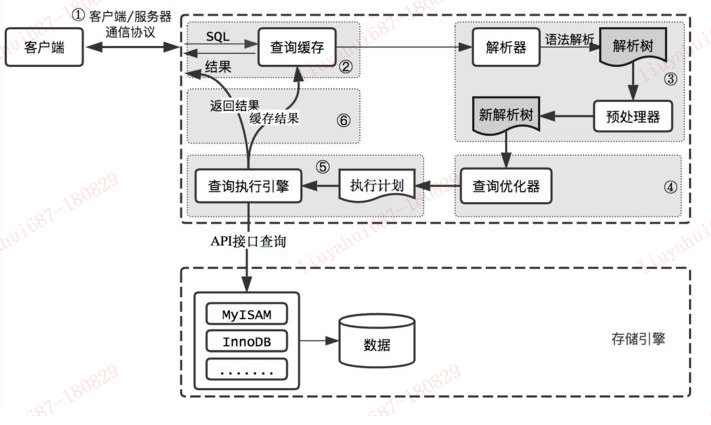

## [原文](https://my.oschina.net/u/3787772/blog/1935070)

# mysql的查询流程

1、客户端先发送一条查询给服务器；

2、服务器先检查查询缓存，如果命中了缓存，则立刻返回给存储在缓存中的结果，否则进入下一个阶段；

3、服务器端进行sql解析、预处理，再由优化器生成对应的执行计划；

4、Mysql根据优化器生成的执行计划，调用存储引擎的API来执行查询；

5、将结果返回客户端，同时缓存查询结果；

