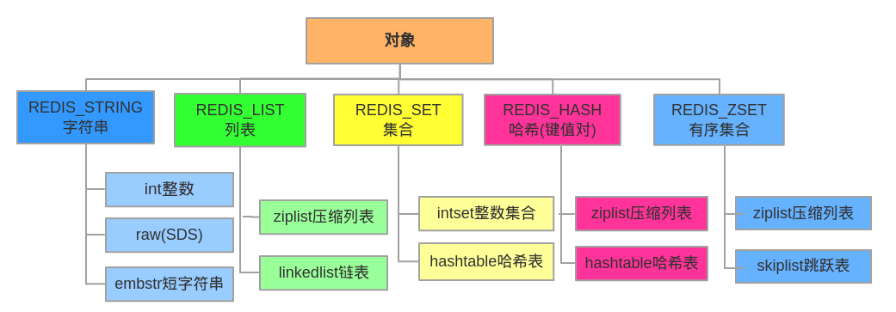

## [原文](https://www.cnblogs.com/chenpingzhao/p/5220498.html)

# redis中的数据类型

## Redis常用数据类型
Redis最为常用的数据类型主要有以下：
String 、Hash 、List 、Set 、Sorted set（zset）

分别有`简单动态字符串(SDS)`、`链表`、`字典`、`跳跃表`、`整数集合`以及`压缩列表`实现。

## 底层数据结构

### String
- 简单动态字符串SDS
- int整数
- embstr短字符串

### List
- 双向链表(linkedlist双向链表) 
- 压缩链表(ziplist压缩表)

### Hash
- 哈希表(hashtable哈希表) 
- 压缩链表(ziplist压缩表)

### SET
- 哈希表(hashtable哈希表) 
- 整型数组(intset整型数组)

### ZSet
- 压缩表压缩链表(ziplist压缩表) 
- 跳跃表(skiplist跳跃表)

