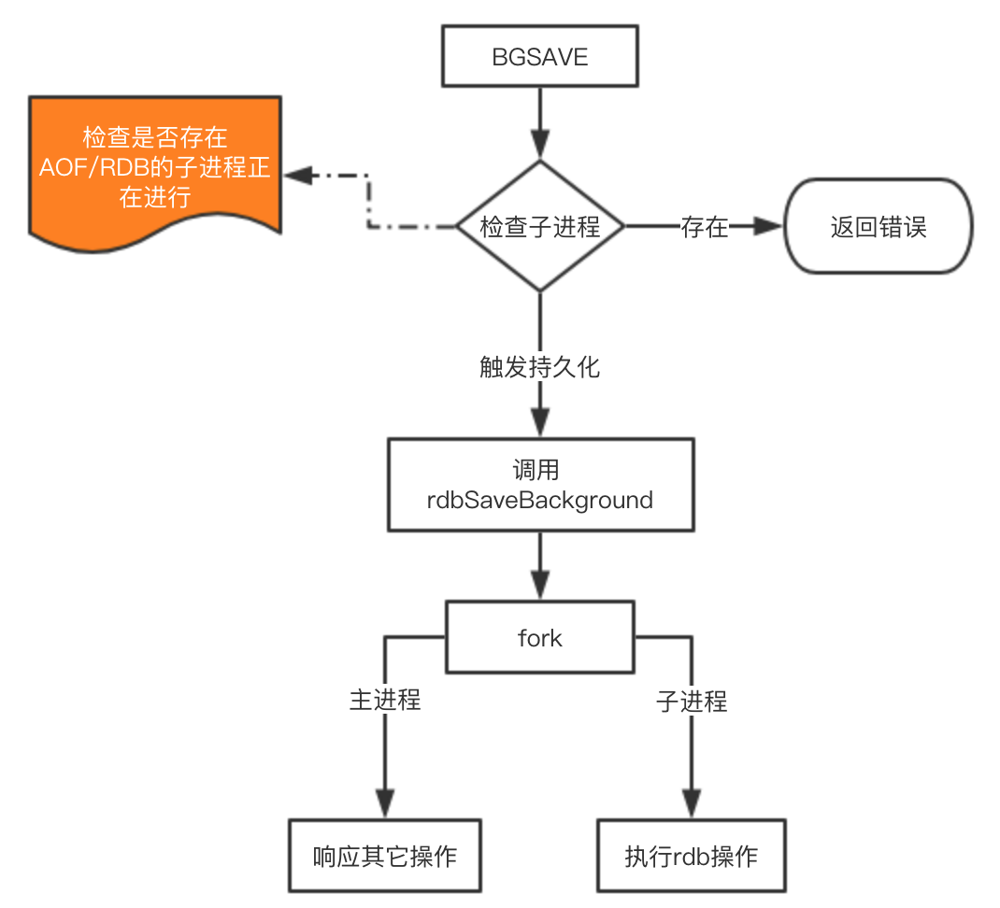
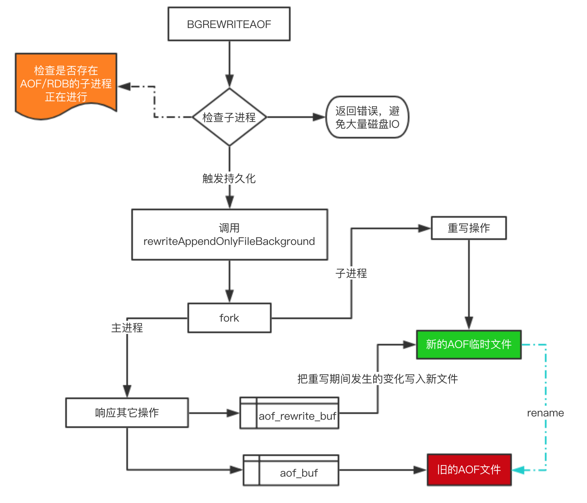

<https://www.cnblogs.com/GrimMjx/p/10695512.html>

## [原文](https://juejin.im/post/5b70dfcf518825610f1f5c16)

# Redis的持久化原理

Redis为持久化提供了两种方式：

- RDB：在`指定的时间间隔`能对你的数据进行`快照存储`。

- AOF：`记录每次对服务器写的操作`,当服务器重启的时候会重新执行这些命令来恢复原始的数据。

## 工作原理

在介绍原理之前先说下Redis内部的定时任务机制，
定时任务执行的频率可以在配置文件中通过 hz 10 来设置（这个配置表示1s内执行10次，
也就是每100ms触发一次定时任务）。该值最大能够设置为：500，但是不建议超过：100，
因为值越大说明`执行频率越频繁越高，这会带来CPU的更多消耗`，从而影响主进程读写性能。

`定时任务`使用的是Redis`自己实现`的 TimeEvent，
它会定时去调用一些命令完成定时任务，这些任务`可能会阻塞主进程`导致Redis性能下降。
因此我们在配置Redis时，一定要整体考虑一些会触发定时任务的配置，根据实际情况进行调整。

无论`RDB`还是`AOF`，由于使用了`写时复制`，fork出来的子进程`不需要拷贝父进程`的物理内存空间，
但是会[复制父进程的`空间内存页表`](10、复制父进程的空间内存页表可能出现问题.md)

## RDB的原理

在Redis中`RDB持久化`的触发分为两种：`自己手动触发`与`Redis定时触发`。

针对RDB方式的持久化，手动触发可以使用：

- save：会阻塞当前Redis服务器，直到持久化完成，线上应该禁止使用。
- bgsave：该触发方式会`fork一个子进程`，由`子进程负责持久化`过程，因此阻塞只会发生在fork子进程的时候。

### 自动触发
而自动触发的场景主要是有以下几点：

- 根据我们的 save m n 配置规则自动触发；

- 从节点`全量复制`时，主节点发送rdb文件给从节点完成复制操作，主节点会触发 bgsave；

- 执行 debug reload 时；

- 执行  shutdown时，如果没有开启aof，也会触发。

由于 save 基本不会被使用到，我们`重点看看` bgsave 这个命令是如何完成RDB的持久化的。

这里注意的是 [`fork 操作会阻塞`](04、fork%20操作会阻塞引起问题.md)，导致`Redis读写性能下降`。
我们可以控制`单个Redis实例的最大内`存，来尽可能降低Redis在fork时的事件消耗。
以及上面提到的自动触发的频率减少fork次数，或者使用手动触发，根据自己的机制来完成持久化。

## AOF的原理
AOF的整个流程大体来看可以分为两步：  

一步是命令的`实时写入`（如果是 appendfsync everysec 配置，会有`1s损耗`），
第二步是对aof文件的重写。

对于`增量追加到文件`这一步主要的流程是：命令写入=>`追加`到`aof_buf` => 同步到`aof磁盘`。

### 为什么要先写入buf在同步到磁盘呢？
如果`实时写入磁盘`会带来非常高的磁盘IO，`影响整体性能`。

`aof重写`是为了`减少aof文件的大小`，可以`手动或者自动触发`，关于`自动触发的规则`请看上面配置部分。
fork的操作也是发生在重写这一步，也是这里会对`主进程`产生阻塞。
> 重写时，会先判断key是否过期，已`过期的key不会重写到aof文件`

手动触发： bgrewriteaof，自动触发 就是根据配置规则来触发，
当然自动触发的整体时间还跟Redis的定时任务频率有关系。

下面来看看重写的一个流程图：

对于上图有四个关键点补充一下：

1. 在重写期间，由于主进程依然在响应命令，为了保证最终备份的完整性；因此它依然会写入`旧的AOF file`中，如果重写失败，能够保证数据不丢失。

2. 为了把重写期间响应的写入信息也写入到`新的文件中`，因此也会为`子进程保留一个buf`，防止新写的file丢失数据。

3. 重写是`直接把当前内存的数据生成`对应命令，`并不需要`读取老的`AOF文件进行分析`、命令合并。

4. AOF文件直接采用的文本协议，主要是兼容性好、追加方便、可读性高可认为修改修复。

> 不论是RDB还是AOF都是先写入一个临时文件，然后通过 rename 完成文件的替换工作。

## 从持久化中恢复数据
数据的备份、持久化做完了，我们如何从这些持久化文件中恢复数据呢？如果一台服务器上有既有RDB文件，又有AOF文件，该加载谁呢？
其实想要从这些文件中恢复数据，只需要重新启动Redis即可。我们还是通过图来了解这个流程：

启动时会`先检查AOF文件`是否存在，如果`不存在`就尝试`加载RDB`。那么为什么会优先加载AOF呢？   
因为`AOF保存的数据更完整`，通过上面的分析我们知道AOF基本上`最多损失1s的数据`。

## 性能与实践
通过上面的分析，我们都知道RDB的快照、AOF的重写都`需要fork`，这是一个重量级操作，会对Redis造成阻塞。
因此为了不影响Redis主进程响应，我们需要尽可能降低阻塞。

1. 降低fork的频率，比如可以手动来触发RDB生成快照、与AOF重写；

2. 控制Redis最大使用内存，防止fork耗时过长；

3. 使用更牛逼的硬件；

4. 合理配置Linux的内存分配策略，避免因为物理内存不足导致fork失败。

在线上我们到底该怎么做？我提供一些自己的实践经验。

1. 如果Redis中的数据并不是特别敏感或者可以通过其它方式重写生成数据，可以关闭持久化，如果丢失数据可以通过其它途径补回；

2. 自己制定策略定期检查Redis的情况，然后可以手动触发备份、重写数据；

3. 单机如果部署多个实例，要防止多个机器同时运行持久化、重写操作，防止出现内存、CPU、IO资源竞争，让持久化变为串行；

4. 可以加入主从机器，利用一台从机器进行备份处理，其它机器正常响应客户端的命令；

5. RDB持久化与AOF持久化可以同时存在，配合使用。

本文的内容主要是运维上的一些注意点，但我们开发者了解到这些知识，在某些时候有助于我们发现诡异的bug。
