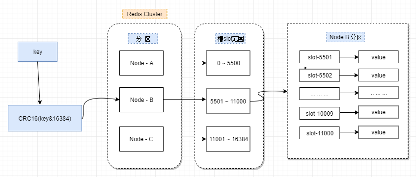

## [原文1](https://www.jianshu.com/p/87e06d81b597)

## [原文2](https://phachon.com/redis/redis-3.html)

# redis集群模式之-集群模式 (cluster)

## 简介

[redis三种集群模式](../03、基础知识/30、redis三种集群模式.md)

Redis 的集群模式使用 `slots 插槽`

## 实现原理

### 数据分布
Redis采用区中心的设计方案，通过虚拟16384个槽，将每个key映射到每一个具体的槽上，
而每个redis节点可以负责管理一定数量的槽，假设有三个redis-cluster中有三个主节点，其槽可能分布如下图：


redis槽分布

### 节点通信
- Gossip协议
  
- meet消息  
用于通知新节点加入，消息发送这通知消息接收者加入集群，消息接收者回复pong消息，
当新节点加入到集群后`各节点`就通过`ping、pong`消息进行信息交换。
- ping  
集群中每个节点每秒向集群中多个节点发送ping消息，用于节点`活性`检测和`状态`交换。
- pong  
pong作为meet消息和ping消息的响应消息，响应自身状态。也可以通过pong消息向集群中其他阶段广播自身的状态。
- fail  
fail消息用于向集群中其他阶段`广播`某个节点已经下线。
- 消息格式  
这些ping、pong等消息具体包括哪些信息呢？在cluster.h头文件中可以看到消息主要是由消息头和消息体组成

### 扩容&缩容

#### 扩容
当集群出现容量限制或者其他一些原因需要扩容时，redis cluster提供了比较优雅的集群扩容方案。

- 首先将`新节点加入到集群`中，可以通过在集群中任何一个客户端执行cluster meet 新节点ip:端口，
或者通过redis-cli add node添加，新添加的节点默认在集群中都是主节点。

- 迁移数据  
迁移数据的大致流程是，首先需要`确定哪些槽需要被迁移到目标节点`，然后获取槽中key，将槽中的key全部迁移到目标节点，
然后`向集群所有主节点广播槽`（数据）全部迁移到了目标节点。
直接通过redis-cli工具做数据迁移很方便。 现在假设将节点A的槽10迁移到B节点，过程如下：
```
B:cluster setslot 10 importing A.nodeId
A:cluster setslot 10 migrating B.nodeId

循环获取槽中key，将key迁移到B节点
A:cluster getkeysinslot 10 100
A:migrate B.ip B.port "" 0 5000 keys key1[ key2....]
向集群广播槽已经迁移到B节点
cluster setslot 10 node B.nodeId
```
#### 缩容
缩容的大致过程与扩容一致，需要判断下线的节点是否是主节点，以及主节点上是否有槽，若主节点上有槽，
需要将槽迁移到集群中其他主节点，槽迁移完成之后，需要向其他节点广播该节点准备下线（cluster forget nodeId）。
最后需要将该下线主节点的从节点指向其他主节点，当然最好是先将从节点下线。

### 故障转移
#### 故障发现
`节点之间通过gossip消息进行通信`，当A节点发送PING消息给B节点，若没有收到B节点回复的PONG消息，持续cluster_node_timeout时长，
则A节点会判定B节点已经下线了。待A判定B节点下线后，就会`向集群广播B节点下线`的消息。
若集群中大部分节点都认为B节点下线后就会`真正地下线B节点`。

当某个节点判断另外一个节点下线后，相应的节点状态会跟随消息在集群内传播，当集群中半数以上的主节点都标记该节点下线时，
就会出发下线B节点的操作。集群中每个节点在收到其他节点发送的pfail状态时，都会尝试触发下线的操作，
只要当前节点是`主节点且半数以上主节点`判定某节点下线就会向集群中广播fail消息，`立即下线问题节点`，
从而触发从节点的`故障转移流程`。

#### 故障恢复
当问题节点下线后，如果该下线节点是带有槽的主节点，则需要从`它的从节点选出一个替换它`，
当问题节点的从节点发现其主节点下线时，将会出发故障恢复流程。

#### 确定参与选主的节点
并不是所有的从节点都能参与到故障恢复的流程中，
若从节点与问题主节点的断线时间超过cluster_node_timeout * cluster-slave-validity-factor时，
该从节点不能参与到后续恢复流程。

### 选主

- 准备选主
cluster内部通过一个延迟出发的机制，从节点中具有更大复制偏移量的从节点具有优先发起选主的权利。
从节点维护着一个执行故障选主的时间，并且有定时任务检测选主时间，若达到故障选主时间后，则发起选主。

- 发起选主
  - 1） 更新配置纪元（epoch）  
`配置纪元`是一个`只增不减`的整数，`每个主节点自身都维护一个配置纪元`，所有主节点的`配置纪元`都`不相等`，
从节点会复制主节点的配置纪元。  

  - 2）广播选主消息  
在集群内广播选主消息（FAIL_AUTH_REQUEST），并记录已发送过消息的状态，保证该从节点在一个配置纪元内只能发起一次选举。

- 选主投票  
只有持有`槽的主节点`才会处理故障选主消息，因为每个持有槽的节点在一个配置纪元内都有唯一的一张选票，
当接到第一个请求投票的从节点消息时回复FAILOVER_AUTH_ACK消息作为投票，之后相同配置纪元内的其他从节点的选主消息将忽略。  
投票过程其实是一个领导者选举的过程，如集群内有N个持有槽的主节点代表有N张票，只要`有N/2 + 1`张票投给同一个从节点，
则该`从节点就将晋升为master`。每个配置纪元代表了一次选主的周期，
在开始投票后的cluster-node-timeout * 2的时间内没有获得足够数量的投票，则本次选举作废，需要发起下一次选主。

- 替换主节点
当从节点收到足够选票后，触发替换主接点的操作：
  - 1）当前从节点取消复制变为主节点。
  - 2）执行cluster del slot做撤销故障主节点负责的槽，并执行cluster add slot把这些`槽委派给自己`，
  - 3）向集群广播PONG消息，通知集群内所有节点当前从节点变为主节点并接管故障主节点的槽信息。

### 请求重定向
由于redis-cluster采用去中心化的架构，集群的主节点各自负责一部分槽，客户端不确定key到底会映射到哪个节点上。
redis-cluster`通过重定向`解决这个问题。在没有使用cluster模式时，redis对请求的处理很简单，
若key存在于自身节点，则直接返回结果，若key不存在则告诉客户端key不存在，在使用cluster模式时，
对请求的处理就变得复杂起来。在cluster模式下，节点对请求的处理过程如下：

- 检查当前key是否存在当前NODE？
  - 1）通过crc16（key）/16384计算出slot
  - 2）查询负责该slot负责的节点，得到节点指针
  - 3）该指针与自身节点比较
- 若slot不是由自身负责，`则返回MOVED重定向`
- 若slot由自身负责，且key在slot中，则返回该key对应结果
- 若key不存在此slot中，检查该slot是否正在迁出（MIGRATING）？
- 若key正在迁出，返回ASK错误重定向客户端到迁移的目的服务器上
- 若Slot未迁出，检查Slot是否导入中？
- 若Slot导入中且有ASKING标记，则直接操作
- 否则返回MOVED重定向

### MOVED重定向
每个客户端可以随便发起请求到集群中的任意一个节点，包括从节点。节点将会解析请求并计算该key对应slot是否由该节点负责，
若不是由该节点负责的槽则返回一个MOVED错误。如下:
```shell script
127.0.0.1:6379> get key1
(error) MOVED 9189 127.0.0.1:6382
```
其中`MOVED错误信息`会包含该key对应的`slot`以及`slot所在节点的ip和端口`。
客户端并不要求保存slot与节点的对应关系，但是为了高性能，客户端应该保存一下slot与节点的对应关系。
发送请求时只需要先计算key对应的slot然后通过slot获取对应的节点，
待客户端收到MOVED错误时更新一下slot与节点的对应关系。

### ASK重定向
ASK重定向主要是解决slot迁移时，同一个槽信息存在两个节点上，但是槽中的key还没有全部迁移完成，
避免客户端重新获取slot重新获取slot与节点的对应关系。
```shell script
127.0.0.1:6379> get key1
(error) ASK 9189 127.0.0.1:6382
```
其格式与MOVED错误差不多，包括该key对应的slot，以及迁出目节点的ip和端口。

### PUB&SUB
在集群模式下，所有的publish命令都会向所有节点（包括从节点）进行广播，
造成每条publish数据都会在集群内所有节点传播一次，加重了带宽负担，
对于在有大量节点的集群中频繁使用pub，会严重消耗带宽，不建议使用。

### cluster的限制
- 对multi-key操作支持不够，虽然支持hash tag，但在迁移槽的过程中也会出现不可用。
- 只支持单层复制；
- `不支持节点自动发现，必须手动广播meet消息`。
###  读写分离
- redis-cluster`默认并不支持读写分离`，默认所有从节点上的读写，都会`重定向到key对接槽的主节点上`；
- 可以通过readonly设置当前连接可读，但只对连接有效；
- `主从节点依然存在数据不一致的问题`；
- 通过readwrite取消当前连接的可读状态；

### 主从同步

> 2.8版本之后 同步操作PSYNC。自行判断 是`全量同步 还是 增量同步` 效率比较高


为了使得集群在一部分节点下线或者无法与集群的大多数（majority）节点进行通讯的情况下， 仍然可以正常运作， 
Redis 集群对节点使用了`主从复制功能`： 集群中的每个节点都有 1 个至 N 个复制品（replica）， 
其中一个复制品为主节点（master）， 而其余的 N-1 个复制品为从节点（slave）。

举例：
```
举个例子， 一个集群可以有三个哈希槽， 其中：

节点 A 负责处理 0 号至 5500 号哈希槽。
节点 B 负责处理 5501 号至 11000 号哈希槽。
节点 C 负责处理 11001 号至 16384 号哈希槽。
```
在列举的节点 A 、B 、C 的例子中， 如果节点 B 下线了， 那么集群将无法正常运行， 
因为`集群找不到节点来处理` 5501 号至 11000 号的哈希槽。

另一方面， 假如在创建集群的时候（或者至少在节点 B 下线之前）， 我们为主节点 B 添加了从节点 B1 ，
 那么当主节点 B 下线的时候， 集群就会将 B1 设置为新的主节点， 并让它代替下线的主节点 B ， 
 继续处理 5501 号至 11000 号的哈希槽， 这样集群就不会因为主节点 B 的下线而无法正常运作了。

不过如果节点 B 和 B1 都下线的话， `Redis 集群还是会停止运作`。

