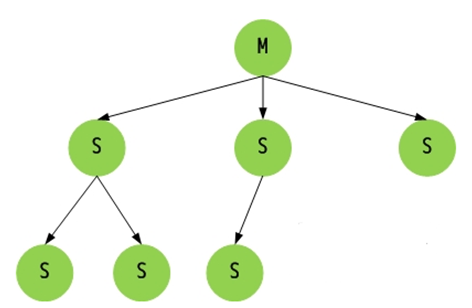
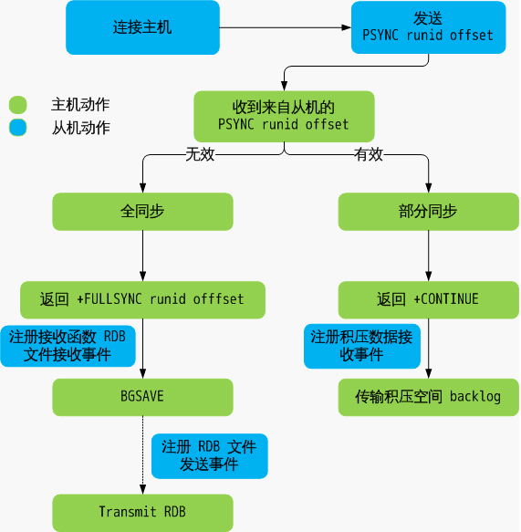

##### [原文](http://xiaorui.cc/2016/05/15/%E6%8E%A2%E7%B4%A2mysql%E5%92%8Credis%E4%B8%BB%E4%BB%8E%E5%A4%8D%E5%88%B6%E7%9A%84%E5%AE%9E%E7%8E%B0%E5%8E%9F%E7%90%86/)

# redis主从复制的实现原理


## 配置主从复制
为了拓展 Redis 的读性能，通常我们可以为一个master实例增加一个或多个slave实例，这就是主从复制。
另一方面，主从复制提供了数据冗余，这在一定程度上提高了 Redis 的可用性，
例如，当master实例发生故障时，我们可以将其中一个slave实例提升为master，从而继续保证 Redis 的可用性。

设置主从复制很简单，只需要在slave实例的配置文件加入一行，然后重启slave实例：
```xml
   # /etc/redis/redis.conf
   slaveof your_redis_master_ip 6379
```

## 主从复制的原理

### Redis主从同步：

Redis的同步分为`全部同步`及`部分同步`。

当我们redis slave客户端连接redis master的时候，master会判断slave是`否为第一次同步`,
redis master后面不单单是靠`IP及PORT`识别用户，更主要的是通过slave提交的`runid`标志来识别客户端。 

如果判定为第一次同步，master首先会`注册一个监听器`，这个监听器主要用来收集用户的命令。
这些命令放在一个叫`积压空间`的数据结构里，之后再`fork一个子进程`调用`bgsave函数`进行`RDB快照`。 

fork子进程的速度是很快的，因为是cow 写实拷贝，意思就是说，子进程只是复制父进程的页表，然后物理内存页帧是一样的。 
当父进程 或者 子进程要修改数据的时候，内核才会copy数据到独立的页帧。 

如果判定为不是第一次同步，那么客户端会根据你的`offset偏移量`**返回数据**。  但是这里也是有个判断条件的，
如果slave长期没有连接master，他的next offset在我的环形队列中早已经没有，那么你走的还是RDB得那个流程。 
反之你的`offset`在我的记录中，那么我会返回命令可以。 

假设你当前的偏移量为200， 如果主服务器又执行了命令 SET blog xiaorui.cc （协议格式的长度为 33 字节），
将自己的复制偏移量更新到了 233 ， 并尝试向从服务器c传播这条指令。 但这条命令却因为网络故障而在传播的途中丢失，
那么主从服务器之间的复制偏移量就会出现不一致： 主服务器的复制偏移量会被更新为 233 ， 而从服务器的复制偏移量仍然为 200。

## 这主从之间的数据不同步怎么办?   
这问题不大，因为slave每次做同步的时候都会拿着自己上次的offset。 这时候master记着你是233，但这时候你居然提交了200.   
那master会顺从slave的意思，你要啥就给你啥。 

在redis里面创建主从特别的容易，创建主—> 从—>从 关系也是相当的容易。

对于redis来说，你只要发送`sync指令`，我就可以根据你的`offset状态`来发送数据。  


下面就是redis的Master Slave同步的流程图. 




