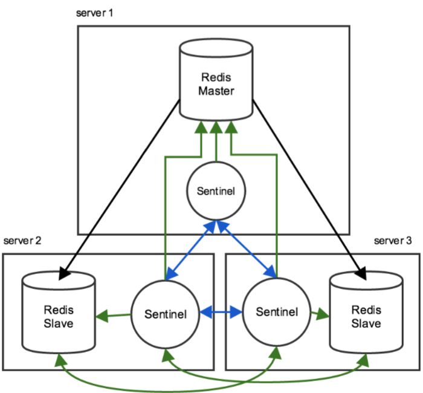
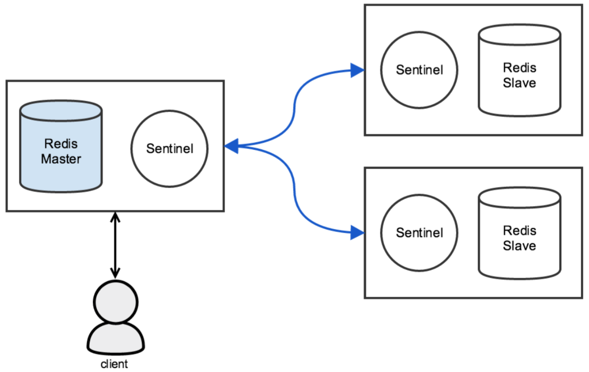
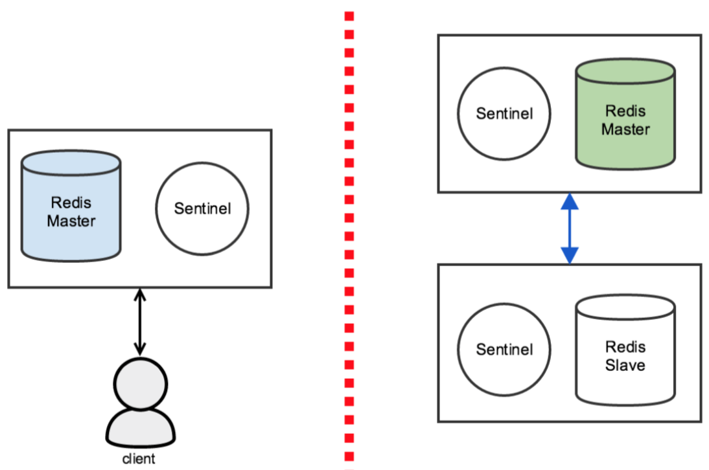

## [原文](http://senlinzhan.github.io/2017/04/08/redis-sentinel/)

# Redis Sentinel 与高可用

## Redis 的高可用
　　使用 Redis Sentinel 可以提高 Redis 的可用性，譬如说，当 Redis 开启了主从复制功能之后，如果 master 实例发生故障，
那么 Sentinel 可以做到自动的故障转移(failover)：当 master 实例故障时，
它的其中一个 slave 实例会自动提升成为新的 master 实例，同时其它的 slave 会重新指向这个新的 master 实例。

　　对于一个健壮的系统来说，通常至少需要三个 Sentinel 实例，譬如说，如果拥有一个 master 实例和两个 slave 实例，
那么经常使用的架构是这样的，即三台服务器上面各自运行一个 Redis 实例和一个 Sentinel 进程：




　　在 Sentinel 的配置文件中只需要指定 master 实例的信息，而无需指定 slave 实例的信息，
因为 Sentinel 会自动发现 slave 实例：
```xml
# /etc/redis/sentinel.conf
sentinel monitor mymaster 127.0.0.1 6379 2
sentinel down-after-milliseconds mymaster 60000
sentinel failover-timeout mymaster 180000
sentinel parallel-syncs mymaster 1
```

## 关于一致性的反思
　　尽管 Sentinel 为 Redis 提供了高可用性，但在网络分区(Network Partition)的情况下，Sentinel 却无法保证强一致性。
譬如说，在网络分区之前，我们有一个 master 实例和两个 slave 实例，并且 client 正在向 master 实例写入数据：



　　如果这时候网络出现故障，导致 master 实例与两个 slave 实例均断开连接，但两个 slave 实例之间仍保持通信。
这时候其中一个 slave 实例将被提升成为新的 master 实例：


　　假设一段时间之后，网络恢复了。这时候旧的 master 实例将成为新的 master 实例的 slave。那么，我们可以发现，
从网络故障到网络恢复这段时间内，client 向旧的 master 实例写入的全部数据都会丢失。
这也说明了在网络分区的情况下， Sentinel 无法保证强一致性。