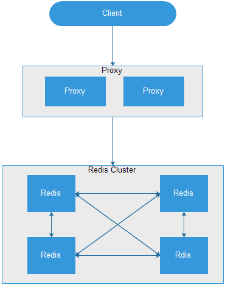
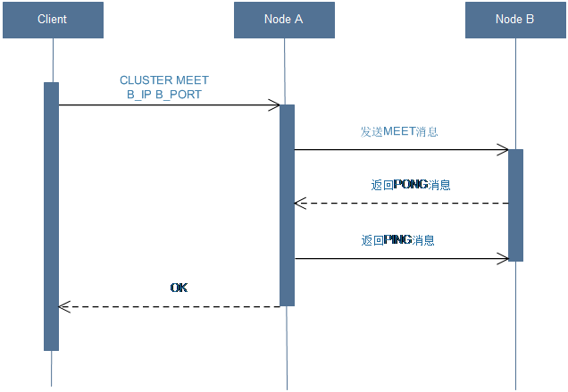
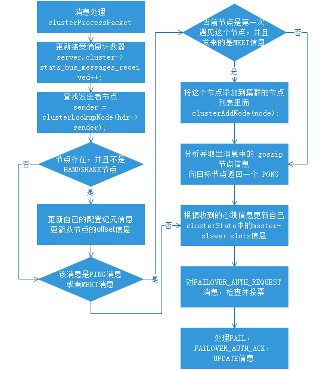
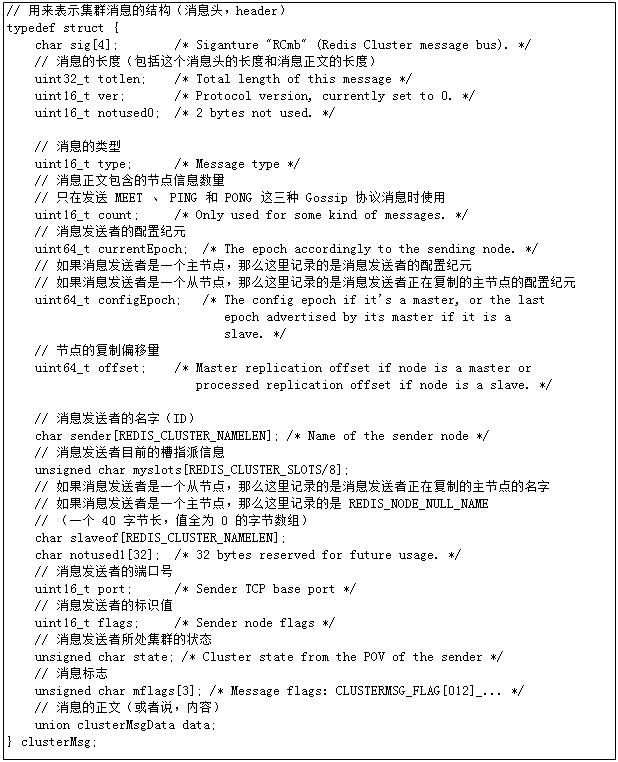
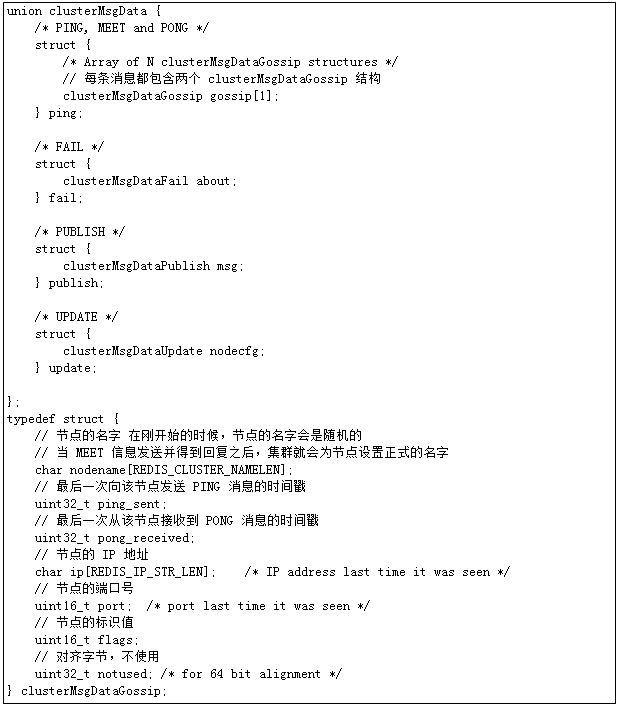
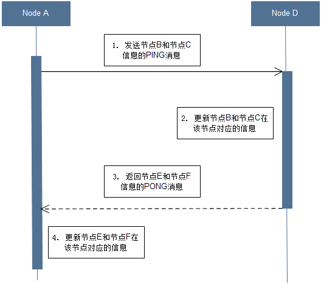
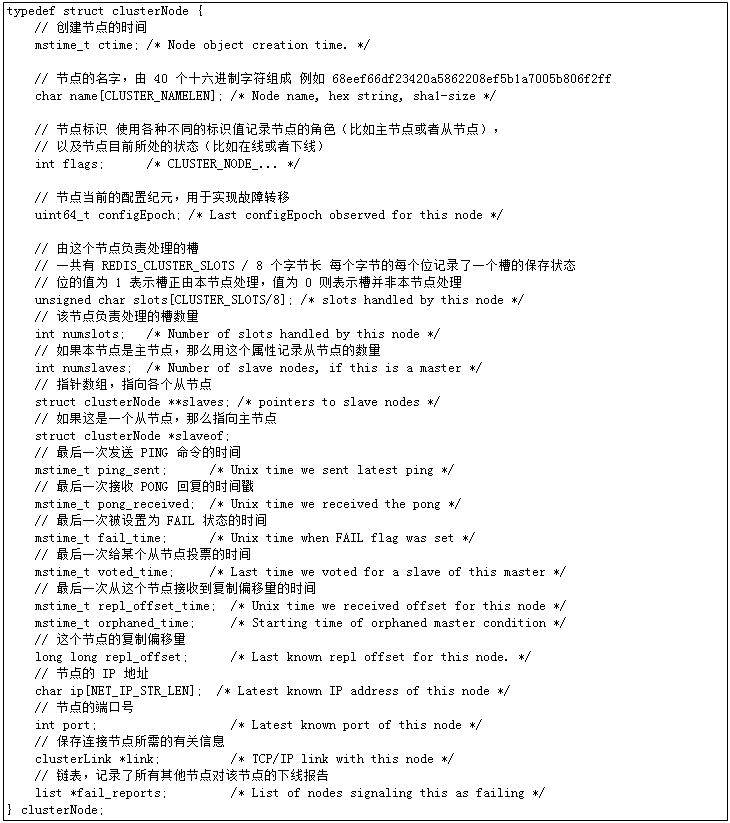
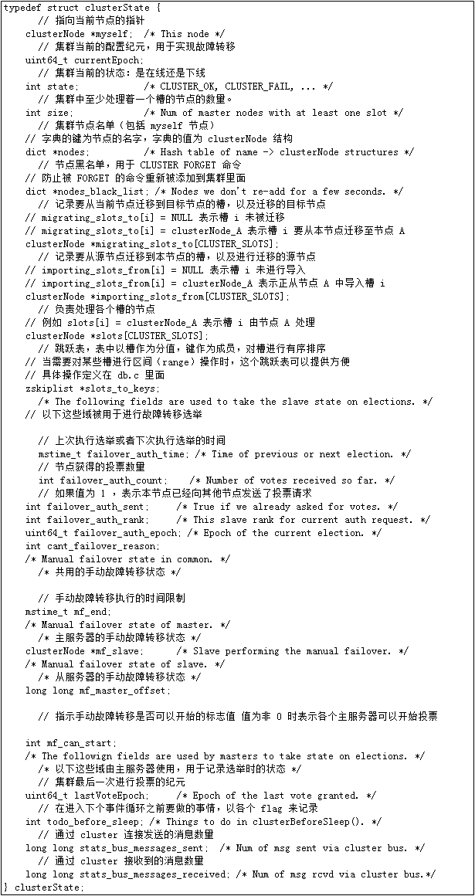
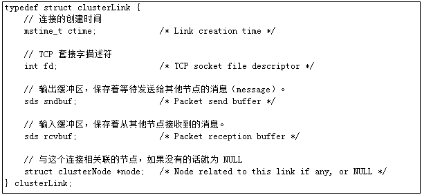
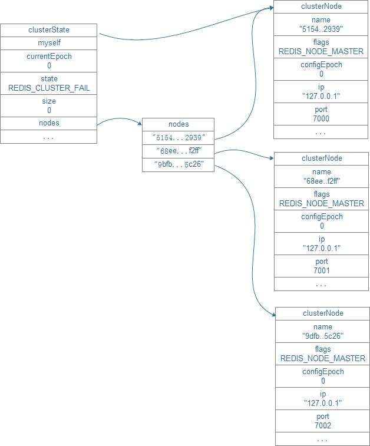

##[原文](https://www.jianshu.com/p/0232236688c1)

> 槽（slot）

# 集群通信

Redis Cluster是一个高性能高可用的分布式系统。由多个Redis实例组成的整体，
数据按照Slot存储分布在多个Redis实例上，通过Gossip协议来进行节点之间通信。

Redis Cluster功能特点如下：

1) 所有的节点相互连接

2) 集群消息通信通过集群总线通信，集群总线端口大小为客户端服务端口+10000，这个10000是固定值

3) 节点与节点之间通过二进制协议进行通信

4) 客户端和集群节点之间通信和通常一样，通过文本协议进行

5) 集群节点不会代理查询

6) 数据按照Slot存储分布在多个Redis实例上

7) 集群节点挂掉会自动故障转移

8) 可以相对平滑扩/缩容节点

 
## 2.1 CLUSTER MEET

需要组建一个真正的可工作的集群，我们必须将各个独立的节点连接起来，构成一个包含多个节点的集群。
连接各个节点的工作使用CLUSTER MEET命令来完成。

> CLUSTER MEET <ip> <port>

### CLUSTER MEET命令实现：
1) 节点A会为节点B创建一个clusterNode结构，并将该结构添加到自己的clusterState.nodes字典里面。

2) 节点A根据CLUSTER MEET命令给定的IP地址和端口号，向节点B发送一条MEET消息。

3) 节点B接收到节点A发送的MEET消息，节点B会为节点A创建一个clusterNode结构，并将该结构添加到自己的clusterState.nodes字典里面。

4) 节点B向节点A返回一条PONG消息。

5) 节点A将受到节点B返回的PONG消息，通过这条PONG消息节点A可以知道节点B已经成功的接收了自己发送的MEET消息。

6) 之后，节点A将向节点B返回一条PING消息。

7) 节点B将接收到的节点A返回的PING消息，通过这条PING消息节点B可以知道节点A已经成功的接收到了自己返回的PONG消息，握手完成。

8) 之后，节点A会将节点B的信息通过Gossip协议传播给集群中的其他节点，让其他节点也与节点B进行握手，
最终，经过一段时间后，节点B会被集群中的所有节点认识。

## 2.2 集群消息处理clusterProcessPacket

1) 更新接收消息计数器

2) 查找发送者节点并且不是handshake节点

3) 更新自己的epoch和slave的offset信息

4) 处理MEET消息，使加入集群

5) 从gossip中发现未知节点，发起handshake

6) 对PING，MEET回复PONG

7) 根据收到的心跳信息更新自己clusterState中的master-slave，slots信息

8) 对FAILOVER_AUTH_REQUEST消息，检查并投票

9) 处理FAIL，FAILOVER_AUTH_ACK，UPDATE信息

## 2.3定时任务clusterCron

定时任务clusterCron

1) 对handshake节点建立Link，发送Ping或Meet

2) 向随机几点发送Ping

3) 如果是从查看是否需要做Failover(故障转移)

4) 统计并决定是否进行slave的迁移，来平衡不同master的slave数

5) 判断所有pfail报告数是否过半数

## 2.4 心跳数据

发送消息头信息Header

1) 所负责slots的信息

2) 主从信息

3) ip port信息

4) 状态信息

发送其他节点Gossip信息

1) ping_sent, pong_received

2) ip, port信息

3) 状态信息，比如发送者认为该节点已经不可达，会在状态信息中标记其为PFAIL或FAIL

clusterMsg结构的currentEpoch、sender、myslots等属性记录了发送者自身的节点信息，接收者会根据这些信息，
在自己的clusterState.nodes字典里找到发送者对应的clusterNode结构，并对结构进行更新。

Redis集群中的各个节点通过Gossip协议来交换各自关于不同节点的状态信息，其中Gossip协议由MEET、PING、PONG三种消息实现，
这三种消息的正文都由两个clusterMsgDataGossip结构组成。

每次发送MEET、PING、PONG消息时，
发送者都从自己的已知节点列表中随机选出两个节点(可以是主节点或者从节点),并将这两个被选中节点的信息分别保存到两个结构中。

当接收者收到消息时，接收者会访问消息正文中的两个结构，
并根据自己是否认识clusterMsgDataGossip结构中记录的被选中节点进行操作：

1. 如果被选中节点不存在于接收者的已知节点列表，那么说明接收者是第一次接触到被选中节点，
接收者将根据结构中记录的IP地址和端口号等信息，与被选择节点进行握手。

2. 如果被选中节点已经存在于接收者的已知节点列表，那么说明接收者之前已经与被选中节点进行过接触，
接收者将根据clusterMsgDataGossip结构记录的信息，对被选中节点对应的clusterNode结构进行更新。

## 2.5 数据结构

clusterNode结构保存了一个节点的当前状态，比如节点的创建时间，节点的名字，节点当前的配置纪元，节点的IP和地址，等等。

1) slots：位图，由当前clusterNode负责的slot为1

2) salve, slaveof：主从关系信息

3) ping_sent, pong_received：心跳包收发时间

4) clusterLink *link：节点间的连接

5) list *fail_reports：收到的节点不可达投票

clusterState结构记录了在当前节点的集群目前所处的状态。

1) myself：指针指向自己的clusterNode

2) currentEpoch：当前节点的最大epoch，可能在心跳包的处理中更新

3) nodes：当前节点记录的所有节点，为clusterNode指针数组

4) slots：slot与clusterNode指针映射关系

5) migrating_slots_to,importing_slots_from：记录slots的迁移信息

6) failover_auth_time,failover_auth_count,failover_auth_sent,failover_auth_rank,failover_auth_epoch：Failover相关信息

clusterLink结构保存了连接节点所需的有关信息，比如套接字描述符，输入缓冲区和输出缓冲区。

