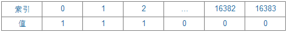
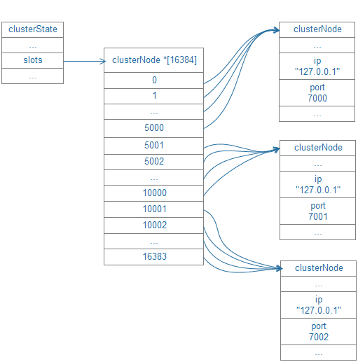
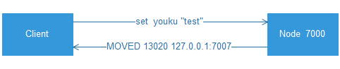

##[原文](https://www.jianshu.com/p/0232236688c1)

# 数据分布及槽信息

## 3.1 槽（slot）

概念Redis Cluster中有一个16384长度的槽的概念，他们的编号为0、1、2、3……16382、16383。这个槽是一个虚拟的槽，并不是真正存在的。
正常工作的时候，Redis Cluster中的每个Master节点都会负责一部分的槽，当有某个key被映射到某个Master负责的槽，
那么这个Master负责为这个key提供服务，至于哪个Master节点负责哪个槽，这是可以由用户指定的，
也可以在初始化的时候自动生成（redis-trib.rb脚本）。

这里值得一提的是，在Redis Cluster中，只有Master才拥有槽的所有权，如果是某个Master的slave，这个slave只负责槽的使用，但是没有所有权。

## 3.2 数据分片

在Redis Cluster中，拥有16384个slot，这个数是固定的，存储在Redis Cluster中的所有的键都会被映射到这些slot中。
数据库中的每个键都属于这16384个哈希槽的其中一个，集群使用公式CRC16(key) % 16384来计算键key属于哪个槽，
其中CRC16(key)语句用于计算键key的CRC16校验和。集群中的每个节点负责处理一部分哈希槽。

## 3.3 节点的槽指派信息

clusterNode结构的slots属性和numslot属性记录了节点负责处理那些槽：
```c
struct clusterNode {
    //…unsignedchar slots[16384/8];
};
```
Slots属性是一个二进制位数组(bitarray)，这个数组的长度为16384/8=2048个字节，共包含16384个二进制位。
Master节点用bit来标识对于某个槽自己是否拥有。比如对于编号为1的槽，Master只要判断序列的第二位（索引从0开始）是不是为1即可。时间复杂度为O（1）。



## 3.4 集群所有槽的指派信息

通过将所有槽的指派信息保存在clusterState.slots数组里面，程序要检查槽i是否已经被指派，又或者取得负责处理槽i的节点，
只需要访问clusterState.slots[i]的值即可，复杂度仅为O（1）。




## 3.5 请求重定向

由于每个节点只负责部分slot，以及slot可能从一个节点迁移到另一节点，造成客户端有可能会向错误的节点发起请求。
因此需要有一种机制来对其进行发现和修正，这就是请求重定向。

有两种不同的重定向场景：

### a) MOVED错误

1. 请求的key对应的槽不在该节点上，节点将查看自身内部所保存的哈希槽到节点ID的映射记录,节点回复一个MOVED错误。

2. 需要客户端进行再次重试。




### b)ASK错误

1. 请求的key对应的槽目前的状态属于MIGRATING状态，并且当前节点找不到这个key了，节点回复ASK错误。
ASK会把对应槽的IMPORTING节点返回给你，告诉你去IMPORTING的节点尝试找找。

2. 客户端进行重试首先发送ASKING命令，节点将为客户端设置一个一次性的标志（flag），使得 客户端可以执行一次针对IMPORTING状态的槽的命令请求，
然后再发送真正的命令请求。

3. 不必更新客户端所记录的槽至节点的映射。

