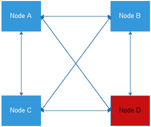
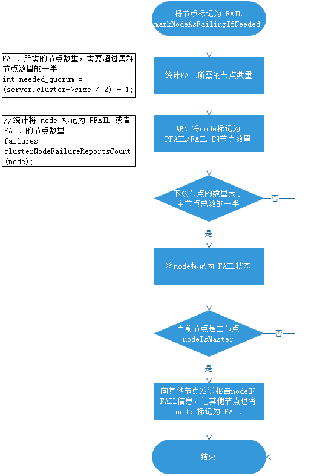

## [原文](https://www.jianshu.com/p/0232236688c1)

## [原文2](https://www.jianshu.com/p/8a2d810402a9)

# 通信故障及其选举

## 5.1故障检测
集群中的每个节点都会定期地向集群中的其他节点发送PING消息，以此交换各个节点状态信息，检测各个节点状态：在线状态、疑似下线状态PFAIL、已下线状态FAIL。



当主节点A通过消息得知主节点B认为主节点D进入了疑似下线(PFAIL)状态时,
主节点A会在自己的clusterState.nodes字典中找到主节点D所对应的clusterNode结构，
并将主节点B的下线报告(failure report)添加到clusterNode结构的fail_reports链表中
```c
struct clusterNode {//...//记录所有其他节点对该节点的下线报告list*fail_reports;//...};
```
每个下线报告由一个clusterNodeFailReport结构：
```c
struct clusterNodeFailReport{
//报告目标节点已经下线的节点structclusterNode *node;
//最后一次从node节点收到下线报告的时间mstime_ttime;}typedef clusterNodeFailReport;
```
如果集群里面，半数以上的主节点都将主节点D报告为疑似下线，那么主节点D将被标记为已下线(FAIL)状态，
将主节点D标记为已下线的节点会向集群广播主节点D的FAIL消息，所有收到FAIL消息的节点都会立即更新nodes里面主节点D状态标记为已下线。

将node标记为FAIL需要满足以下两个条件：

1. 有半数以上的主节点将node标记为PFAIL状态。
2. 当前节点也将node标记为PFAIL状态。



## 5.2多个从节点选主
选新主的过程基于Raft协议选举方式来实现的

1. 当从节点发现自己的主节点进行已下线状态时，从节点会广播一条CLUSTERMSG_TYPE_FAILOVER_AUTH_REQUEST消息，
要求所有收到这条消息，并且具有投票权的主节点向这个从节点投票

2. 如果一个主节点具有投票权，并且这个主节点尚未投票给其他从节点，那么主节点将向要求投票的从节点返回一条，
CLUSTERMSG_TYPE_FAILOVER_AUTH_ACK消息，表示这个主节点支持从节点成为新的主节点

3. 每个参与选举的从节点都会接收CLUSTERMSG_TYPE_FAILOVER_AUTH_ACK消息,
并根据自己收到了多少条这种消息来统计自己获得了多少主节点的支持

4. 如果集群里有N个具有投票权的主节点，那么当一个从节点收集到大于等于集群N/2+1张支持票时，这个从节点就成为新的主节点

5. 如果在一个配置纪元没有从能够收集到足够的支持票数，那么集群进入一个新的配置纪元，并再次进行选主，直到选出新的主节点为止


## 5.3 Slave排序
   
- 一旦一个master处于FAIL状态，一个slave会在尝试选举前等待一小段时间。等待的时间按照如下公式计算：
> DELAY = 500 milliseconds + random delay between 0 and 500 milliseconds + SLAVE_RANK * 1000 milliseconds

- 固定的DELAY用来保证FAIL状态扩散到整个集群，否则slave可能会在多数master不知道该FAIL时请求选举并被拒绝投票。

- 随机的DELAY用来使slave之间异步，避免在同一时间同时发起选举。

- SLAVE_RANK是该slave针对它从master获得的备份数据的总量的排序。
在master失败之后，slave之间通过交换消息来创建一个（最大努力）排序：拥有最新备份offset的slave获得排序0，
第二个更新为1，以此类推。这样最新的slave会尝试最先开始选举。

- 排序的顺序并没有严格强制。如果一个拥有最高排序的slave再选剧终失败了，其他slave会很快进行重试。

- 一旦某个slave赢得了选举，它就获得了一个新的唯一的递增的configEPoch，
这个configEpoch会比所有其他现存的master更大。它会在ping和pong包中作为master广播自己，
同时提供自己的服务slot和比之前的master更大的configEpoch。

- 为了加速重配置，新master会向集群内所有节点直接发送pong包。

- 当前不可达的节点，最终也将会被重新配置，比如它重新连接后接收到了其他节点发来的ping和pong包，
或者通过它自己发送的心跳包被其他节点检测到已过期并回复了UPDATE包之后。

- 其他节点会检测到有一个新的master服务于之前master相同的slots，但是拥有一个更大的configEpoch，
之后它们会更新自己的配置。旧master的其他slave（包括重新接入的旧master自己），不但会更新配置，
而且会重新从新的master同步所有数据。


## 5.4 Masters回复slave选举请求

- Master接收到slave的FAILOVER_AUTH_REQUEST后就会开始一次选举。

- 只有符合如下条件，master才会授予选票：

  - master针对每一个epoch只会投票一次，一旦投票后就会拒绝所有更小的epoch：每个master有一个lastVoteEpoch字段，
  并且会拒绝对currentEpoch小于该值的请求投票。一旦master对投票请求回复确认，lasterVoteEpoch就会同步更新并安全地保存到磁盘。

  - 只有当slave所属的master被标记为FAIL时，master才会投票给该slave

  - 如果一个FAIL_AUTH_REQUEST的cureentEpoch的值小于master的currentEpoch，那么该选举请求将被忽略。
  因此，master的回复总是与FAIL_AUTH_REQUEST拥有相同的currentEpoch。
  如果同样的slave再次请求选票，并增加了currentEpoch，这可以保证针对旧请求的DELAY的投票不会在新投票请求中被接受。

- 如果一个master在上一轮选举中投票过，那么它在NODE_TIMEOUT*2时间窗内，不会为该master的任意slave再次投票。
这不是严格的需求，因为两个slave不可能在一个相同的epoch中同时获胜。然而，在实践中，它保证了当一个slave被选举后，
它拥有足够的时间通知其他slave并避免其他slave赢得新一轮选举的可能性，否则这会造成有一次没有必要的failover。

- master不会做任何尝试来保证选出最好的slave。如果slave的master处于FAIL状态，
且master没有在当前的term(任期，代?)中投票过，那么它一定会将授予自己的投票。
最好的slave总是更可能启动一次选举并在其他slave之前赢得选举，因为由于它拥有更高的排名，它总是会先于其他slave发起选举。

- 当一个master拒绝为某个slave投票，那么它会简单地忽略该请求，而不会发出一个负面的响应。

- master不会投票给这样的slaves，它们发送的configEpoch小于master表中为slave宣称的slot服务的master的configEpoch。
记得之前提起过，slave发送的消息中使用它的master的configEpoch，以及它的master服务的slots。
这意味着请求选票的slave必须拥有它打算failover的master的slot配置，并且这个配置需要比授权选票的master更新或至少相等


## 5.4 故障转移

当从节点发现自己的主节点变为已下线(FAIL)状态时，便尝试进Failover，以期成为新的主。以下是故障转移的执行步骤：

1) 从下线主节点的所有从节点中选中一个从节点

2) 被选中的从节点执行SLAVEOF NO NOE命令，成为新的主节点

3) 新的主节点会撤销所有对已下线主节点的槽指派，并将这些槽全部指派给自己

4) 新的主节点对集群进行广播PONG消息，告知其他节点已经成为新的主节点

5) 新的主节点开始接收和处理槽相关的请求


 