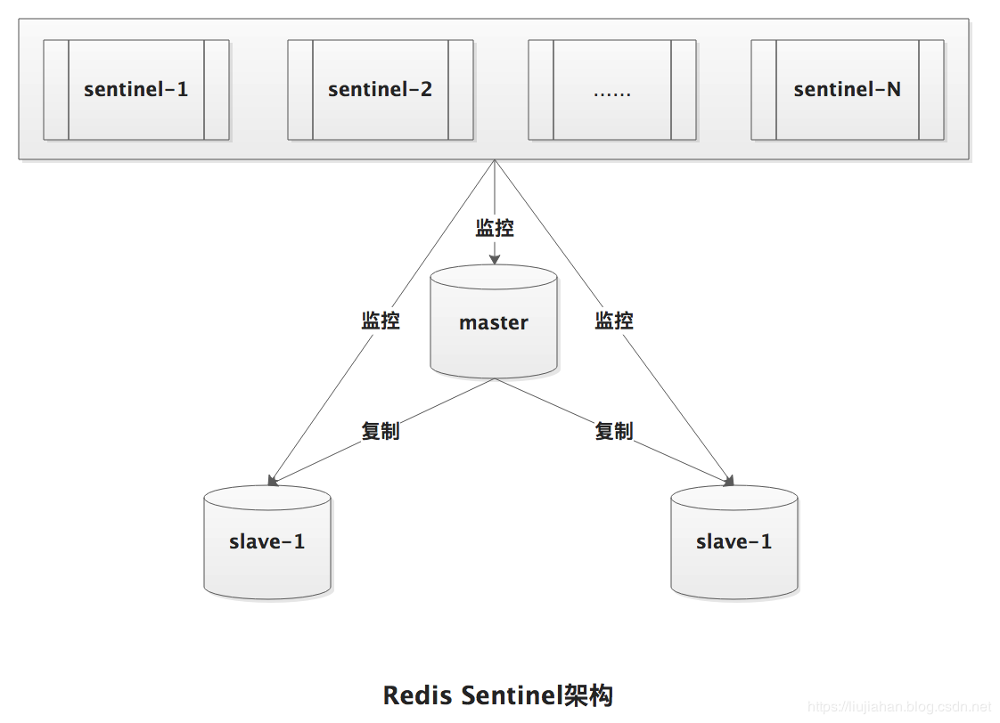
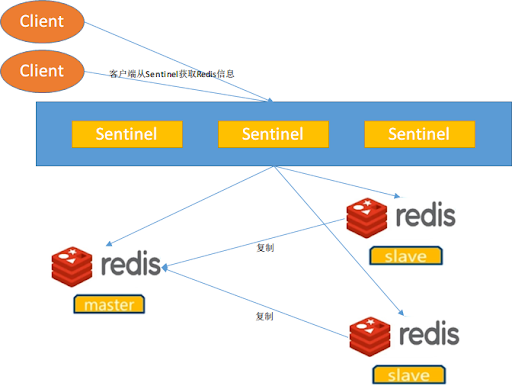
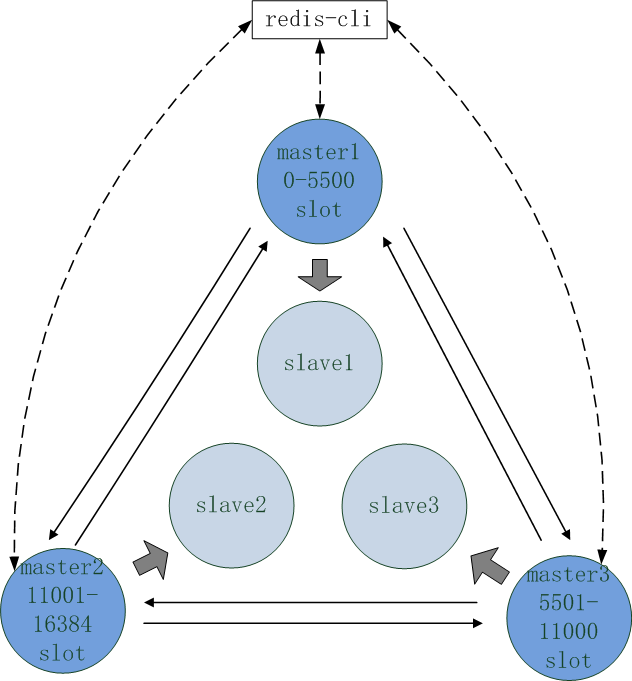

## [原文1](https://phachon.com/redis/redis-1.html)

## [原文2](http://kwin.xyz/passages/Tools/Redis/Redis-Sentinel/)

# redis三种集群模式

我们常用sharding技术来对此进行管理，其集群模式主要有以下几种方式：

- 主从复制
- 哨兵模式
- Redis官方 Cluster集群模式（服务端sharding）

- Jedis sharding集群（客户端sharding）
- 利用中间件代理

主要看这三种集群模式， 主从复制 、哨兵机制 、cluster   

## 1. 主从复制

### 什么是主从同步 
简单来说，主从同步 就是指以一个主节点作为基准节点，将数据同步给从节点，使得主从节点的数据保持一致。
这里的主节点一般也称为 Master 节点，从节点一般也叫做 Slave 节点。一个 Master 节点可以

拥有多个 Slave 节点。这种架构就叫做 一主多从 的主从架构。如果每一个 Slave 节点也作为基准节点，
同时也拥有多个 Slave 节点，那么这中架构就叫做 级联结构的主从架构。本篇文章仅研究 一主多从主从架构。

### Redis 主从同步 架构

一主多从&级联结构图

通过redis的复制功能可以很好的实现数据库的读写分离，提高服务器的负载能力。
主数据库主要进行写操作，而从数据库负责读操作。

> 我们不难看出Redis在主从模式下，必须保证主节点不会宕机——一旦主节点宕机，
其它节点不会竞争称为主节点，此时，Redis将丧失写的能力。这点在生产环境中，是致命的

一旦主节点宕机，从节点晋升成主节点，同时需要修改应用方的主节点地址，还需要命令所有从节点去复制新的主节点，
`整个过程需要人工干预`。

### 主从复制问题
- 手动故障转移
- 写能力和存储能力受限

### Redis 主从同步的优缺点
优点
- 同一个 Master 可以部署多个 Slave
- Slave 还可以接受其他的 Slave 的连接和同步，即所谓的 级联结构。有效的减轻 Master 的压力
- 主从同步期间，主从节点均是非阻塞。不影响服务的查询和写入
- 可以很好的实现读写分离的架构，系统的伸缩性得到提高

缺点
- 主机的宕机会非常严重，导致整个数据不一致的问题。
- 全量的复制的过程中，必须保证主节点必须有足够的内存。若快照的文件过大，还会对集群的服务能力产生影响。

## 实现原理

[redis集群模式之-主从复制](../30、原理知识点/07、redis集群模式之-主从复制.md)

## 2. 哨兵机制

sentinel是一个独立于redis之外的进程，不对外提供key/value服务，
在redis的安装目录下名称叫redis-sentinel。主要用来`监控redis-server`进程，进行`master/slave管理`

> 当采用 Master-Slave 的高可用方案时候，如果 Master 宕机之后，`想自动切换`，可以`考虑使用哨兵模式`。
哨兵模式其实是在主从模式的基础上工作的。

###  什么是哨兵模式(Redis Sentinel)

Redis Sentinel是一个分布式架构，包含若干个Sentinel节点和Redis数据节点，
每个Sentinel节点会对数据节点和其余Sentinel节点进行监控，当发现节点不可达时，会对节点做下线标识。

如果被标识的是主节点，他还会选择和其他Sentinel节点进行“协商”，当大多数的Sentinel节点都认为主节点不可达时，
他们会选举出一个Sentinel节点来完成自动故障转移工作，同时将这个变化通知给Redis应用方。
哨兵（Sentinel）模式下会启动多个哨兵进程。

### Redis Sentinel架构

客户端访问

 
### 哨兵进程的作用如下：
 
- 监控：能持续的监控 Redis 集群中主从节点的工作状态
- 通知：当被监控的节点出现问题之后，能通过 API 来通知系统管理员或其他程序
- 自动故障迁移(Automatic failover)：如果`发现主节点无法正常工作`，`哨兵进程将启动故障恢复机制把一个从节点提升为主节点`，
其他的从节点将会重新配置到新的主节点，并且应用程序会得到一个更换新地址的通知

### 哨兵机制简介

1）Sentinel(哨兵) 进程是用于监控 Redis 集群中 Master 主服务器工作的状态

2）在 Master 主服务器发生故障的时候，可以实现 Master 和 Slave 服务器的切换，保证系统的高可用（High Availability）

3）哨兵机制被集成在 Redis2.6+ 的版本中，到了2.8版本后就稳定下来了。

## 3. cluster
 
Redis Cluster 集群自身实现了高可用，并不需要借助哨兵，这完全是一个自治的过程。
### 为什么还要一个cluster呢
前面介绍了 redis sentinel，既然有了sentinel，`为什么还要一个cluster呢`？
因为随着业务量的增加，不可避免要对redis进行扩容，扩容方式一般由2种：`1. 垂直扩容 2. 水平扩容`

- 垂直扩容：`增加内存`方式来增加整个缓存系统容量。比如从2G增加到4G  
- 水平扩容：`通过增加节点`的方式来增加整个缓存系统的容量。 这种方式一般需要应用程序支持。  

垂直扩容比较方便，但是`受制于机制内存的限制`，一个机器不可能无限增大内存， 所以到了一定阶段肯定要进行水平扩容。
但是水平扩容，就会涉及到数据迁移。 而迁移过程中，一方面要`保持业务可用`，另一方面也要`尽量保证数据不丢失`。 但是 sentinel 在这方面
几乎没有作用。 针对这些问题，redis的作者就开发出了一个解决方案 redis cluster， 所以redis cluster就应运而生了。

## 实现原理

[redis集群模式之-哨兵模式(sentinel)](../30、原理知识点/08、redis集群模式之-哨兵模式(sentinel).md)

### cluster 简介
Redis Cluster是Redis官方出的一个分布式解决方案， 是在Redis3.0正式版推出的，有效解决了Redis在单机、并发、流量等方面的瓶颈。

Redis 集群是一个可以在多个 Redis 节点之间进行数据共享的设施（installation）。

Redis 集群不支持那些需要同时处理多个键的 Redis 命令， 因为执行这些命令需要在多个 Redis 节点之间移动数据， 
并且在高负载的情况下， 这些命令将降低 Redis 集群的性能， 并导致不可预测的行为。

Redis 集群通过分区（partition）来提供一定程度的可用性（availability）： 即使集群中有一部分节点失效或者无法进行通讯， 集群也可以继续处理命令请求。

Redis 集群提供了以下两个好处：

- 将数据自动切分（split）到多个节点的能力。
- 当集群中的一部分节点失效或者无法进行通讯时， 仍然可以继续处理命令请求的能力

优势

- 无中心架构
- 数据按照slot存储分布在多个节点，节点间数据共享，可动态调整数据分布
- 可扩展性，可线性扩展到1000个节点，节点可动态添加或删除
- 高可用性，部分节点不可用时，集群仍可用。通过增加Slave做standby数据副本，能够实现故障自动failover，
节点之间通过gossip协议交换状态信息，用投票机制完成Slave到Master的角色提升
- 降低运维成本，提高系统的扩展性和可用性

不足

- Client实现复杂，驱动要求实现Smart Client，缓存slots mapping信息并及时更新，提高了开发难度，客户端的不成熟影响业务的稳定性。
目前仅JedisCluster相对成熟，异常处理部分还不完善，比如常见的“max redirect exception”
- 节点会因为某些原因发生阻塞（阻塞时间大于clutser-node-timeout），被判断下线，这种failover是没有必要的
- 数据通过异步复制,不保证数据的强一致性
- 多个业务使用同一套集群时，无法根据统计区分冷热数据，资源隔离性较差，容易出现相互影响的情况
- Slave在集群中充当“冷备”，不能缓解读压力，当然可以通过SDK的合理设计来提高Slave资源的利用率

### Redis Cluster 架构

节点通信:
- Gossip协议
- meet消息  
用于通知新节点加入，消息发送这通知消息接收者加入集群，消息接收者回复pong消息，当新节点加入到集群后各节点就通过ping、pong消息进行信息交换。

## Redis Cluster提供的功能
- 数据自动分片
集群中每个节点都会负责一定数量的slot，每个key会映射到一个具体的slot，通过这种方式就可能找到key具体保存在哪个节点上了。

- 提供hash tags功能
通过hash tag功能可以将多个不同key映射到同一个slot上，这样就能够提供multi-key操作，
hash tag的使用的方式是在key中包含“{}”，这样只有在“{...}”中字串被用于hash计算。

- 自动失效转移和手动失效转移

- 减少硬件成本和运维成本

## 实现原理

[redis集群模式之-集群模式](../30、原理知识点/09、redis集群模式之-集群模式%20(cluster).md)
 