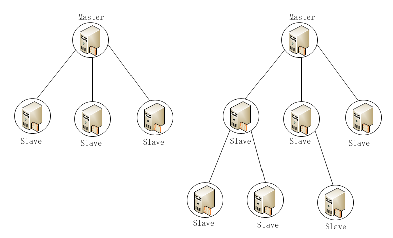
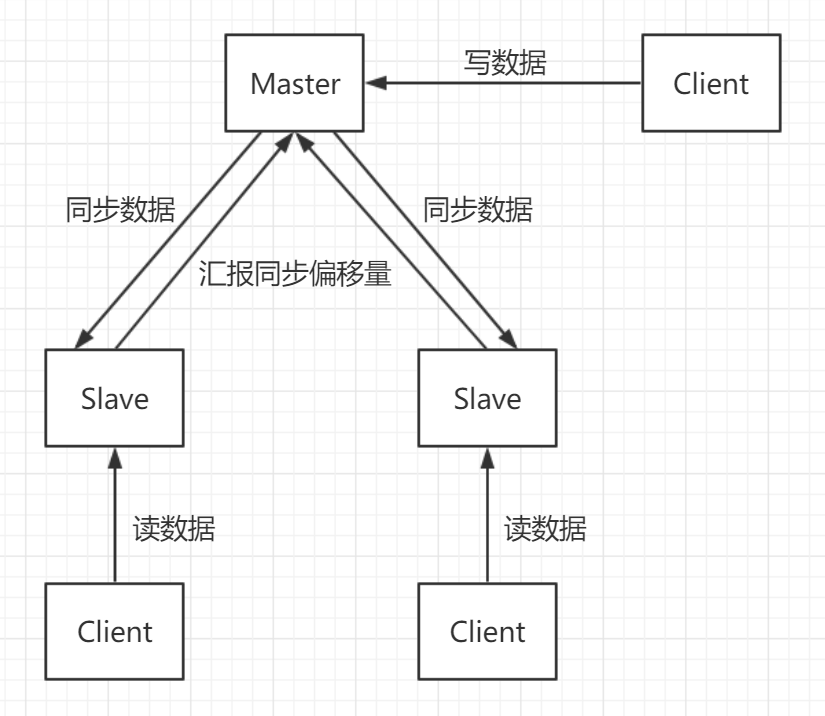

## [原文1](https://phachon.com/redis/redis-1.html)

## [原文2](https://phachon.com/redis/redis-1.html)

# redis三种集群模式

我们常用sharding技术来对此进行管理，其集群模式主要有以下几种方式：

- 主从复制
- 哨兵模式
- Redis官方 Cluster集群模式（服务端sharding）

- Jedis sharding集群（客户端sharding）
- 利用中间件代理

主要看这三种集群模式， 主从复制 、哨兵机制 、cluster   

## 1. 主从复制

### 什么是主从同步 
简单来说，主从同步 就是指以一个主节点作为基准节点，将数据同步给从节点，使得主从节点的数据保持一致。
这里的主节点一般也称为 Master 节点，从节点一般也叫做 Slave 节点。一个 Master 节点可以

拥有多个 Slave 节点。这种架构就叫做 一主多从 的主从架构。如果每一个 Slave 节点也作为基准节点，
同时也拥有多个 Slave 节点，那么这中架构就叫做 级联结构的主从架构。本篇文章仅研究 一主多从主从架构。

一主多从&级联结构图

通过redis的复制功能可以很好的实现数据库的读写分离，提高服务器的负载能力。
主数据库主要进行写操作，而从数据库负责读操作。

### Redis 主从同步的优缺点
优点
- 同一个 Master 可以部署多个 Slave
- Slave 还可以接受其他的 Slave 的连接和同步，即所谓的 级联结构。有效的减轻 Master 的压力
- 主从同步期间，主从节点均是非阻塞。不影响服务的查询和写入
- 可以很好的实现读写分离的架构，系统的伸缩性得到提高

缺点
- 主机的宕机会非常严重，导致整个数据不一致的问题。
- 全量的复制的过程中，必须保证主节点必须有足够的内存。若快照的文件过大，还会对集群的服务能力产生影响。

## 2. 哨兵机制
###  什么是哨兵模式(Redis Sentinel)
 哨兵（Sentinel）模式下会启动多个哨兵进程，哨兵进程的作用如下：
 
- 监控：能持续的监控 Redis 集群中主从节点的工作状态
- 通知：当被监控的节点出现问题之后，能通过 API 来通知系统管理员或其他程序
-  自动故障处理：如果`发现主节点无法正常工作`，`哨兵进程将启动故障恢复机制把一个从节点提升为主节点`，
其他的从节点将会重新配置到新的主节点，并且应用程序会得到一个更换新地址的通知

## 3. cluster
 
