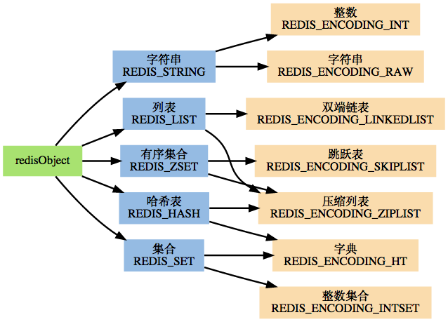

## [原文](https://www.cnblogs.com/chenpingzhao/p/5220498.html)

# redis中的数据类型

## 一、 Redis常用数据类型
Redis最为常用的数据类型主要有以下：

String

Hash

List

Set

Sorted set（zset）

一张图说明问题的本质

图一：



图二：


代码：
```c
/* Object types */
#define REDIS_STRING 0
#define REDIS_LIST 1
#define REDIS_SET 2
#define REDIS_ZSET 3
#define REDIS_HASH 4
  
/* Objects encoding. Some kind of objects like Strings and Hashes can be
 * internally represented in multiple ways. The 'encoding' field of the object
 * is set to one of this fields for this object. */
#define REDIS_ENCODING_RAW 0     /* Raw representation */
#define REDIS_ENCODING_INT 1     /* Encoded as integer */
#define REDIS_ENCODING_HT 2      /* Encoded as hash table */
#define REDIS_ENCODING_ZIPMAP 3  /* Encoded as zipmap */
#define REDIS_ENCODING_LINKEDLIST 4 /* Encoded as regular linked list */
#define REDIS_ENCODING_ZIPLIST 5 /* Encoded as ziplist */
#define REDIS_ENCODING_INTSET 6  /* Encoded as intset */
#define REDIS_ENCODING_SKIPLIST 7  /* Encoded as skiplist */
#define REDIS_ENCODING_EMBSTR 8  /* Embedded sds string encoding */
```
redisobject
```c
/* The actual Redis Object */
#define REDIS_LRU_BITS 24
#define REDIS_LRU_CLOCK_MAX ((1<<REDIS_LRU_BITS)-1) /* Max value of obj->lru */
#define REDIS_LRU_CLOCK_RESOLUTION 1000 /* LRU clock resolution in ms */
typedef struct redisObject {
    unsigned type:4;
    unsigned encoding:4;
    unsigned lru:REDIS_LRU_BITS; /* lru time (relative to server.lruclock) */
    int refcount;
    void *ptr;
} robj;
 
struct sdshdr {
    unsigned int len;
    unsigned int free;
    char buf[];
};
```
## 二、各种数据类型应用和实现方式
```c
robj *createObject(int type, void *ptr) {
    robj *o = zmalloc(sizeof(*o));
    o->type = type;   
    o->encoding = REDIS_ENCODING_RAW;
    o->ptr = ptr;
    o->refcount = 1;  
                  
    /* Set the LRU to the current lruclock (minutes resolution). */
    o->lru = LRU_CLOCK();
    return o;   
}
```
### 1、String
- 如果一个字符串保存的是整数值，并且这个整数值可以用long类型表示，那么字符串对象会把整数值保存到ptr所指的空间里，编码设为int

- 如果是普通字符串，并且长度大于39字节，使用redis自己实现的SDS类型

- 如果是普通字符串，并且长度小于等于39字节，采用embstr存储

```c
#define REDIS_ENCODING_EMBSTR_SIZE_LIMIT 39
robj *createStringObject(char *ptr, size_t len) {
    if (len <= REDIS_ENCODING_EMBSTR_SIZE_LIMIT)
        return createEmbeddedStringObject(ptr,len);
    else                  
        return createRawStringObject(ptr,len);
}
```
embstr 编码是专门用于保存短字符串的一种优化编码方式， 这种编码和 raw 编码一样， 
都使用 redisObject 结构和 sdshdr 结构来表示字符串对象， 
但 raw 编码会调用两次内存分配函数来分别创建 redisObject 结构和 sdshdr 结构， 
而 embstr 编码则通过调用一次内存分配函数来分配一块连续的空间， 空间中依次包含 redisObject 和 sdshdr 两个结构

应用场景：String是最常用的一种数据类型，普通的key/ value 存储都可以归为此类.即可以完全实现目前 Memcached 的功能，并且效率更高。
还可以享受Redis的定时持久化，操作日志及 Replication等功能。

除了提供与 Memcached 一样的get、set、incr、decr 等操作外，Redis还提供了下面一些操作：

- 获取字符串长度

- 往字符串append内容

- 设置和获取字符串的某一段内容

- 设置及获取字符串的某一位（bit）

- 批量设置一系列字符串的内容

```bash
127.0.0.1:6379> set name "This is a test"
OK
127.0.0.1:6379> get name
"This is a test"
```
### 2、Hash

默认使用 REDIS_ENCODING_ZIPLIST 编码， 当以下任何一个条件被满足时， 
程序将编码从 REDIS_ENCODING_ZIPLIST 切换为 REDIS_ENCODING_HT

- 哈希表中某个键或某个值的长度大于 server.hash_max_ziplist_value （默认值为 64 ）

- 压缩列表中的节点数量大于 server.hash_max_ziplist_entries （默认值为 512 ）

应用场景：在Memcached中，我们经常将一些结构化的信息打包成HashMap，在客户端序列化后存储为一个字符串的值，
比如用户的昵称、年龄、性别、积分等，这时候在需要修改其中某一项时，通常需要将所有值取出反序列化后，
修改某一项的值，再序列化存储回去。这样不仅增大了开销，也不适用于一些可能并发操作的场合（比如两个并发的操作都需要修改积分）。
而Redis的Hash结构可以使你像在数据库中Update一个属性一样只修改某一项属性值。

我们简单举个实例来描述下Hash的应用场景
```
比如我们要存储一个用户信息对象数据，包含以下信息：用户ID为查找的key，存储的value用户对象包含姓名，年龄，生日等信息，
如果用普通的key/value结构来存储，主要有以下2种存储方式：

第一种方式将用户ID作为查找key,把其他信息封装成一个对象以序列化的方式存储，这种方式的缺点是，增加了序列化/反序列化的开销，
并且在需要修改其中一项信息时，需要把整个对象取回，并且修改操作需要对并发进行保护，引入CAS等复杂问题。

第二种方法是这个用户信息对象有多少成员就存成多少个key-value对儿，用用户ID+对应属性的名称作为唯一标识来取得对应属性的值，
虽然省去了序列化开销和并发问题，但是用户ID为重复存储，如果存在大量这样的数据，内存浪费还是非常可观的。

那么Redis提供的Hash很好的解决了这个问题，Redis的Hash实际是内部存储的Value为一个HashMap，并提供了直接存取这个Map成员的接口

Key仍然是用户ID, value是一个Map，这个Map的key是成员的属性名，value是属性值，
这样对数据的修改和存取都可以直接通过其内部Map的Key(Redis里称内部Map的key为field), 
也就是通过 key(用户ID) + field(属性标签) 就可以操作对应属性数据了，既不需要重复存储数据，也不会带来序列化和并发修改控制的问题，很好的解决了问题。

这里同时需要注意，Redis提供了接口(hgetall)可以直接取到全部的属性数据,但是如果内部Map的成员很多，
那么涉及到遍历整个内部Map的操作，由于Redis单线程模型的缘故，这个遍历操作可能会比较耗时，而另其它客户端的请求完全不响应，这点需要格外注意。
```

```bash
127.0.0.1:6379> HMSET user:1 username root password 123456 score 100
OK
127.0.0.1:6379> hgetall user:1
1) "username"
2) "root"
3) "password"
4) "123456"
5) "score"
6) "100"
3、List
```
默认使用 REDIS_ENCODING_ZIPLIST 编码， 当以下任意一个条件被满足时， 列表会被转换成 REDIS_ENCODING_LINKEDLIST 编码

往列表新添加一个字符串值且这个字符串的长度超过 server.list_max_ziplist_value （默认值为 64 ）

ziplist 包含的节点超过 server.list_max_ziplist_entries （默认值为 512 ）

应用场景：Redis list的应用场景非常多，也是Redis最重要的数据结构之一，比如twitter的关注列表，
粉丝列表等都可以用Redis的list结构来实现。Lists 就是链表，相信略有数据结构知识的人都应该能理解其结构。
使用Lists结构，我们可以轻松地实现最新消息排行等功能。Lists的另一个应用就是消息队列，

可以利用Lists的PUSH操作，将任务存在Lists中，然后工作线程再用POP操作将任务取出进行执行。
Redis还提供了操作Lists中某一段的api，你可以直接查询，删除Lists中某一段的元素。

```bash
127.0.0.1:6379> lpush list mysql
(integer) 1
127.0.0.1:6379> lpush list mssql
(integer) 2
127.0.0.1:6379> lpush list oracle
(integer) 3
127.0.0.1:6379> lrange list 0 3
1) "oracle"
2) "mssql"
3) "mysql"
4、Set
```
如果第一个元素可以表示为 long long 类型值（也即是，它是一个整数）， 那么集合的初始编码为 REDIS_ENCODING_INTSET

否则集合的初始编码为 REDIS_ENCODING_HT

如果一个集合使用 REDIS_ENCODING_INTSET 编码， 那么当以下任何一个条件被满足时， 这个集合会被转换成 REDIS_ENCODING_HT 编码

intset 保存的整数值个数超过 server.set_max_intset_entries （默认值为 512 ）

试图往集合里添加一个新元素，并且这个元素不能被表示为 long long 类型（也即是，它不是一个整数）

应用场景：Redis set对外提供的功能与list类似是一个列表的功能，特殊之处在于set是可以自动排重的，
当你需要存储一个列表数据，又不希望出现重复数据时，set是一个很好的选择，
并且set提供了判断某个成员是否在一个set集合内的重要接口，这个也是list所不能提供的。

Sets 集合的概念就是一堆不重复值的组合。利用Redis提供的Sets数据结构，可以存储一些集合性的数据，
比如在微博应用中，可以将一个用户所有的关注人存在一个集合中，将其所有粉丝存在一个集合。
Redis还为集合提供了求交集、并集、差集等操作，可以非常方便的实现如共同关注、共同喜好、二度好友等功能，
对上面的所有集合操作，你还可以使用不同的命令选择将结果返回给客户端还是存集到一个新的集合中。

```bash
127.0.0.1:6379> sadd sets  redis
(integer) 1
127.0.0.1:6379> sadd sets mongodb
(integer) 1
127.0.0.1:6379> sadd sets hbase
(integer) 1
127.0.0.1:6379> smembers sets
1) "hbase"
2) "redis"
3) "mongodb"
5、Sorted Set
```
如果第一个元素符合以下条件的话， 就创建一个 REDIS_ENCODING_ZIPLIST 编码的有序集

服务器属性 server.zset_max_ziplist_entries 的值大于 0 （默认为 128 ），
元素的 member 长度小于服务器属性 server.zset_max_ziplist_value 的值（默认为 64 ）

否则，程序就创建一个 REDIS_ENCODING_SKIPLIST 编码的有序集
对于一个 REDIS_ENCODING_ZIPLIST 编码的有序集， 只要满足以下任一条件， 就将它转换为 REDIS_ENCODING_SKIPLIST 编码

ziplist 所保存的元素数量超过服务器属性 server.zset_max_ziplist_entries 的值（默认值为 128 ）

新添加元素的 member 的长度大于服务器属性 server.zset_max_ziplist_value 的值（默认值为 64 ）

使用场景：Redis sorted set的使用场景与set类似，区别是set不是自动有序的，
而sorted set可以通过用户额外提供一个优先级(score)的参数来为成员排序，并且是插入有序的，即自动排序。
当你需要一个有序的并且不重复的集合列表，那么可以选择sorted set数据结构，
比如twitter 的public timeline可以以发表时间作为score来存储，这样获取时就是自动按时间排好序的。

另外还可以用Sorted Sets来做带权重的队列，比如普通消息的score为1，重要消息的score为2，
然后工作线程可以选择按score的倒序来获取工作任务。让重要的任务优先执行。

```bash
127.0.0.1:6379> zadd ssets 0 redis
(integer) 1
127.0.0.1:6379> zadd ssets 0 mongodb
(integer) 1
127.0.0.1:6379> zadd ssets 0 hbase
(integer) 1
127.0.0.1:6379> zrangebyscore ssets 0 10
1) "hbase"
2) "mongodb"
3) "redis"
```

## 三、其他

### 1、Pub/Sub
Pub/Sub 从字面上理解就是发布（Publish）与订阅（Subscribe），在Redis中，你可以设定对某一个key值进行消息发布及消息订阅，
当一个key值上进行了消息发布后，所有订阅它的客户端都会收到相应的消息。这一功能最明显的用法就是用作实时消息系统，比如普通的即时聊天，群聊等功能

### 2、Transactions
谁说NoSQL都不支持事务，虽然Redis的Transactions提供的并不是严格的ACID的事务（比如一串用EXEC提交执行的命令，
在执行中服务器宕机，那么会有一部分命令执行了，剩下的没执行），
但是这个Transactions还是提供了基本的命令打包执行的功能（在服务器不出问题的情况下，可以保证一连串的命令是顺序在一起执行的，
中间有会有其它客户端命令插进来执行）。Redis还提供了一个Watch功能，你可以对一个key进行Watch，
然后再执行Transactions，在这过程中，如果这个Watched的值进行了修改，那么这个Transactions会发现并拒绝执行

