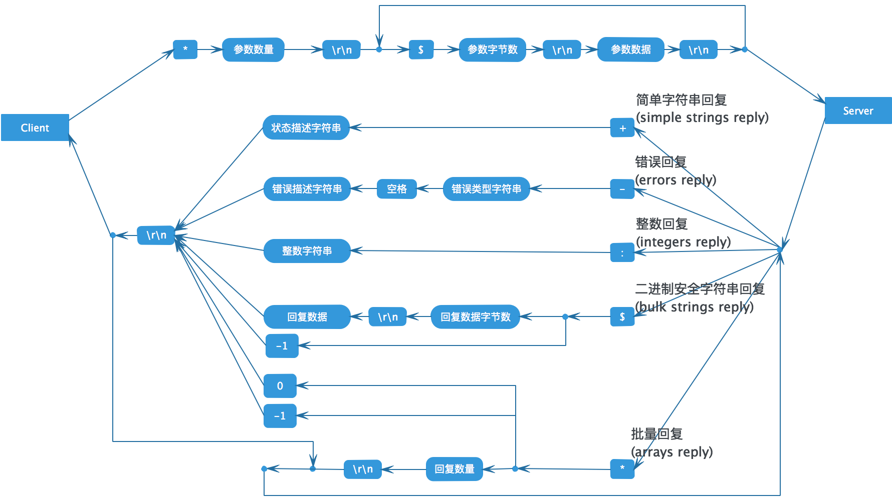

# [图解Redis通信协议](https://www.jianshu.com/p/f670dfc9409b)

Redis客户端和服务端之间使用一种名为`RESP(Redis Serialization Protocol)`的`二进制安全文本协议进行通信`。
RESP设计的十分精巧，下面是一张完备的协议描述图：




## 举个栗子
用SET命令来举例说明RESP协议的格式。
```bash
redis> SET mykey "Hello"
"OK"

```
实际发送的请求数据：

```bash
*3\r\n$3\r\nSET\r\n$5\r\nmykey\r\n$5\r\nHello\r\n

```
实际收到的响应数据：

```
+OK\r\n

```
每种命令对应的回复类型，可以查询Redis官网的命令列表Command reference。
更详细的协议说明请参考Redis官方协议规范Redis Protocol specification。

## 参考
[1] [通信协议(protocol)](http://redisdoc.com/topic/protocol.html)

[2] [Redis Protocol specification](https://redis.io/topics/protocol)
