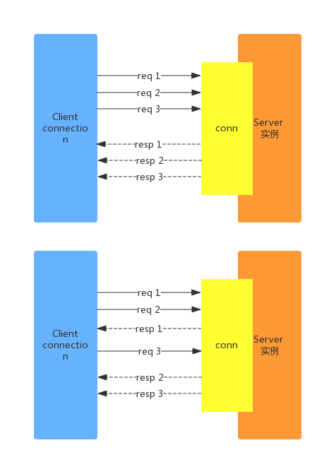
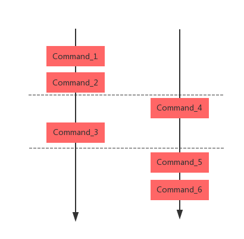
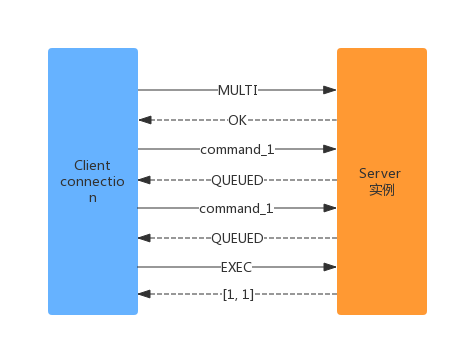

## [原文](http://moguhu.com/article/detail?articleId=104)

# Redis客户端与服务端交互详解

Redis实例运行在单独的进程中，应用系统（Redis客户端）通过Redis协议和Redis Server 进行交互。
在Redis 协议之上，客户端和服务端可以实现多种类型的交互模式：

1. 串行请求/响应模式、
2. 双工的请求/响应模式(pipeline)、
3. 原子化的批量请求/响应模式（事务）、
4. 发布/订阅模式、脚本化的批量执行（Lua脚本）。

## Redis协议

Redis的交互协议包含2 个部分：`网络模型和序列化协议`。前者讨论数据交互的组织方式，后者讨论数据本身如何序列化。

### 网络模型

Redis协议位于TCP之上，客户端和Redis实例保持双工的连接，如下图所示：


客户端和服务端交互的内容是序列化后的数据，服务器为每个客户端建立与之对应的连接，在应用层维护一系列状态保存在connection 中，
connection 间相互无关联。在Redis中，connection 通过redisClient 结构体实现。

### 序列化协议

客户端-服务端之间交互的是序列化后的协议数据。在Redis中，协议数据分为不同的类型，每种类型的数据均以CRLF（\r\n）结束，通过数据的首字符区分类型。

#### 1. inline command

这类数据表示Redis命令，首字符为Redis命令的字符，格式为 str1 str2 str3 ...。如：exists key1，命令和参数以空格分隔。

#### 2. simple string 

首字符为'+'，后续字符为string的内容，且该string 不能包含'\r'或者'\n'两个字符，最后以'\r\n'结束。
如：'+OK\r\n'，表示"OK"，这个string数据。

simple string 本身不包含转义，所以客户端的反序列化效率很高，直接将'+'和最后的'\r\n' 去掉即可。

#### 3. bulk string

对于string 本身包含了'\r'、'\n' 的情况，simple string 不再适用。通常可以使用的办法有：转义和长度自描述。
Redis采用了后者(长度自描述)，也就是 bulk string。

bulk string 首字符为'$'，紧跟着的是string数据的长度，'\r\n'后面是内容本身（包含'\r'、'\n'等特殊字符），最后以'\r\n'结束。如：
``` 
"$12\r\nhello\r\nworld\r\n"
```

上面字节串描述了 "hello\r\nworld" 的内容（中间有个换行）。对于" "空串和null，通过'$' 之后的数字进行区分：
```
"$0\r\n\r\n" 表示空串；

"$-1\r\n" 表示null。
```
#### 4. error

对于服务器返回的内容，客户端需要识别是成功还是失败。对于异常信息，在Redis中就是一个普通的string，
和simple string的表达的类似。唯一区别的就是首字符为'-'。客户端可以直接通过首字符'-'，就可以识别出成功还是失败。

例如："-ERR unknown command 'foobar'\r\n"，表示的是执行错误，和相关的描述信息。

有些客户端需要对不同种类的 error 信息做不同的处理，为了使得error 种类的区分更加快速，
在Redis 序列化协议之上，还包含简单的error 格式协议，以error 的种类开头，空格之后紧跟着error的信息。

#### 5. integer

以 ':' 开头，后面跟着整型内容，最后以'\r\n' 结尾。如：":13\r\n"，表示13的整数。

#### 6. array

以'*' 开头，紧跟着数组的长度，"\r\n" 之后是每个元素的序列化数据。
如："*2\r\n+abc\r\n:9\r\n" 表示一个长度为2的数组：["abc", 9]。

数组长度为0或 -1分别表示空数组或 null。

数组的元素本身也可以是数组，多级数组是树状结构，采用先序遍历的方式序列化。如：[[1, 2], ["abc"]]，
序列化为："*2\r\n*2\r\n:1\r\n:2\r\n*1\r\n+abc\r\n"。

#### 7. C/S 两端使用的协议数据类型

由客户端发送给服务器端的类型为：inline command、由 bulk string 组成的array。

由服务端发给客户端的类型为：除了 inline command之外的所有类型。并根据客户端命令或交互模式的不同进行确定，如：

请求/响应模式下，客户端发送的exists key1 命令，返回 integer 型数据。

发布/订阅模式下，往 channel 订阅者推送的消息，采用array 类型数据。

## 请求/响应模式

对于之前提到的数据结构，其基本操作都是通过请求/响应模式完成的。同一个连接上，请求/响应模式如下：

交互方向：客户端发送数据，服务端响应数据。

对应关系：每一个请求数据，有且仅有一个对应的响应数据。

时序：响应数据的发送发生在，服务器完全收到请求数据之后。


### 1. 串行化实现

串行化的实现方式比较简单，同一个connection在前一个命令执行完成之后，再发送第二个请求。如下图所示：


这种方式的弊端在于，每一个请求的发送都依赖于前一个响应。同一个connection 上面的吞吐量较低：

> 单连接吞吐量 = 1 / (2*网络延迟 + 服务器处理时间 + 客户端处理时间)

Redis 对于单个请求的处理时间（10几微秒）通常比局域网的延迟小1个数量级。
因此串行模式下，单连接的大部分时间都处于网络等待，没有充分利用服务器的处理能力。

### 2. pipeline实现

因为TCP是全双工的，请求响应穿插进行时，也不会引起混淆。此时批量的发送命令至服务器，在批量的获取响应数据，
可以极大的提高单连接的吞吐量。如下入所示：


上面就是pipeline 交互模式的穿插请求响应。pipeline 的实现取决于客户端，需要考虑一下几个方面：

通过批量发送还是异步化请求实现。

批量发送需要考虑每个批次的数据量，避免连接的buffer 满之后的死锁。

对使用者如何封装接口，使得pipiline 使用简单。

pileline 能达到的单连接每秒最高吞吐量为：

> (n - 2*网络延迟) / n*(服务器处理时间 + 客户端处理时间)

当n 无限大时，可以得到：

> 1 / (服务器处理时间 + 客户端处理时间)

此时可以看出，吞吐量上了一个数量级。

## 事务模式

上面介绍的pipeline 模式对于Redis 来说和普通的请求/响应模式没有太大的区别。当多个客户端时，
Server接到的交叉请求和pipeline 模式类似。如下图所示：



通常我们在开发时，需要将批量的命令原子化执行，Redis 中引入了事务模式，如下图所示：


- 1、入队/执行分离的事务原子性

客户端通过和Redis Server两阶段的交互做到了批量命令原子化的执行效果：

入队阶段：客户端发送请求到服务器，这些命令会被存放在Server端的conn的请求队列中。

执行阶段：发送完一个批次后，Redis 服务器一次执行队列中的所有请求。由于单实例使用单线程处理请求，因此不会存在并发的问题。

因为Redis执行器一次执行的粒度是“命令”，所以为了原子地执行批次命令，Redis引入了批量命令执行：EXEC。事务交互模式如下：



上图由MULTI命令开启事务，随后发送的请求都是暂存在Server conn的队列中，最后通过EXEC批量提交执行；并返回每一个命令执行的结果数组。

- 2、事务的一致性

当入队阶段出现语法错误时，不执行EXEC 也不会对数据产生影响；当EXEC 中有一条command 执行出错时，后续请求继续执行，
执行结果会在响应数组中体现，并且由客户端决定如何恢复，Redis 本身不包含回滚机制。

Redis 事务没有回滚机制，使得事务的实现大大简化，但是严格的将，Redis 事务并不是一致的。

- 3、事务的只读操作

批量请求在服务器端一次性执行，应用程序需要在入队阶段确定操作值。也就是说，每个请求的参数不能依赖上一次请求的执行结果。
由此看来，在事务操作中使用只读操作没有任何意义。

一个事务通常需要包含读操作，应用程序需要根据读取的结果决定后续的操作流程。但是在Redis中，事务中的读操作并无意义，如下所示：
```
100 <== get a  // 获取a 的值=100
100 <== get b  // 获取b 的值=100
OK  <== multi
QUEUED  <== set b 110
QUEUED  <== set a 90
[1, 1] <== exec  // 执行上述操作，并返回2次执行的结果
```
由此可以看出，在multi 之前的步骤如果a / b 的值发生了改变，此时数据就错了。

- 4、乐观锁的可串行化事务隔离

Redis可以通过watch 机制用乐观锁解决上述问题。

（1）将本次事务涉及的所有key 注册为观察者模式，此时逻辑时间为tstart。

（2）执行读操作。

（3）根据读操作的结果，组装写操作并发送到服务端入队。

（4）发送exec 尝试执行队列中的命令，此时逻辑时间为tcommit。

执行的结果有以下2种情况：

（4a）如果前面受观察的key，在tstart和tcommit 之间被修改过，那么exec 将直接失败，拒绝执行；

（4b）否则顺序执行请求队列中的所有请求。

Demo如下所示：
```
WATCH mykey

val = GET mykey
val = val + 1

MULTI
SET mykey $val
EXEC
```
上面需要注意一点的是，exec 无论执行成功与否，甚至是没执行，当conn断掉的时候，就会自动unwatch。
上述流程执行失败后，客户端通常的处理逻辑是重试，这也类似于JDK中提供的无锁自旋操作。

- 5、事务实现

事务的状态保存在redisClient中，通过2 个属性控制：
```c
typedef struct redisClient {
  ...
  int flags;
  multiState mstate;
  ...
} redisClient;
```

其中flags 包含多个bit，其中有2 个bit分别标记了：当前连接处于multi 和 exec 之间、当前watch 之后到现在它所观察的key 是否被修改过。
mstate 的结构如下：
```c
typedef struct multiState {
  multiCmd *commands;
  int count;
  ...
} multiState;
```
count 用来标记multi 到exec 之间总共有多少个待执行命令，同时commands 就是该连接的请求队列。

watch 机制通过维护redisDb 中的全局map 来实现：
```c
typedef struct redisDb {
  dict *dict;
  dict *expires;
  dict *blocking_keys;
  dict *ready_keys;
  dict *watched_keys;
  struct evictionPoolEntry * eviction_pool;
  int id;
  long long avg_ttl;
} redisDb;
```
map的键是被watch 的key，值是watch 这些key 的redisClient 指针的链表。

当redis 执行一个写命令时，它同时会对执行命令的key 在watched_keys 中找到对应的client，
并将client 的flag 对应位置设为：REDIS_DIRTY_CAS，client 执行exec 之前看到flag 有REDIS_DIRTY_CAS 标记，则拒绝执行。

事务的结束或者显示的unwatch 都会重置redisClient 中的REDIS_DIRTY_CAS 标记，并从redisDb 对应watched_keys 中的链表中删除。

- 6、事务交互模式

综上，conn 中的事务交互如下：

客户端发送4 类请求：监听相关（watch、unwatch）、读请求、写请求的批量执行（EXEC）或者放弃执行请求（DISCARD）、写请求的入队（MULTI 和 EXEC之间的命令）。

交互时序为：开启对keys 的监听-->只读操作-->MULTI请求-->根据前面只读操作的结果编排/参数赋值/入队写操作-->批量执行队列中的命令。

## 脚本模式

对于前面介绍的事务模式，Redis 需要做到如下的约束：

事务的读操作必须优先于写操作。

所有写操作不依赖于其他写操作。

使用乐观锁避免一致性问题，对相同key 并发访问频繁时，成功率较低。

然而Redis允许客户端向服务器提交一个脚本，脚本可以获取每次操作的结果，作为下次执行的入参。这使得服务器端的逻辑嵌入成为了可能，下面介绍一下脚本的交互。

1、脚本交互模式

客户端发送 eval lua_script_string 2 key1 key2 first second 给服务端。

服务端解析lua_script_string 并根据string 本身的内容通过sha1 计算出sha值，存放到redisServer对象的lua_scripts变量中。

服务端原子化的通过内置Lua环境执行 lua_script_string，脚本可能包含对Redis的方法调用如set 等。

执行完成之后将lua的结果转换成Redis类型返回给客户端。

2、script 特性

提交给服务端的脚本包含以下特性：

每一个提交到服务器的lua_script_string 都会在服务器的lua_script_map 中常驻，除非显示通过flush 命令清除。

script 在示例的主备间可通过script 重放和cmd 重放2 种方式实现复制。

前面执行过的script，后续可以通过直接通过sha指定，而不用再向服务器发送一遍script内容。

## 发布/订阅模式

上面几种交互模式都是由客户端主动触发，服务器端被动接收。Redis还有一种交互模式是一个客户端触发，
通过服务器中转，然后发送给多个客户端被动接收。这种模式称为发布/订阅模式。

1、发布/订阅交互模式

（1）角色关系

客户端分为发布者和订阅者2 中角色；

发布者和订阅者通过channel 关联。

（2）交互方向

发布者和Redis 服务端的交互模式仍为 请求/响应模式；

服务器向订阅者推送数据；

时序：推送发生在服务器接收到发布消息之后。

2、两类 channel

普通channel：订阅者通过subscribe/unsubscribe 将自己绑定/解绑到某个channel上；

pattern channel：订阅者通过psubscrige/punsubscribe 将自己绑定/解绑到某个 pattern channel上面，这个是模式匹配的channel，如下图所示：


上图中的customer-2 同时订阅了普通的channel abc 和pattern channel *bc。当producer-1 向channel abc 发送消息时，
除了abc 之外，pattern channel *bc 也会收到消息，然后再推送给分别的订阅者。

3、订阅关系的实现

channel 的订阅关系，维护在Redis 实例级别，独立于redisDb 的key-value 体系，由下面2 个成员变量维护：
```c
typedef struct redisServer {
  ...
  dict *pubsub_channels;
  list *pubsub_patterns;
  ...
};

```
pubsub_channels map 维护普通channel和订阅者的关系：key 是channel的名字，value是所有订阅者 client 的链表；

pubsub_patterns 维护 pattern channel 和订阅者的关系：链表的每个元素包含2部分（pattern channel 的名字和订阅它的client 指针）。

每当发布者向某个channel publish 一条消息时，redis 首先会从pubsub_channels 中找到对应的value，
向它的所有Client发送消息；同时遍历pubsub_patterns列表，向能够匹配到元素的client 发送消息。

普通/pattern channel的订阅关系增减仅在pubsub_channels / pubsub_patterns 独立进行，不做关联变更。
例如：向普通channel subscribe 一个订阅者时，不会同时修改pubsub_patterns。