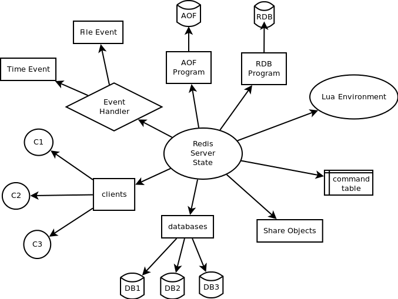

## [原文](https://my.oschina.net/lvhuizhenblog/blog/677705)

## [原文](https://www.zhihu.com/question/55818031)

# Redis 是单线程的，怎么实现的多个客户端的连接访问？

> 所谓服务端单线程应该这么理解，即多客户端并发连接的时候，服务器在同一个线程里处理这些请求。
但并不是说服务器自己只准开一个线程，有一些线程/进程去处理其他非连接任务也是完全合理的。

> 单线程指的是网络请求模块使用了一个线程，其他模块用了多个线程。
  可能因为用了异步IO模型，单线程的效率已经足够高了。
 
  
如图：单线程指的是网络请求模块使用了一个线程，其他模块用了多个线程。

我们首先要明白，[ Redis为什么这么快](../01、基础知识/80、Redis为什么这么快%3F.md)，
都是为了营造一个Redis很快的氛围！官方FAQ表示，因为Redis是基于内存的操作，CPU不是Redis的瓶颈，
Redis的瓶颈最有可能是机器内存的大小或者网络带宽。

既然单线程容易实现，而且CPU不会成为瓶颈，那就顺理成章地采用单线程的方案了（毕竟采用多线程会有很多麻烦！）。
 
可以参考：<https://redis.io/topics/faq>

看到这里，你可能会气哭！本以为会有什么重大的技术要点才使得Redis使用单线程就可以这么快，
没想到就是一句官方看似糊弄我们的回答！但是，我们已经可以很清楚的解释了为什么Redis这么快，
并且正是由于在单线程模式的情况下已经很快了，就没有必要在使用多线程了！

但是，我们使用单线程的方式是无法发挥多核CPU 性能，不过我们可以通过在单机开多个Redis 实例来完善！

警告1：这里我们一直在强调的单线程，只是在处理我们的网络请求的时候只有一个线程来处理，一个正式的Redis Server运行的时候肯定是不止一个线程的，
这里需要大家明确的注意一下！例如Redis进行持久化的时候会以子进程或者子线程的方式执行（具体是子线程还是子进程待读者深入研究）；
例如我在测试服务器上查看Redis进程，然后找到该进程下的线程：

ps命令的“-T”参数表示显示线程（Show threads, possibly with SPID column.）“SID”栏表示线程ID，而“CMD”栏则显示了线程名称。

警告2：在上图中FAQ中的最后一段，表述了从Redis 4.0版本开始会支持多线程的方式，但是，只是在某一些操作上进行多线程的操作！
所以该篇文章在以后的版本中是否还是单线程的方式需要读者考证！

 

