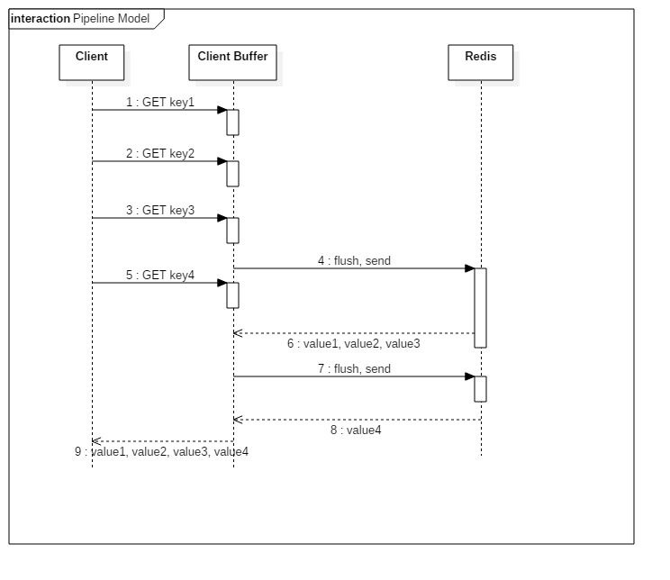

##### [原文](https://www.cnblogs.com/jabnih/p/7157921.html)

# Redis Pipeline原理分析

>  Pipeline: 客户端将执行的命令写入`到缓冲`中，最后由`exec命令`一次性发送给redis执行返回。
>> pipeline 的默认的同步的个数为`53个`，累加到53条数据时会把数据提交。
>
>  服务端通过`命令拆分`，`逐个`执行返回结果。

## 1. 基本原理
```
面试官：怎么快速删除10万个key?
某厂面试题：prod环境，如何快速删除10万个key？

答案：使用 pipeline
```

### 1.1 为什么会出现Pipeline

Redis客户端与redis-server交互通信，采用的TCP请求/响应模型，正常情况下，客户端发送一个命令，等待Redis应答，
Redis在接收到命令，处理后应答。在这种情况下，如果`同时需要执行大量的命令`，那就是等待上一条命令应答后再执行，
这中间不仅仅多了`RTT`（Round Time Trip：往返行程），而且还`频繁的调用系统IO`，发送网络请求。


为了`提升效率`，这时候Pipeline出现了，它允许客户端可以一次`发送多条命令`，而不等待上一条命令执行的结果，
这和网络的Nagel算法有点像（TCP_NODELAY选项）。不仅减少了RTT，同时也减少了IO调用次数（IO调用涉及到用户态到内核态之间的切换）。



客户端这边首先将执行的`命令写入到缓冲`中，最后再一次性发送Redis。但是有一种情况就是，`缓冲区的大小是有限制的`，
比如Jedis，限制为8192，超过了，`则刷缓存`，`发送到Redis`，但是不去处理Redis的应答，如上图所示那样。

### 1.2 实现原理
要支持Pipeline，其实既要`服务端的支持`，也要`客户端支持`。
对于服务端来说，所需要的是`能够处理一个客户端通过同一个TCP连接发来的多个命令`，可以理解为，这里将`多个命令切分`，
和处理单个命令一样（之前老生常谈的黏包现象），Redis就是这样处理的。
而客户端，则是要`将多个命令缓存起来`，`缓冲区满了就发送`，然后再写缓冲，最后才处理Redis的应答，如Jedis。

> 客户端将执行的命令写入到缓冲中，最后由exec命令一次性发送给redis执行返回。

pipeline `底层实现是队列`，队列的先进先出特性，保证了数据的顺序性。 
pipeline 的默认的同步的个数为`53个`，也就是说arges中累加到53条数据时会把数据提交。

### 1.3 从哪个方面提升性能
正如上面所说的，一个是RTT，`节省往返时间`，但是另一个原因也很重要，就是`IO系统调用`。一个read`系统调用`，`需要从用户态，切换到内核态`。

### 1.4 注意点
Redis的Pipeline和Transaction不同，`Transaction会存储客户端的命令`，最后一次性执行，
而Pipeline则是处理一条，响应一条，但是这里却有一点，就是客户端会并不会调用read去读取socket里面的缓冲数据，
这也就造就了，如果Redis应答的数据填满了该接收缓冲（SO_RECVBUF），
那么客户端会`通过ACK，WIN=0（接收窗口）来控制服务端不能再发送数据`，
那样子，数据就会缓冲在Redis的客户端应答列表里面。所以需要注意`控制Pipeline的大小`。如下图：


- pipeline“独占”connection，直到pipeline结束
pipeline期间将“`独占”connection`，此期间将不能进行非“管道”类型的其他操作，`直到pipeline关闭`；
如果你的pipeline的指令集很庞大，为了不干扰链接中的其他操作，你可以为pipeline操作新建Client连接，
让pipeline和其他正常操作分离在`2个client连接`中。

- 使用pipeline，如果发送的命令很多的话，建议对返回的结果加标签，当然这也会`增加使用的内存`；
> 打包的命令越多，缓存消耗内存也越多

### pipeline 的局限性
- pipeline 只能用于`执行连续且无相关性的命令`，当某个命令的生成需要依赖于前一个命令的返回时(或需要一起执行时)，
就无法使用 pipeline 了。通过 `脚本`（Scripting lua脚本）功能，可以规避这一局限性。

- 有些系统可能对`可靠性要求很高`，每次操作都需要立马知道这次操作是否成功，是否数据已经写进redis了，
如Redis实现分布式锁等，那这种场景就不适合了。

### pipeline与Redis事务(multi)

- multi：标记一个事务块的开始。 事务块内的多条命令会按照先后顺序被放进一个队列当中，最后由 EXEC 命令原子性(atomic)地执行。
- pipeline：客户端将执行的命令写入到缓冲中，最后由exec命令一次性发送给redis执行返回。

- multi 是redis服务端`一次性返回所有命令执行返回结果`。
- pipeline管道操作是需要客户端与服务端的支持，客户端将命令写入缓冲，最后再通过`exec命令`发送给服务端，
`服务端通过命令拆分`，`逐个执行返回结果`。

#### 两者的区别

- pipeline选择客户端缓冲，multi选择服务端队列缓冲；
- 请求次数的不一致，multi需要每个命令都发送一次给服务端，pipeline最后一次性发送给服务端，请求次数相对于multi减少
- multi/exec可以保证原子性，而pipeline不保证原子性
### 对pipeline的支持

- pipeline(管道)功能在命令行CLI`客户端redis-cli中没有提供`，也就是我们不能通过终端交互的方式使用pipeline；

- redis的客户端，如jedis，lettuce等都实现了对pipeline的支持。

## 2. Codis Pipeline
在一般情况下，都会在Redis前面使用一个代理，来作负载以及高可用。
这里在公司里面使用的是Codis，以Codis 3.2版本为例（3.2版本是支持Pipeline的）。

Codis在接收到客户端请求后，首先`根据Key来计算出一个hash，映射到对应slots`，然后转发请求到slots对应的Redis。
在这过程中，一个客户端的多个请求，有可能会对应多个Redis，这个时候就需要保证请求的有序性（不能乱序），
Codis采用了一个Tasks队列，将请求依次放入队列，然后loopWriter从里面取，如果Task请求没有应答，
则等待（这里和Java的Future是类似的）。内部BackenRedis是通过channel来进行通信的，
dispatcher将Request通过channel发送到BackenRedis，然后BackenRedis处理完该请求，则将值填充到该Request里面。
最后loopWriter等待到了值，则返回给客户端。如下图所示：


## 3. 总结
Pipeline减少了RTT，也减少了IO调用次数（IO调用涉及到用户态到内核态之间的切换）
`需要控制Pipeline的大小，否则会消耗Redis的内存`
Codis 3.2 Pipeline默认10K，3.1则是1024
Jedis客户端缓存是8192，超过该大小则刷新缓存，或者直接发送