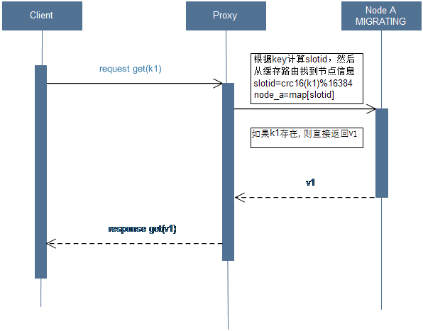
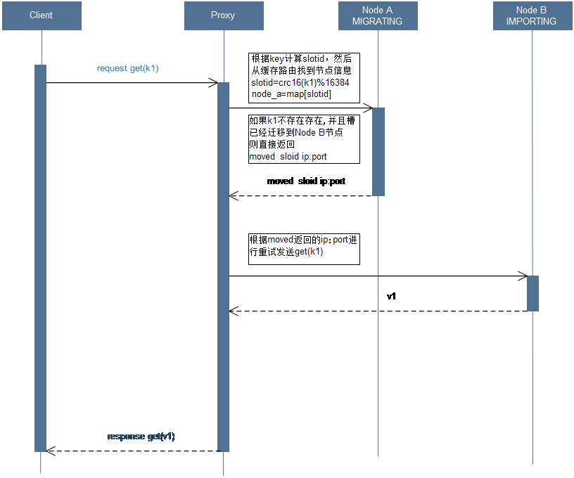
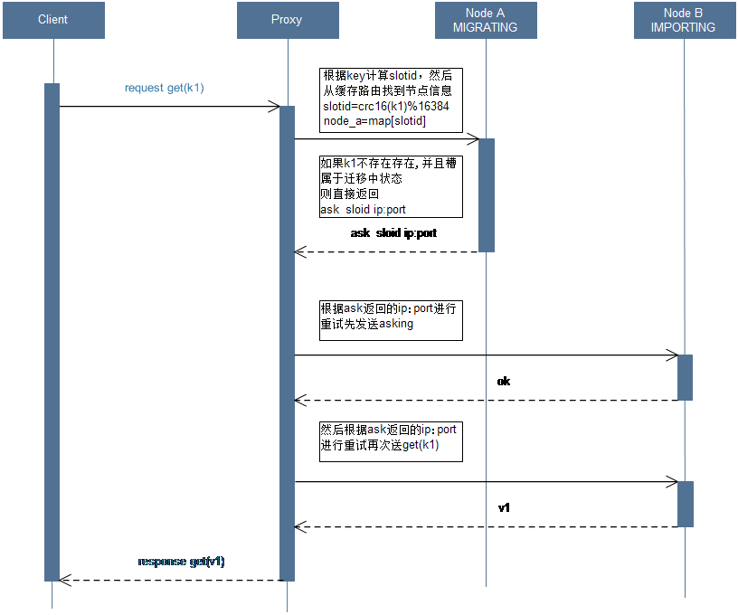

## [原文](https://www.jianshu.com/p/0232236688c1)

# 数据迁移

当槽x从Node A向Node B迁移时，Node A和Node B都会有这个槽x，Node A上槽x的状态设置为MIGRATING，
Node B上槽x的状态被设置为IMPORTING。

### MIGRATING状态

1) 如果key存在则成功处理

2) 如果key不存在，则返回客户端ASK，客户端根据ASK首先发送ASKING命令到目标节点，
然后发送请求的命令到目标节点

3) 当key包含多个命令    
   
   a) 如果都存在则成功处理    
         
   b) 如果都不存在，则返回客户端ASK  
             
   c) 如果一部分存在，则返回客户端TRYAGAIN，通知客户端稍后重试，
  这样当所有的key都迁移完毕的时候客户端重试请求的时候回得到ASK，然后经过一次重定向就可以获取这批键
  
4) 此时不刷新客户端中node的映射关系IMPORTING状态
   1) 如果key不在该节点上，会被MOVED重定向，刷新客户端中node的映射关系
   2) 如果是ASKING命令则命令会被执行，key不在迁移的节点已经被迁移到目标的节点
   3) Key不存在则新建
   
## 4.1读写请求

槽里面的key还未迁移，并且槽属于迁移中假如k1属于槽x，并且k1还在Node A

## 4.2 MOVED请求

槽里面的key已经迁移过去，并且槽属于迁移完假如k1属于槽x，并且k1不在Node A，而且槽x已经迁移到Node B

## 4.3 ASK请求

槽里面的key已经迁移完，并且槽属于迁移中假如k1属于槽x，并且k1不在Node A，而且槽x还是MIGRATING状态

