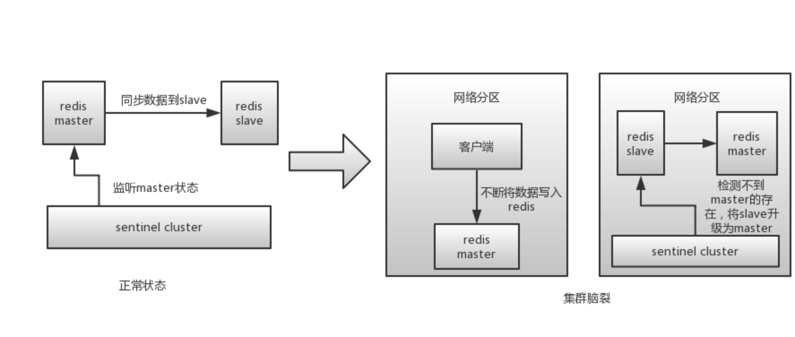

## [原文1](https://blog.csdn.net/LO_YUN/article/details/97131426)

# redis脑裂问题

## 什么是redis的集群脑裂？

redis的集群脑裂是指因为`网络问题`，导致redis master节点跟redis slave节点和sentinel集群处于不同的网络分区，
此时因为sentinel集群无法感知到master的存在，所以将slave节点提升为master节点。
此时存在两个不同的master节点，就像一个大脑分裂成了两个。


redis sentinel cluster 脑裂图

集群脑裂问题中，如果客户端还在基于原来的master节点继续写入数据，那么新的master节点将无法同步这些数据，
当网络问题解决之后，sentinel集群将原先的master节点降为slave节点，
此时再从新的master中同步数据，将会造成大量的数据丢失。


## 解决异步复制和脑裂导致的数据丢失

在配置文件中添加如下配置
```xml
min-slaves-to-write 1
min-slaves-max-lag 10
```
这两个配置什么意思呢？

> min-slaves-to-write 1，要求至少有一个slave。  
> min-slaves-max-lag 10，主从数据同步超时时间，10秒。

以上两个配置，都不满足就会导致master拒绝接受客户端请求。
根据以上配置可以将master通信异常期间的数据丢失控制在10秒以内


 
