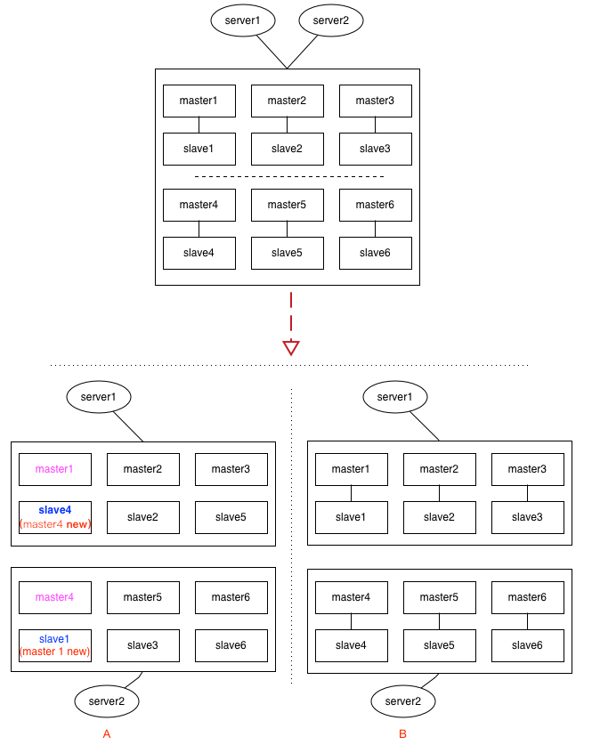

## [原文1](https://blog.csdn.net/LO_YUN/article/details/97131426)

# redis脑裂问题

## 什么是redis的集群脑裂？

redis的集群脑裂是指因为`网络问题`，导致redis master节点跟redis slave节点和sentinel集群处于不同的网络分区，
此时因为sentinel集群无法感知到master的存在，所以将slave节点提升为master节点。
此时存在两个不同的master节点，就像一个大脑分裂成了两个。

### 一、哨兵(sentinel)模式下的脑裂

redis sentinel cluster 脑裂图

集群脑裂问题中，如果客户端还在基于原来的master节点继续写入数据，那么新的master节点将无法同步这些数据，
当网络问题解决之后，sentinel集群将原先的master节点降为slave节点，
此时再从新的master中同步数据，将会造成大量的数据丢失。

### 二、集群(cluster)模式下的脑裂



custer模式下，这种情况要更复杂，见上面的示意图，集群中有6组分片，每给分片节点都有1主1从，如果出现网络分区时，
各种节点之间的分区组合都有可能，上面列了2种情况：
 
- 情况A：
  假设master1与slave4落到同1个分区，这时slave4经过选举后，可能会被提升为新的master4，
  而另一个分区里的slave1，可能会提升为新的master1。看过本博客前面介绍redis cluster的同学应该知道，
  cluster中key的定位是依赖slot（槽位），情况A经过这一翻折腾后，master1与master4上的slot，
  出现了重复，在二个分区里都有。类似的，如果依赖incr及setNX的应用场景，都会出现数据不一致的情况。
 
- 情况B：
 如果每给分片内部的逻辑（即：主从关系）没有乱，只是恰好分成二半，这时slot整体上看并没有出现重复，
 如果原来请求的key落在其它区，最多只是访问不到，还不致于发生数据不一致的情况。（即：宁可出错，也不要出现数据混乱）

### 三、主从迁移带来的不一致
> 迁移过程中发生了选主

1主1从，如果采用incr来生成全局唯一键，假如master上的值是4，但是尚未同步到slave上（slave上仍然是旧值3），
这时候如果发生选举，slave被提升为新master，应用服务器server1切换到新主后，下次再incr获取的值，
就可能重复了（3+1=4）

 
 
## 解决异步复制和脑裂导致的数据丢失

在配置文件中添加如下配置
```xml
min-slaves-to-write 1
min-slaves-max-lag 10
```
这两个配置什么意思呢？

> min-slaves-to-write 1，要求至少有一个slave。  
> min-slaves-max-lag 10，主从数据同步超时时间，10秒。

以上两个配置，都不满足就会导致master拒绝接受客户端请求。
根据以上配置可以将master通信异常期间的数据丢失控制在10秒以内


 
