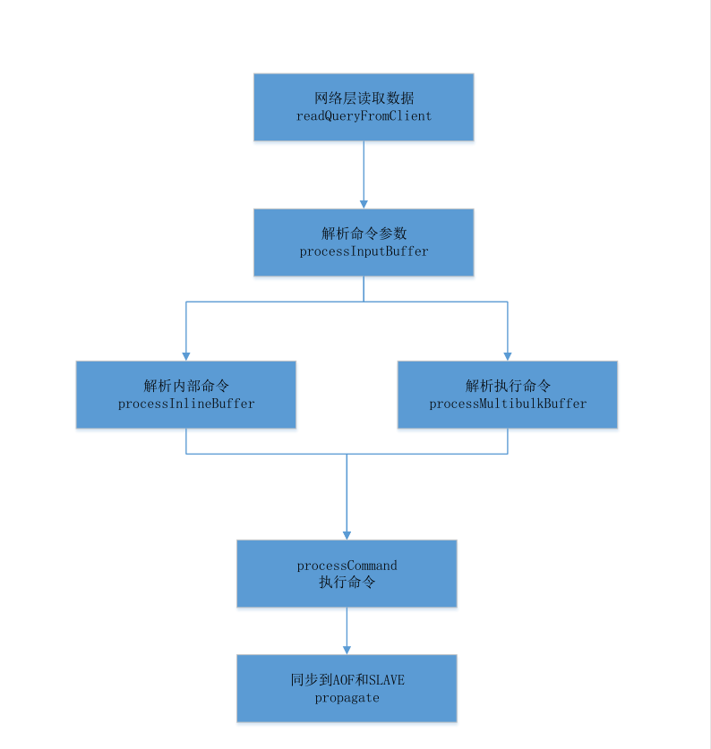

## [原文](https://www.jianshu.com/p/e8a2c727da66)

# Redis 命令的执行过程

## 服务器端命令执行过程

描述redis server在处理client命令的执行过程，大概包括流程图、源码、以及redis的命令格式说明，
redis的通信协议参考自redis的官网。

### 命令执行过程
 整个redis的server端命令执行过程就如下面这个流程图：

- nio层读取数据
- 解析数据到命令行格式
- 查找命令对应的执行函数执行命令
- 同步数据到slave和aof

### 命令执行过程源码

读取命令

 nread = read(fd, c->querybuf+qblen, readlen);负责读取命令数，通过processInputBuffer进行下一步处理。
void readQueryFromClient(aeEventLoop *el, int fd, void *privdata, int mask) {
    redisClient *c = (redisClient*) privdata;
    int nread, readlen;
    size_t qblen;
    REDIS_NOTUSED(el);
    REDIS_NOTUSED(mask);

    // 设置服务器的当前客户端
    server.current_client = c;
    
    // 读入长度（默认为 16 MB）
    readlen = REDIS_IOBUF_LEN;

    // 获取查询缓冲区当前内容的长度
    // 如果读取出现 short read ，那么可能会有内容滞留在读取缓冲区里面
    // 这些滞留内容也许不能完整构成一个符合协议的命令，
    qblen = sdslen(c->querybuf);
    // 如果有需要，更新缓冲区内容长度的峰值（peak）
    if (c->querybuf_peak < qblen) c->querybuf_peak = qblen;
    // 为查询缓冲区分配空间
    c->querybuf = sdsMakeRoomFor(c->querybuf, readlen);
    // 读入内容到查询缓存
    nread = read(fd, c->querybuf+qblen, readlen);

    if (nread) {
        // 根据内容，更新查询缓冲区（SDS） free 和 len 属性
        // 并将 '\0' 正确地放到内容的最后
        sdsIncrLen(c->querybuf,nread);
        // 记录服务器和客户端最后一次互动的时间
        c->lastinteraction = server.unixtime;
        // 如果客户端是 master 的话，更新它的复制偏移量
        if (c->flags & REDIS_MASTER) c->reploff += nread;
    }

    // 查询缓冲区长度超出服务器最大缓冲区长度
    // 清空缓冲区并释放客户端
    if (sdslen(c->querybuf) > server.client_max_querybuf_len) {
        sds ci = catClientInfoString(sdsempty(),c), bytes = sdsempty();

        bytes = sdscatrepr(bytes,c->querybuf,64);
        redisLog(REDIS_WARNING,"Closing client that reached max query buffer length: %s (qbuf initial bytes: %s)", ci, bytes);
        sdsfree(ci);
        sdsfree(bytes);
        freeClient(c);
        return;
    }

    // 从查询缓存重读取内容，创建参数，并执行命令
    // 函数会执行到缓存中的所有内容都被处理完为止
    processInputBuffer(c);

    server.current_client = NULL;
}

解析命令
 核心在于processInlineBuffer处理内联命令，processMultibulkBuffer处理批量命令包括get/set等，核心的processCommand用于执行命令。
// 处理客户端输入的命令内容
void processInputBuffer(redisClient *c) {

    while(sdslen(c->querybuf)) {
        // 判断请求的类型
        // 两种类型的区别可以在 Redis 的通讯协议上查到：
        // http://redis.readthedocs.org/en/latest/topic/protocol.html
        // 简单来说，多条查询是一般客户端发送来的，
        // 而内联查询则是 TELNET 发送来的
        if (!c->reqtype) {
            if (c->querybuf[0] == '*') {
                // 多条查询
                c->reqtype = REDIS_REQ_MULTIBULK;
            } else {
                // 内联查询
                c->reqtype = REDIS_REQ_INLINE;
            }
        }

        // 将缓冲区中的内容转换成命令，以及命令参数
        if (c->reqtype == REDIS_REQ_INLINE) {
            if (processInlineBuffer(c) != REDIS_OK) break;
        } else if (c->reqtype == REDIS_REQ_MULTIBULK) {
            if (processMultibulkBuffer(c) != REDIS_OK) break;
        } else {
            redisPanic("Unknown request type");
        }

        /* Multibulk processing could see a <= 0 length. */
        if (c->argc == 0) {
            resetClient(c);
        } else {
            /* Only reset the client when the command was executed. */
            // 执行命令，并重置客户端
            if (processCommand(c) == REDIS_OK)
                resetClient(c);
        }
    }
}

执行命令前准备
 执行命令的过程其实主要是寻找命令对应的执行函数，通过lookupCommand查找对应的执行命令，通过call执行命令。
int processCommand(redisClient *c) {

    // 特别处理 quit 命令
    if (!strcasecmp(c->argv[0]->ptr,"quit")) {
        addReply(c,shared.ok);
        c->flags |= REDIS_CLOSE_AFTER_REPLY;
        return REDIS_ERR;
    }

    // 查找命令，并进行命令合法性检查，以及命令参数个数检查
    c->cmd = c->lastcmd = lookupCommand(c->argv[0]->ptr);
  
    // 中间省略了很多异常情况的检测，包括是否超过内存限制、是否合法命令等
    
    if (c->flags & REDIS_MULTI &&
        c->cmd->proc != execCommand && c->cmd->proc != discardCommand &&
        c->cmd->proc != multiCommand && c->cmd->proc != watchCommand)
    {
        // 在事务上下文中
        // 除 EXEC 、 DISCARD 、 MULTI 和 WATCH 命令之外
        // 其他所有命令都会被入队到事务队列中
        queueMultiCommand(c);
        addReply(c,shared.queued);
    } else {
        // 执行命令
        call(c,REDIS_CALL_FULL);

        c->woff = server.master_repl_offset;
        // 处理那些解除了阻塞的键
        if (listLength(server.ready_keys))
            handleClientsBlockedOnLists();
    }

    return REDIS_OK;
}

执行命令
 负责执行命令c->cmd->proc并更新统计信息，执行完成后负责同步数据propagate。
// 调用命令的实现函数，执行命令
void call(redisClient *c, int flags) {

    // 执行实现函数
    c->cmd->proc(c);

    // 将命令复制到 AOF 和 slave 节点
    if (flags & REDIS_CALL_PROPAGATE) {
        int flags = REDIS_PROPAGATE_NONE;

        // 强制 REPL 传播
        if (c->flags & REDIS_FORCE_REPL) flags |= REDIS_PROPAGATE_REPL;

        // 强制 AOF 传播
        if (c->flags & REDIS_FORCE_AOF) flags |= REDIS_PROPAGATE_AOF;

        // 如果数据库有被修改，那么启用 REPL 和 AOF 传播
        if (dirty)
            flags |= (REDIS_PROPAGATE_REPL | REDIS_PROPAGATE_AOF);

        if (flags != REDIS_PROPAGATE_NONE)
            propagate(c->cmd,c->db->id,c->argv,c->argc,flags);
    }

同步执行命令
 主要是负责同步数据到AOF文件和slave节点，feedAppendOnlyFile负责同步到AOF文件，replicationFeedSlaves负责同步
/* Propagate the specified command (in the context of the specified database id)
 * to AOF and Slaves.
 *
 * 将指定命令（以及执行该命令的上下文，比如数据库 id 等信息）传播到 AOF 和 slave 。
 *
 * flags are an xor between:
 * FLAG 可以是以下标识的 xor ：
 *
 * + REDIS_PROPAGATE_NONE (no propagation of command at all)
 *   不传播
 *
 * + REDIS_PROPAGATE_AOF (propagate into the AOF file if is enabled)
 *   传播到 AOF
 *
 * + REDIS_PROPAGATE_REPL (propagate into the replication link)
 *   传播到 slave
 */
void propagate(struct redisCommand *cmd, int dbid, robj **argv, int argc,
               int flags)
{
    // 传播到 AOF
    if (server.aof_state != REDIS_AOF_OFF && flags & REDIS_PROPAGATE_AOF)
        feedAppendOnlyFile(cmd,dbid,argv,argc);

    // 传播到 slave
    if (flags & REDIS_PROPAGATE_REPL)
        replicationFeedSlaves(server.slaves,dbid,argv,argc);
}

同步AOF
 AOF涉及的缓存有多份，包括

首先先缓存在局部的buf当中
然后将局部buf的数据拷贝到全局server.aof_buf当中
如果现在刚好在重写AOF文件，那么还会将数据拷贝到重写缓存当中。

/*
 * 将命令追加到 AOF 文件中，
 * 如果 AOF 重写正在进行，那么也将命令追加到 AOF 重写缓存中。
 */
void feedAppendOnlyFile(struct redisCommand *cmd, int dictid, robj **argv, int argc) {
    sds buf = sdsempty();
    robj *tmpargv[3];

    /* 
     * 使用 SELECT 命令，显式设置数据库，确保之后的命令被设置到正确的数据库
     */
    if (dictid != server.aof_selected_db) {
        char seldb[64];

        snprintf(seldb,sizeof(seldb),"%d",dictid);
        buf = sdscatprintf(buf,"*2\r\n$6\r\nSELECT\r\n$%lu\r\n%s\r\n",
            (unsigned long)strlen(seldb),seldb);

        server.aof_selected_db = dictid;
    }

    // EXPIRE 、 PEXPIRE 和 EXPIREAT 命令
    if (cmd->proc == expireCommand || cmd->proc == pexpireCommand ||
        cmd->proc == expireatCommand) {
        /* 
         * 将 EXPIRE 、 PEXPIRE 和 EXPIREAT 都翻译成 PEXPIREAT
         */
        buf = catAppendOnlyExpireAtCommand(buf,cmd,argv[1],argv[2]);

    // SETEX 和 PSETEX 命令
    } else if (cmd->proc == setexCommand || cmd->proc == psetexCommand) {
        /* Translate SETEX/PSETEX to SET and PEXPIREAT 
         *
         * 将两个命令都翻译成 SET 和 PEXPIREAT
         */

        // SET
        tmpargv[0] = createStringObject("SET",3);
        tmpargv[1] = argv[1];
        tmpargv[2] = argv[3];
        buf = catAppendOnlyGenericCommand(buf,3,tmpargv);

        // PEXPIREAT
        decrRefCount(tmpargv[0]);
        buf = catAppendOnlyExpireAtCommand(buf,cmd,argv[1],argv[2]);

    // 其他命令
    } else {
        buf = catAppendOnlyGenericCommand(buf,argc,argv);
    }

    /* 
     * 将命令追加到 AOF 缓存中，
     * 在重新进入事件循环之前，这些命令会被冲洗到磁盘上，
     * 并向客户端返回一个回复。
     */
    if (server.aof_state == REDIS_AOF_ON)
        server.aof_buf = sdscatlen(server.aof_buf,buf,sdslen(buf));

    /* 
     * 如果 BGREWRITEAOF 正在进行，
     * 那么我们还需要将命令追加到重写缓存中，
     * 从而记录当前正在重写的 AOF 文件和数据库当前状态的差异。
     */
    if (server.aof_child_pid != -1)
        aofRewriteBufferAppend((unsigned char*)buf,sdslen(buf));

    // 释放
    sdsfree(buf);
}

命令行映射关系表
 包含了命令和对应执行函数的映射关系，应该看上去很清晰命令。
struct redisCommand redisCommandTable[] = {
    {"get",getCommand,2,"r",0,NULL,1,1,1,0,0},
    {"set",setCommand,-3,"wm",0,NULL,1,1,1,0,0},
    {"setnx",setnxCommand,3,"wm",0,NULL,1,1,1,0,0},
    {"setex",setexCommand,4,"wm",0,NULL,1,1,1,0,0},
    {"psetex",psetexCommand,4,"wm",0,NULL,1,1,1,0,0},
    {"append",appendCommand,3,"wm",0,NULL,1,1,1,0,0},
    {"strlen",strlenCommand,2,"r",0,NULL,1,1,1,0,0},
    {"del",delCommand,-2,"w",0,NULL,1,-1,1,0,0},
    {"exists",existsCommand,2,"r",0,NULL,1,1,1,0,0},
    {"setbit",setbitCommand,4,"wm",0,NULL,1,1,1,0,0},
    {"getbit",getbitCommand,3,"r",0,NULL,1,1,1,0,0},
    {"setrange",setrangeCommand,4,"wm",0,NULL,1,1,1,0,0},
    {"getrange",getrangeCommand,4,"r",0,NULL,1,1,1,0,0},
    {"substr",getrangeCommand,4,"r",0,NULL,1,1,1,0,0},
    {"incr",incrCommand,2,"wm",0,NULL,1,1,1,0,0},
    {"decr",decrCommand,2,"wm",0,NULL,1,1,1,0,0},
    {"mget",mgetCommand,-2,"r",0,NULL,1,-1,1,0,0},
    {"rpush",rpushCommand,-3,"wm",0,NULL,1,1,1,0,0},
    {"lpush",lpushCommand,-3,"wm",0,NULL,1,1,1,0,0},
    {"rpushx",rpushxCommand,3,"wm",0,NULL,1,1,1,0,0},
    {"lpushx",lpushxCommand,3,"wm",0,NULL,1,1,1,0,0},
    {"linsert",linsertCommand,5,"wm",0,NULL,1,1,1,0,0},
    {"rpop",rpopCommand,2,"w",0,NULL,1,1,1,0,0},
    {"lpop",lpopCommand,2,"w",0,NULL,1,1,1,0,0},
    {"brpop",brpopCommand,-3,"ws",0,NULL,1,1,1,0,0},
    {"brpoplpush",brpoplpushCommand,4,"wms",0,NULL,1,2,1,0,0},
    {"blpop",blpopCommand,-3,"ws",0,NULL,1,-2,1,0,0},
    {"llen",llenCommand,2,"r",0,NULL,1,1,1,0,0},
    {"lindex",lindexCommand,3,"r",0,NULL,1,1,1,0,0},
    {"lset",lsetCommand,4,"wm",0,NULL,1,1,1,0,0},
    {"lrange",lrangeCommand,4,"r",0,NULL,1,1,1,0,0},
    {"ltrim",ltrimCommand,4,"w",0,NULL,1,1,1,0,0},
    {"lrem",lremCommand,4,"w",0,NULL,1,1,1,0,0},
    {"rpoplpush",rpoplpushCommand,3,"wm",0,NULL,1,2,1,0,0},
    {"sadd",saddCommand,-3,"wm",0,NULL,1,1,1,0,0},
    {"srem",sremCommand,-3,"w",0,NULL,1,1,1,0,0},
    {"smove",smoveCommand,4,"w",0,NULL,1,2,1,0,0},
    {"sismember",sismemberCommand,3,"r",0,NULL,1,1,1,0,0},
    {"scard",scardCommand,2,"r",0,NULL,1,1,1,0,0},
    {"spop",spopCommand,2,"wRs",0,NULL,1,1,1,0,0},
    {"srandmember",srandmemberCommand,-2,"rR",0,NULL,1,1,1,0,0},
    {"sinter",sinterCommand,-2,"rS",0,NULL,1,-1,1,0,0},
    {"sinterstore",sinterstoreCommand,-3,"wm",0,NULL,1,-1,1,0,0},
    {"sunion",sunionCommand,-2,"rS",0,NULL,1,-1,1,0,0},
    {"sunionstore",sunionstoreCommand,-3,"wm",0,NULL,1,-1,1,0,0},
    {"sdiff",sdiffCommand,-2,"rS",0,NULL,1,-1,1,0,0},
    {"sdiffstore",sdiffstoreCommand,-3,"wm",0,NULL,1,-1,1,0,0},
    {"smembers",sinterCommand,2,"rS",0,NULL,1,1,1,0,0},
    {"sscan",sscanCommand,-3,"rR",0,NULL,1,1,1,0,0},
    {"zadd",zaddCommand,-4,"wm",0,NULL,1,1,1,0,0},
    {"zincrby",zincrbyCommand,4,"wm",0,NULL,1,1,1,0,0},
    {"zrem",zremCommand,-3,"w",0,NULL,1,1,1,0,0},
    {"zremrangebyscore",zremrangebyscoreCommand,4,"w",0,NULL,1,1,1,0,0},
    {"zremrangebyrank",zremrangebyrankCommand,4,"w",0,NULL,1,1,1,0,0},
    {"zremrangebylex",zremrangebylexCommand,4,"w",0,NULL,1,1,1,0,0},
    {"zunionstore",zunionstoreCommand,-4,"wm",0,zunionInterGetKeys,0,0,0,0,0},
    {"zinterstore",zinterstoreCommand,-4,"wm",0,zunionInterGetKeys,0,0,0,0,0},
    {"zrange",zrangeCommand,-4,"r",0,NULL,1,1,1,0,0},
    {"zrangebyscore",zrangebyscoreCommand,-4,"r",0,NULL,1,1,1,0,0},
    {"zrevrangebyscore",zrevrangebyscoreCommand,-4,"r",0,NULL,1,1,1,0,0},
    {"zrangebylex",zrangebylexCommand,-4,"r",0,NULL,1,1,1,0,0},
    {"zrevrangebylex",zrevrangebylexCommand,-4,"r",0,NULL,1,1,1,0,0},
    {"zcount",zcountCommand,4,"r",0,NULL,1,1,1,0,0},
    {"zlexcount",zlexcountCommand,4,"r",0,NULL,1,1,1,0,0},
    {"zrevrange",zrevrangeCommand,-4,"r",0,NULL,1,1,1,0,0},
    {"zcard",zcardCommand,2,"r",0,NULL,1,1,1,0,0},
    {"zscore",zscoreCommand,3,"r",0,NULL,1,1,1,0,0},
    {"zrank",zrankCommand,3,"r",0,NULL,1,1,1,0,0},
    {"zrevrank",zrevrankCommand,3,"r",0,NULL,1,1,1,0,0},
    {"zscan",zscanCommand,-3,"rR",0,NULL,1,1,1,0,0},
    {"hset",hsetCommand,4,"wm",0,NULL,1,1,1,0,0},
    {"hsetnx",hsetnxCommand,4,"wm",0,NULL,1,1,1,0,0},
    {"hget",hgetCommand,3,"r",0,NULL,1,1,1,0,0},
    {"hmset",hmsetCommand,-4,"wm",0,NULL,1,1,1,0,0},
    {"hmget",hmgetCommand,-3,"r",0,NULL,1,1,1,0,0},
    {"hincrby",hincrbyCommand,4,"wm",0,NULL,1,1,1,0,0},
    {"hincrbyfloat",hincrbyfloatCommand,4,"wm",0,NULL,1,1,1,0,0},
    {"hdel",hdelCommand,-3,"w",0,NULL,1,1,1,0,0},
    {"hlen",hlenCommand,2,"r",0,NULL,1,1,1,0,0},
    {"hkeys",hkeysCommand,2,"rS",0,NULL,1,1,1,0,0},
    {"hvals",hvalsCommand,2,"rS",0,NULL,1,1,1,0,0},
    {"hgetall",hgetallCommand,2,"r",0,NULL,1,1,1,0,0},
    {"hexists",hexistsCommand,3,"r",0,NULL,1,1,1,0,0},
    {"hscan",hscanCommand,-3,"rR",0,NULL,1,1,1,0,0},
    {"incrby",incrbyCommand,3,"wm",0,NULL,1,1,1,0,0},
    {"decrby",decrbyCommand,3,"wm",0,NULL,1,1,1,0,0},
    {"incrbyfloat",incrbyfloatCommand,3,"wm",0,NULL,1,1,1,0,0},
    {"getset",getsetCommand,3,"wm",0,NULL,1,1,1,0,0},
    {"mset",msetCommand,-3,"wm",0,NULL,1,-1,2,0,0},
    {"msetnx",msetnxCommand,-3,"wm",0,NULL,1,-1,2,0,0},
    {"randomkey",randomkeyCommand,1,"rR",0,NULL,0,0,0,0,0},
    {"select",selectCommand,2,"rl",0,NULL,0,0,0,0,0},
    {"move",moveCommand,3,"w",0,NULL,1,1,1,0,0},
    {"rename",renameCommand,3,"w",0,NULL,1,2,1,0,0},
    {"renamenx",renamenxCommand,3,"w",0,NULL,1,2,1,0,0},
    {"expire",expireCommand,3,"w",0,NULL,1,1,1,0,0},
    {"expireat",expireatCommand,3,"w",0,NULL,1,1,1,0,0},
    {"pexpire",pexpireCommand,3,"w",0,NULL,1,1,1,0,0},
    {"pexpireat",pexpireatCommand,3,"w",0,NULL,1,1,1,0,0},
    {"keys",keysCommand,2,"rS",0,NULL,0,0,0,0,0},
    {"scan",scanCommand,-2,"rR",0,NULL,0,0,0,0,0},
    {"dbsize",dbsizeCommand,1,"r",0,NULL,0,0,0,0,0},
    {"auth",authCommand,2,"rslt",0,NULL,0,0,0,0,0},
    {"ping",pingCommand,1,"rt",0,NULL,0,0,0,0,0},
    {"echo",echoCommand,2,"r",0,NULL,0,0,0,0,0},
    {"save",saveCommand,1,"ars",0,NULL,0,0,0,0,0},
    {"bgsave",bgsaveCommand,1,"ar",0,NULL,0,0,0,0,0},
    {"bgrewriteaof",bgrewriteaofCommand,1,"ar",0,NULL,0,0,0,0,0},
    {"shutdown",shutdownCommand,-1,"arlt",0,NULL,0,0,0,0,0},
    {"lastsave",lastsaveCommand,1,"rR",0,NULL,0,0,0,0,0},
    {"type",typeCommand,2,"r",0,NULL,1,1,1,0,0},
    {"multi",multiCommand,1,"rs",0,NULL,0,0,0,0,0},
    {"exec",execCommand,1,"sM",0,NULL,0,0,0,0,0},
    {"discard",discardCommand,1,"rs",0,NULL,0,0,0,0,0},
    {"sync",syncCommand,1,"ars",0,NULL,0,0,0,0,0},
    {"psync",syncCommand,3,"ars",0,NULL,0,0,0,0,0},
    {"replconf",replconfCommand,-1,"arslt",0,NULL,0,0,0,0,0},
    {"flushdb",flushdbCommand,1,"w",0,NULL,0,0,0,0,0},
    {"flushall",flushallCommand,1,"w",0,NULL,0,0,0,0,0},
    {"sort",sortCommand,-2,"wm",0,sortGetKeys,1,1,1,0,0},
    {"info",infoCommand,-1,"rlt",0,NULL,0,0,0,0,0},
    {"monitor",monitorCommand,1,"ars",0,NULL,0,0,0,0,0},
    {"ttl",ttlCommand,2,"r",0,NULL,1,1,1,0,0},
    {"pttl",pttlCommand,2,"r",0,NULL,1,1,1,0,0},
    {"persist",persistCommand,2,"w",0,NULL,1,1,1,0,0},
    {"slaveof",slaveofCommand,3,"ast",0,NULL,0,0,0,0,0},
    {"debug",debugCommand,-2,"as",0,NULL,0,0,0,0,0},
    {"config",configCommand,-2,"art",0,NULL,0,0,0,0,0},
    {"subscribe",subscribeCommand,-2,"rpslt",0,NULL,0,0,0,0,0},
    {"unsubscribe",unsubscribeCommand,-1,"rpslt",0,NULL,0,0,0,0,0},
    {"psubscribe",psubscribeCommand,-2,"rpslt",0,NULL,0,0,0,0,0},
    {"punsubscribe",punsubscribeCommand,-1,"rpslt",0,NULL,0,0,0,0,0},
    {"publish",publishCommand,3,"pltr",0,NULL,0,0,0,0,0},
    {"pubsub",pubsubCommand,-2,"pltrR",0,NULL,0,0,0,0,0},
    {"watch",watchCommand,-2,"rs",0,NULL,1,-1,1,0,0},
    {"unwatch",unwatchCommand,1,"rs",0,NULL,0,0,0,0,0},
    {"cluster",clusterCommand,-2,"ar",0,NULL,0,0,0,0,0},
    {"restore",restoreCommand,-4,"awm",0,NULL,1,1,1,0,0},
    {"restore-asking",restoreCommand,-4,"awmk",0,NULL,1,1,1,0,0},
    {"migrate",migrateCommand,-6,"aw",0,NULL,0,0,0,0,0},
    {"asking",askingCommand,1,"r",0,NULL,0,0,0,0,0},
    {"readonly",readonlyCommand,1,"r",0,NULL,0,0,0,0,0},
    {"readwrite",readwriteCommand,1,"r",0,NULL,0,0,0,0,0},
    {"dump",dumpCommand,2,"ar",0,NULL,1,1,1,0,0},
    {"object",objectCommand,-2,"r",0,NULL,2,2,2,0,0},
    {"client",clientCommand,-2,"ar",0,NULL,0,0,0,0,0},
    {"eval",evalCommand,-3,"s",0,evalGetKeys,0,0,0,0,0},
    {"evalsha",evalShaCommand,-3,"s",0,evalGetKeys,0,0,0,0,0},
    {"slowlog",slowlogCommand,-2,"r",0,NULL,0,0,0,0,0},
    {"script",scriptCommand,-2,"ras",0,NULL,0,0,0,0,0},
    {"time",timeCommand,1,"rR",0,NULL,0,0,0,0,0},
    {"bitop",bitopCommand,-4,"wm",0,NULL,2,-1,1,0,0},
    {"bitcount",bitcountCommand,-2,"r",0,NULL,1,1,1,0,0},
    {"bitpos",bitposCommand,-3,"r",0,NULL,1,1,1,0,0},
    {"wait",waitCommand,3,"rs",0,NULL,0,0,0,0,0},
    {"pfselftest",pfselftestCommand,1,"r",0,NULL,0,0,0,0,0},
    {"pfadd",pfaddCommand,-2,"wm",0,NULL,1,1,1,0,0},
    {"pfcount",pfcountCommand,-2,"w",0,NULL,1,1,1,0,0},
    {"pfmerge",pfmergeCommand,-2,"wm",0,NULL,1,-1,1,0,0},
    {"pfdebug",pfdebugCommand,-3,"w",0,NULL,0,0,0,0,0}
};

