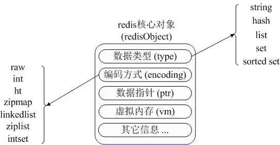

## [原文](https://www.jianshu.com/p/f09480c05e42)

# Redis-基本数据类型与内部存储结构

## 1 概览
Redis是典型的Key-Value类型数据库，Key为字符类型，Value的类型常用的为五种类型：String、Hash 、List 、 Set 、 Ordered Set。

字符串、哈希表、列表、集合和有序集，基于这些类型丰富的value，扩展出了功能强大的操作，例如hmset、lpush、sadd等。

## 2 Redis内部内存管理

- redisObject 核心对象

> Redis 内部使用一个 redisObject 对象来表示所有的 key 和 value。

1. type ：代表一个 value 对象具体是何种数据类型。

2. encoding ：是不同数据类型在 redis 内部的存储方式，
比如：type=string 代表 value 存储的是一个普通字符串，那么对应的 encoding 可以是 raw 或者是 int，
如果是 int 则代表实际 redis 内部是按数值型类存储和表示这个字符串的，当然前提是这个字符串本身可以用数值表示，比如："123" "456"这样的字符串。

3. vm 字段：只有打开了 Redis 的虚拟内存功能，此字段才会真正的分配内存，该功能默认是关闭状态的。 
Redis 使用 redisObject 来表示所有的 key/value 数据是比较浪费内存的，
当然这些内存管理成本的付出主要也是为了给 Redis 不同数据类型提供一个统一的管理接口，实际作者也提供了多种方法帮助我们尽量节省内存使用。

## 内部存储结构

### 4- String（字符串类型的Value）

> 可以是String，也可是是任意的byte[]类型的数组，如图片等。String 在 redis 内部存储默认就是一个字符串，
被 redisObject 所引用，当遇到 incr,decr 等操作时会转成数值型进行计算，此时 redisObject 的 encoding 字段为int。   
https://redis.io/commands#string

1. 大小限制：最大为512Mb，基本可以存储任意图片啦。

2. 常用命令的时间复杂度为O(1)，读写一样的快。

3. 对String代表的数字进行增减操作（没有指定的Key则设置为0值，然后在进行操作）：Incr/IncrBy/IncrByFloat/Decr/DecrBy（原子性），
`  可以用来做计数器，做自增序列，也可以用于限流，令牌桶计数等 `。key不存在时会创建并贴心的设原值为0。IncrByFloat专门针对float。。

4. 设置Value的安全性：SetNx命令仅当key不存在时才Set（原子性操作）。可以用来选举Master或做分布式锁：
所有Client不断尝试使用SetNx master myName抢注Master，成功的那位不断使用Expire刷新它的过期时间。
如果Master倒掉了key就会失效，剩下的节点又会发生新一轮抢夺。SetEx， Set + Expire 的简便写法，p字头版本以毫秒为单位。

5. 获取：GetSet（原子性）， 设置新值，返回旧值。比如一个按小时计算的计数器，可以用GetSet获取计数并重置为0。
这种指令在服务端做起来是举手之劳，客户端便方便很多。MGet/MSet/MSetNx， 一次get/set多个key。

6. 其他操作：Append/SetRange/GetRange/StrLen，对文本进行扩展、替换、截取和求长度，只对特定数据格式如字段定长的有用，json就没什么用。

7. BitMap的用法：GetBit/SetBit/BitOp,与或非/BitCount， BitMap的玩法，比如统计今天的独立访问用户数时，
每个注册用户都有一个offset，他今天进来的话就把他那个位设为1，用BitCount就可以得出今天的总人数。

### 5 Hash（HashMap，哈希映射表）

> Redis 的 Hash 实际是内部存储的 Value 为一个 HashMap，并提供了直接存取这个 Map 成员的接口。
Hash将对象的各个属性存入Map里，可以只读取/更新对象的某些属性。另外不同的模块可以只更新自己关心的属性而不会互相并发覆盖冲突。

不同程序通过 key（用户 ID） + field（属性标签）就可以并发操作各自关心的属性数据
https://redis.io/commands#hash

### 实现原理
Redis Hash 对应 Value 内部实际就是一个 HashMap，实际这里会有2种不同实现，
** 这个 Hash 的成员比较少时 Redis 为了节省内存会采用类似一维数组的方式来紧凑存储，而不会采用真正的 HashMap 结构，
对应的 value redisObject 的 encoding 为 zipmap，当成员数量增大时会自动转成真正的 HashMap，此时 encoding 为 ht**。
一般操作复杂度是O(1)，要同时操作多个field时就是O(N)，N是field的数量。

- 常用操作

O(1)操作：hget、hset等等

O(n)操作：hgetallRedis 可以直接取到全部的属性数据，但是如果内部 Map 的成员很多，那么涉及到遍历整个内部 Map 的操作，
由于 Redis 单线程模型的缘故，这个遍历操作可能会比较耗时，而另其它客户端的请求完全不响应，这点需要格外注意。

## 6 List（双向链表）

> Redis list 的应用场景非常多，也是 Redis 最重要的数据结构之一，比如 twitter 的关注列表，粉丝列表等都可以用 Redis 的 list 结构来实现，
还提供了生产者消费者阻塞模式（B开头的命令），常用于任务队列，消息队列等。

### 实现方式
Redis list 的实现为一个双向链表，即可以支持反向查找和遍历，更方便操作，
不过带来了部分额外的内存开销，Redis 内部的很多实现，包括发送缓冲队列等也都是用的这个数据结构。

用作消息队列中防止数据丢失的解决方法

### 如果消费者把job给Pop走了又没处理完就死机了怎么办？

- 消息生产者保证不丢失

加多一个sorted set，分发的时候同时发到list与sorted set，以分发时间为score，
用户把job做完了之后要用ZREM消掉sorted set里的job，并且定时从sorted set中取出超时没有完成的任务，
重新放回list。 如果发生重复可以在sorted set中在查询确认一遍，或者将消息的消费接口设计成幂等性。

- 消息消费者保证不丢失

为每个worker多加一个的list，弹出任务时改用RPopLPush，将job同时放到worker自己的list中，
完成时用LREM消掉。如果集群管理(如zookeeper)发现worker已经挂掉，就将worker的list内容重新放回主list

- 常用操作

1 复合操作：RPopLPush/ BRPopLPush，弹出来返回给client的同时，把自己又推入另一个list，是原子操作。

2 按值进行的操作：LRem(按值删除元素)、LInsert(插在某个值的元素的前后)，复杂度是O(N)，N是List长度，
因为List的值不唯一，所以要遍历全部元素，而Set只要O(log(N))。

3 按下表进行操作（下标从0开始，队列从左到右算，下标为负数时则从右到左，-1为右端第一个元素）

> 时间复杂度为O(N)

- LSet ：按下标设置元素值。（N为List的长度）
- LIndex：按下标返回元素。（N为index的值）

- LTrim：限制List的大小，保留指定范围的元素。（N是移除元素的个数）

- LRange：返回列表内指定范围下标的元素，常用于分页。（N = start+range）

## 7 set（HashSet）

> Set就是HashSet，可以将重复的元素随便放入而Set会自动去重，底层实现也是HashMap，
并且 set 提供了判断某个成员是否在一个 set 集合内的重要接口，这个也是 list 所不能提供的。

### 实现原理
set 的内部实现是一个 value 永远为 null 的 HashMap，实际就是通过计算 hash 的方式来快速排重的，这也是 set 能提供判断一个成员是否在集合内的原因。

- 常用操作

增删改查：SAdd/SRem/SIsMember/SCard/SMove/SMembers等等。除了SMembers都是O(1)。

集合操作：SInter/SInterStore/SUnion/SUnionStore/SDiff/SDiffStore，各种集合操作。
交集运算可以用来显示在线好友(在线用户 交集 好友列表)，共同关注(两个用户的关注列表的交集)。O(N)，
并集和差集的N是集合大小之和，交集的N是小的那个集合的大小的2倍。

## 8 Sorted Set（插入有序Set集合）

set 不是自动有序的，而** sorted set 可以通过用户额外提供一个优先级（score）的参数来为成员排序，并且是插入有序的，即自动排序**。
当你需要一个有序的并且不重复的集合列表，那么可以选择 sorted set 数据结构，
比如 twitter 的 public timeline 可以以发表时间作为 score 来存储，这样获取时就是自动按时间排好序的。

- 实现方式

内部使用 `HashMap` 和`跳跃表`（SkipList）来保证数据的存储和有序

Sorted Set的实现是HashMap(element->score, 用于实现ZScore及判断element是否在集合内)，
和SkipList(score->element,按score排序)的混合体。
SkipList有点像平衡二叉树那样，不同范围的score被分成一层一层，每层是一个按score排序的链表。

- 常用操作

> ZAdd/ZRem是O(log(N))；ZRangeByScore/ZRemRangeByScore是O(log(N)+M)，
N是Set大小，M是结果/操作元素的个数。复杂度的log取对数很关键，可以使，1000万大小的Set，
复杂度也只是几十不到。但是，如果一次命中很多元素M很大则复杂度很高。

1. ZRange/ZRevRange，按排序结果的范围返回元素列表，可以为正数与倒数。

2. ZRangeByScore/ZRevRangeByScore，按score的范围返回元素，可以为正数与倒数。

3. ZRemRangeByRank/ZRemRangeByScore，按排序/按score的范围限删除元素。

4. ZCount，统计按score的范围的元素个数。

5. ZRank/ZRevRank ，显示某个元素的正/倒序的排名。

6. ZScore/ZIncrby，显示元素的Score值/增加元素的Score。

7. ZAdd(Add)/ZRem(Remove)/ZCard(Count)，ZInsertStore(交集)/ZUnionStore(并集)，与Set相比，少了IsMember和差集运算。

## 8 Redis使用与内存优化

上面的一些实现上的分析可以看出 redis 实际上的内存管理成本非常高，即占用了过多的内存，属于用空间换时间。
作者对这点也非常清楚，所以提供了一系列的参数和手段来控制和节省内存

### 建议不要开启VM（虚拟内存）选项
VM 选项是作为 Redis 存储超出物理内存数据的一种数据在内存与磁盘换入换出的一个持久化策略，将严重地拖垮系统的运行速度，
所以要关闭 VM 功能，请检查你的 redis.conf 文件中 vm-enabled 为 no。

### 设置最大内存选项
最好设置下 redis.conf 中的 maxmemory 选项，该选项是告诉 Redis 当使用了多少物理内存后就开始拒绝后续的写入请求，
该参数能很好的保护好你的 Redis 不会因为使用了过多的物理内存而导致 swap，最终严重影响性能甚至崩溃。

一般还需要设置内存饱和回收策略

- volatile-lru：从已设置过期时间的数据集（server.db[i].expires）中挑选最近最少使用的数据淘汰
- volatile-ttl：从已设置过期时间的数据集（server.db[i].expires）中挑选将要过期的数据淘汰
- volatile-random：从已设置过期时间的数据集（server.db[i].expires）中任意选择数据淘汰
- allkeys-lru：从数据集（server.db[i].dict）中挑选最近最少使用的数据淘汰
- allkeys-random：从数据集（server.db[i].dict）中任意选择数据淘汰
- no-enviction（驱逐）：禁止驱逐数据

控制内存使用的参数

Redis 为不同数据类型分别提供了一组参数来控制内存使用

- Hash

redis.conf 配置文件中下面2项

**hash-max-zipmap-entries 64 **

含义是当 value 这个 Map 内部不超过多少个成员时会采用线性紧凑格式存储，默认是64，
即 value 内部有64个以下的成员就是使用线性紧凑存储zipmap，超过该值自动转成真正的 HashMap(ht)。

hash-max-zipmap-value 512

hash-max-zipmap-value 含义是当 value 这个 Map 内部的每个成员值长度不超过
多少字节就会采用线性紧凑存储zipmap来节省空间。

以上2个条件任意一个条件超过设置值都会转换成真正的 HashMap，也就不会再节省内存了，但是也不是越大越好（空间和查改效率需要根据实际情况来权衡）

- List

list-max-ziplist-entries 512
list 数据类型多少节点以下会采用去指针的紧凑存储格式ziplist

list-max-ziplist-value 64
list 数据类型节点值大小小于多少字节会采用紧凑存储格式ziplist。

- Set

set-max-intset-entries 512
set 数据类型内部数据如果全部是数值型，且包含多少节点以下会采用紧凑格式存储

Redis内部的优化

Redis 内部实现没有对内存分配方面做过多的优化，在一定程度上会存在内存碎片，不过大多数情况下这个不会成为 Redis 的性能瓶颈。
Redis 缓存了一定范围的常量数字作为资源共享，在很多数据类型是数值型则能极大减少内存开销，
默认为1-10000，可以重新编译配置修改源代码中的一行宏定义 REDIS_SHARED_INTEGERS。

## 9 总结

根据业务需要选择合适的数据类型，并为不同的应用场景设置相应的紧凑存储参数。
当业务场景不需要数据持久化时，关闭所有的持久化方式可以获得最佳的性能以及最大的内存使用量。
如果需要使用持久化，根据是否可以容忍重启丢失部分数据在快照方式与语句追加方式之间选择其一，不要使用虚拟内存以及 diskstore 方式。
不要让你的 Redis 所在机器物理内存使用超过实际内存总量的3/5。

Redis 的持久化使用了 Buffer IO ，所谓 Buffer IO 是指 Redis 对持久化文件的写入和读取操作都会使用物理内存的 Page Cache，而当 Redis 的持久化文件过大操作系统会进行Swap，这时你的系统就会有内存还有余量但是系统不稳定或者崩溃的风险。

参考链接
Java消息队列任务的平滑关闭
redis消息队列性能测试及知识点整理
