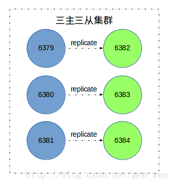
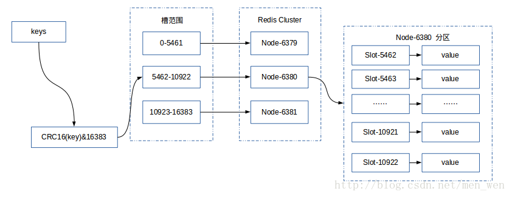
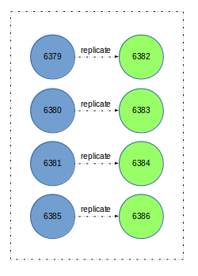

## [原文 Redis Cluster 集群扩容与收缩](https://www.jianshu.com/p/c67041648309)

## [redis集群动态增加或者删除节点](https://blog.csdn.net/xu470438000/article/details/42972123)

# Redis Cluster 集群扩容与收缩

> Redis5.0发布了，其中更新了一个新的特性，把Redis的集群管理从Ruby(redis-trib.rb)移植到了C语言代码，
直接使用redis-cli就可以管理集群，今天我们就尝试一下。

## Redis Cluster 集群伸缩

### 1. 伸缩原理
Redis提供了灵活的节点扩容和收缩方案。在不影响集群对外服务的情况下，可以为集群添加节点进行扩容也可以对下线节点进行缩容。

我们在Redis Cluster 介绍与搭建这篇文章中搭建了一个三主三从的redis集群（如下图所示）。
在搭建 Redis Cluster 通信流程剖析这篇博客中根据源码详细剖析了搭建集群的流程。


 

本篇博客要讲的是，Redis集群的扩容和缩容过程。

我们先根据Redis Cluster 介绍与搭建将如图的集群搭建起来，查看搭建的效果。
```bash
➜  redis redis-cli -c -h 127.0.0.1 -p 7000
127.0.0.1:7000> cluster nodes
0692d0eb55d802ab04c31a68810e62130ed033e1 127.0.0.1:7005@17005 slave 203585fce854919a8868796925e8f6d5504027c9 0 1559198961000 6 connected
ea143f5d1bfee89ec737437d08ae4de82568b3c1 127.0.0.1:7000@17000 myself,master - 0 1559198959000 1 connected 0-5460
7a97a17f5c428a625004a5eb122dcdbd1314aeb6 127.0.0.1:7002@17002 master - 0 1559198962023 3 connected 10923-16383
686847aae9755c6d8b5deec1108b6730d8a1d010 127.0.0.1:7003@17003 slave 7a97a17f5c428a625004a5eb122dcdbd1314aeb6 0 1559198961011 4 connected
39ec77bea0288aa550e6f3b3cf88dc8de7926588 127.0.0.1:7004@17004 slave ea143f5d1bfee89ec737437d08ae4de82568b3c1 0 1559198960507 5 connected
203585fce854919a8868796925e8f6d5504027c9 127.0.0.1:7001@17001 master - 0 1559198960507 2 connected 5461-10922
```
对应的主节点负责的槽位信息，如下图所示：

> connected 后面就是槽位范围  connected 0-5460   connected 5461-10922  connected 10923-16383



 

## 2. 扩容集群

扩容集群是分布式存储最常见的需求，Redis集群扩容可以分为如下步骤：

- 准备新节点

- 加入集群

- 迁移槽和数据

### 2.1 准备新节点
我们需要两个节点，端口分别为6385和6386，配置和之前集群节点配置基本相同，除了端口不同，以便于管理。6385节点配置如下：
```
port 6385                               //端口
cluster-enabled yes                     //开启集群模式
cluster-config-file nodes-6385.conf     //集群内部的配置文件
cluster-node-timeout 15000              //节点超时时间，单位毫秒
// 其他配置和单机模式相同
```
启动两个节点
```bash
sudo redis-server conf/redis-6385.conf
sudo redis-server conf/redis-6386.conf
```

启动后的新节点会作为孤儿节点运行，没有和其他节点与之通信。
### 2.2 加入集群
我们可以通过CLUSTER MEET命令将6385节点加入到集群中。
```bash
127.0.0.1:6379> CLUSTER MEET 127.0.0.1 6385
OK
127.0.0.1:6379> CLUSTER NODES
cb987394a3acc7a5e606c72e61174b48e437cedb 127.0.0.1:6385 master - 0 1496731333689 8 connected
......
```

也可以使用redis专门进行集群管理的工具redis-trib.rb，位于Redis的源码目录中，把6386节点加入到集群中

> 新版本之后 使用下面这个提示使用这个替换
>> redis-cli --cluster reshard 127.0.0.1:7000

```bash
sudo src/redis-trib.rb add-node 127.0.0.1:6386 127.0.0.1:6379
127.0.0.1:6379> CLUSTER NODES
cdfb1656353c5c7f29d0330a754c71d53cec464c 127.0.0.1:6386 master - 0 1496731447703 0 connected
......
```
这两种方法可以，新加入的节点都是主节点，因为没有负责槽位，所以不能接受任何读写操作，对于新加入的节点，我们可以有两个操作：

- 为新节点迁移槽和数据实现扩容。
- 作为其他主节点的从节点负责故障转移。

### 2.3 迁移槽和数据
当我们将新节点加入集群后，我们就可以将槽和数据迁移到新的节点，迁移的方法也有两种，
可以使用redis-trib.rb工具，也可以通过手动命令的方式，但是一般要确保每个主节点负责的槽数是均匀的，
因此要使用redis-trib.rb工具来批量完成，但是我们只是为了演示迁移的过程，所以接下来手动使用命令进行迁移。

我们先创建几个属于一个槽的键，将这些键迁移到新的节点中。
```bash
127.0.0.1:6379> SET key:{test}:555 value:test:555
-> Redirected to slot [6918] located at 127.0.0.1:6380
OK
127.0.0.1:6380> SET key:{test}:666 value:test:666
OK
127.0.0.1:6380> SET key:{test}:777 value:test:777
OK
127.0.0.1:6380> CLUSTER KEYSLOT key:{test}:555
(integer) 6918
127.0.0.1:6380> CLUSTER KEYSLOT key:{test}:666
(integer) 6918
127.0.0.1:6380> CLUSTER KEYSLOT key:{test}:777
(integer) 6918
```
本来在6379节点中创建，但是重定向到了6380节点中，因为我们常见的键根据CRC16算法计算分配到了6918槽中，而这个槽由6380节点负责。

如果键的名字中带有{}，那么计算哈希值时就只计算{}包含的字符串，所以创建的三个键属于一个槽。

计算哈希值的源码如下：
```cpp
unsigned int keyHashSlot(char *key, int keylen) {
    int s, e; /* start-end indexes of { and } */
    // 找'{'字符
    for (s = 0; s < keylen; s++)
        if (key[s] == '{') break;
    // 没有找到"{}"，直接计算整个key的哈希值
    if (s == keylen) return crc16(key,keylen) & 0x3FFF;
    // 找到'{'，检查是否有'}'
    for (e = s+1; e < keylen; e++)
        if (key[e] == '}') break;
    // 没有找到配对的'}'，直接计算整个key的哈希值
    if (e == keylen || e == s+1) return crc16(key,keylen) & 0x3FFF;
    // 如果找到了"{}"，计算{}中间的哈希值
    return crc16(key+s+1,e-s-1) & 0x3FFF;
}
```
我们已经获取了要迁移的槽，是6918。因此，流程如下：

目标6385节点中，将槽6918设置为导入状态
```bash

127.0.0.1:6385> CLUSTER SETSLOT 6918 importing 8f285670923d4f1c599ecc93367c95a30fb8bf34
OK
// 8f285670923d4f1c599ecc93367c95a30fb8bf34 是 6380 节点的名字
```
目标6385节点中，查看槽6918导入状态
```bash
127.0.0.1:6385> CLUSTER NODES
cb987394a3acc7a5e606c72e61174b48e437cedb 127.0.0.1:6385 myself,master - 0 0 8 connected [6918-<-8f285670923d4f1c599ecc93367c95a30fb8bf34]
```
源6380节点中，将槽6918设置为导出状态
```bash

127.0.0.1:6380> CLUSTER SETSLOT 6918 migrating cb987394a3acc7a5e606c72e61174b48e437cedb
OK
// cb987394a3acc7a5e606c72e61174b48e437cedb 是 6385 节点的名字
```
源6380节点中，查看槽6918导出状态
```bash
127.0.0.1:6380> CLUSTER NODES
8f285670923d4f1c599ecc93367c95a30fb8bf34 127.0.0.1:6380 myself,master - 0 0 3 
connected 5462-10922 [6918->-cb987394a3acc7a5e606c72e61174b48e437cedb]
```
批量获取槽6918中的键
```bash
127.0.0.1:6380> CLUSTER GETKEYSINSLOT 6918 5
1) "key:{test}:555"
2) "key:{test}:666"
3) "key:{test}:777"
```
确认一下这三个键是否存在于源6380节点。
```bash
127.0.0.1:6380> MGET key:{test}:777 key:{test}:666 key:{test}:555
1) "value:test:777"
2) "value:test:666"
3) "value:test:555"
```
执行migrate命令进行迁移
```bash
127.0.0.1:6380> MIGRATE 127.0.0.1 6385 "" 0 1000 keys key:{test}:777 key:
{test}:666 key:{test}:555
OK
```
批量迁移版本的MIGRATE命令是在redis 3.0.6之后加入的，命令参数如下：
```bash
MIGRATE host port key dbid timeout [COPY | REPLACE]
MIGRATE host port "" dbid timeout [COPY | REPLACE] KEYS key1 key2 ... keyN
// host port 指定迁移的目的节点地址
// dbid 指定迁移的数据库id
// timeout 迁移的超时时间
// 如果指定了 COPY 选项，表示不删除源节点上的key
// 如果指定了 REPLACE 选项，替换目标节点上已存在的key（如果存在）
```
当迁移完成后，我们在源6380节点查询这三个键，发送回复了一个ASK错误
```bash
127.0.0.1:6380> MGET key:{test}:777 key:{test}:666 key:{test}:555
(error) ASK 6918 127.0.0.1:6385
```
最后，我们只需向任意节点发送CLUSTER SETSLOT <slot> NODE <target_name>命令，将槽指派的信息发送给节点，
然后这个节点会将这个指派信息发送至整个集群。
```bash
CLUSTER SETSLOT 6918 node cb987394a3acc7a5e606c72e61174b48e437cedb
// cb987394a3acc7a5e606c72e61174b48e437cedb 是 6385 节点的名字
```
在6381节点执行命令
```bash
127.0.0.1:6381> CLUSTER SETSLOT 6918 node cb987394a3acc7a5e606c72e61174b48e437cedb
OK
```

在6379节点查看当前集群槽指派信息
```bash
127.0.0.1:6379> CLUSTER NODES
29978c0169ecc0a9054de7f4142155c1ab70258b 127.0.0.1:6379 myself,master - 0 0 7 connected 0-5461
66478bda726ae6ba4e8fb55034d8e5e5804223ff 127.0.0.1:6381 master - 0 1496736248776 2 connected 10923-16383
cb987394a3acc7a5e606c72e61174b48e437cedb 127.0.0.1:6385 master - 0 1496736244766 10 connected 6918
8f285670923d4f1c599ecc93367c95a30fb8bf34 127.0.0.1:6380 master - 0 1496736247773 3 connected 5462-6917 6919-10922
// 过滤掉从节点和未指派槽的主节点
```
可以看到6380节点负责的槽变为5462-6917 6919-10922，而6918已经被6385节点负责了。

### 添加从节点
开始的时候，我们加入了两个新节点到集群中，节点6385已经迁移了槽位和数据作为主节点，但是该节点还不具有故障转移的能力。

此时，还需要将6386节点作为6385节点的从节点，从而保证集群的高可用。使用cluster
replicate <master_id>命令为主节点添加从节点，集群模式下不支持slaveof命令。
```bash
127.0.0.1:6386> CLUSTER REPLICATE 
cb987394a3acc7a5e606c72e61174b48e437cedb
OK
127.0.0.1:6386> CLUSTER NODES
cb987394a3acc7a5e606c72e61174b48e437cedb 127.0.0.1:6385 master 
- 0 1496742992748 10 connected 6918
cdfb1656353c5c7f29d0330a754c71d53cec464c 127.0.0.1:6386 
myself,slave cb987394a3acc7a5e606c72e61174b48e437cedb 0 0 0 
connected
```
到此就完成了集群的扩容。集群关系如下图所示：



 
## 收缩集群

收缩集群以为着缩减规模，需要从集群中安全下线部分节点。需要考虑两种情况：

确定下线的节点是否有负责槽，如果是，需要把槽迁移到其他节点，保证节点下线后整个槽节点映射的完整性。

当下线节点不在负责槽或着本身是从节点时，就可以通知集群内其他节点忘记下线节点，当所有节点忘记该节点后就可以正常关闭。

我们这次使用redis-trib.rb工具来下线迁移槽。流程和扩容集群非常相似，正好方向相反，将6380变为目标节点，
6385成了源节点。将刚才新扩容的集群收缩回去。
```bash
./redis-trib.rb reshard 127.0.0.1:6385
>>> Performing Cluster Check (using node 127.0.0.1:6385)
......
[OK] All nodes agree about slots configuration.
>>> Check for open slots...
>>> Check slots coverage...
[OK] All 16384 slots covered.
// 你想迁移多少个槽
How many slots do you want to move (from 1 to 16384)? 1 /*迁移一个槽*/
// 目标节点的id
What is the receiving node ID? 8f285670923d4f1c599ecc93367c95a30fb8bf34 /*输入目标`6380`节点的id*/
Please enter all the source node IDs.
  Type 'all' to use all the nodes as source nodes for the hash slots.
  Type 'done' once you entered all the source nodes IDs.
// 输入要迁移槽的源节点
// all 表示所有节点都是源节点
// done 表示输入完成
Source node #1:cb987394a3acc7a5e606c72e61174b48e437cedb
Source node #2:done
.....
// 是否立即执行重新分片计划
Do you want to proceed with the proposed reshard plan (yes/no)? yes
Moving slot 6918 from 127.0.0.1:6385 to 127.0.0.1:6380: ...

```
查看一下结果：

```bash
127.0.0.1:6380> CLUSTER NODES
8f285670923d4f1c599ecc93367c95a30fb8bf34 127.0.0.1:6380 myself,master - 0 0 11 connected 5462-10922
cb987394a3acc7a5e606c72e61174b48e437cedb 127.0.0.1:6385 master - 0 1496744498017 10 connected

```
6380节点已经接管了6385节点的槽。
最后让集群所有的节点忘记下线节点6385。执行CLUSTER FORGET
<down_node_id>或者使用工具。

```bash
./redis-trib.rb del-node 127.0.0.1:6379 cdfb1656353c5c7f29d0330a754c71d53cec464c
>>> Removing node cdfb1656353c5c7f29d0330a754c71d53cec464c from cluster 127.0.0.1:6379
>>> Sending CLUSTER FORGET messages to the cluster...
>>> SHUTDOWN the node.
./redis-trib.rb del-node 127.0.0.1:6379 cb987394a3acc7a5e606c72e61174b48e437cedb
>>> Removing node cb987394a3acc7a5e606c72e61174b48e437cedb from cluster 127.0.0.1:6379
>>> Sending CLUSTER FORGET messages to the cluster...
>>> SHUTDOWN the node.

```
注意，先下线从节点，在下线主节点，以免不必要的全量复制操作。对6379节点做忘记下线节点的操作，
那么经过一段时间，集群中的其他节点也都会忘记。

```bash
127.0.0.1:6380> CLUSTER NODES
6fb7dfdb6188a9fe53c48ea32d541724f36434e9 127.0.0.1:6383 slave 8f285670923d4f1c599ecc93367c95a30fb8bf34 0 1496744890808 11 connecte
29978c0169ecc0a9054de7f4142155c1ab70258b 127.0.0.1:6379 master - 0 1496744892814 7 connected 0-5461
66478bda726ae6ba4e8fb55034d8e5e5804223ff 127.0.0.1:6381 master - 0 1496744891810 2 connected 10923-16383
e0c7961a1b07ab655bc31d8dfd583da565ec167d 127.0.0.1:6384 slave 66478bda726ae6ba4e8fb55034d8e5e5804223ff 0 1496744888804 2 connected
8f285670923d4f1c599ecc93367c95a30fb8bf34 127.0.0.1:6380 myself,master - 0 0 11 connected 5462-10922
961097d6be64ebd2fd739ff719e97565a8cee7b5 127.0.0.1:6382 slave 29978c0169ecc0a9054de7f4142155c1ab70258b 0 1496744889805 7 connected

```
6380端口的主节点已经忘记了下线节点，因此下线节点已经安全的下线。

