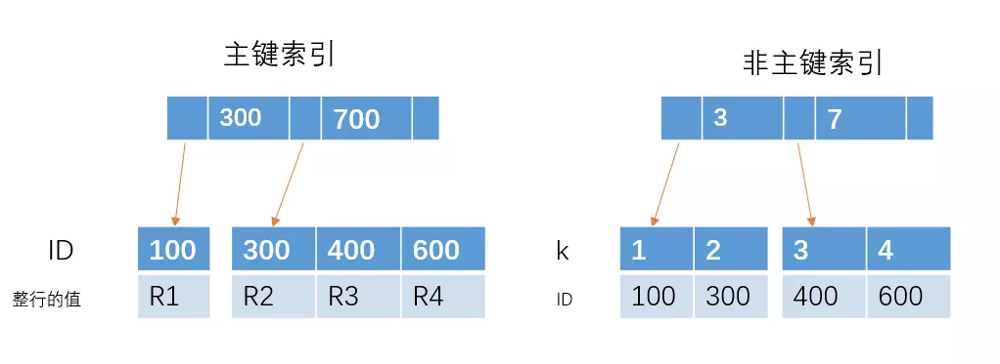

# 主键索引和非主键索引的区别

非主键索引的`叶子节点`存放的是`主键的值`，而`主键索引的叶子节`点存放的是`整行数据`，
其中非主键索引也被称为二级索引，而`主键索引也被称为聚簇索引`。

根据这两种结构我们来进行下查询，看看他们在查询上有什么区别。

1、如果查询语句是 select * from table where ID = 100,即主键查询的方式，则只需要搜索 ID 这棵 B+树。

2、如果查询语句是 select * from table where k = 1，即非主键的查询方式，
则先搜索k索引树，得到ID=100,再到ID索引树搜索一次，这个过程也被称为`回表`。

[主键和唯一索引的区别](02、主键和唯一索引的区别.md)
