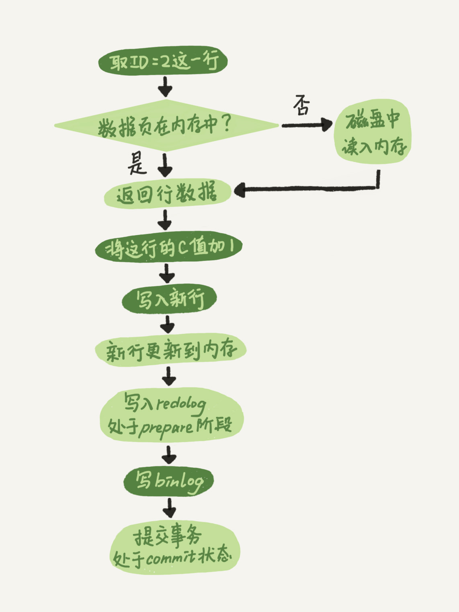

# 一条更新语句执行的顺序(日志两段提交)


```mysql
update T set c=c+1 where ID=2;
```



- `执行器`先找`存储引擎`取 ID=2 这一行。ID 是主键，引擎直接用树搜索找到这一行。如果 ID=2 这一行所在的数据页本来就在内存中，
就直接返回给执行器；否则，需要先从磁盘读入内存，然后再返回。

- `执行器`拿到`存储引擎`给的行数据，`把这个值加上 1`，比如原来是 N，现在就是 N+1，得到新的一行数据，再`调用存储引擎接口写入`这行新数据。

- `存储引擎`将这行新数据`更新到内存`中，同时将这个`更新操作记录到 redo log` 里面，此时 redo log 处于 `prepare` 状态。
然后`告知执行器`执行完成了，随时可以提交事务。

- `执行器`生成这个操作的 `binlog`，并把 `binlog 写入磁盘`。

- `执行器`调用`存储引擎`的提`交事务接口`，引擎把刚刚写入的 redo log 改成提交（commit）状态，更新完成。


