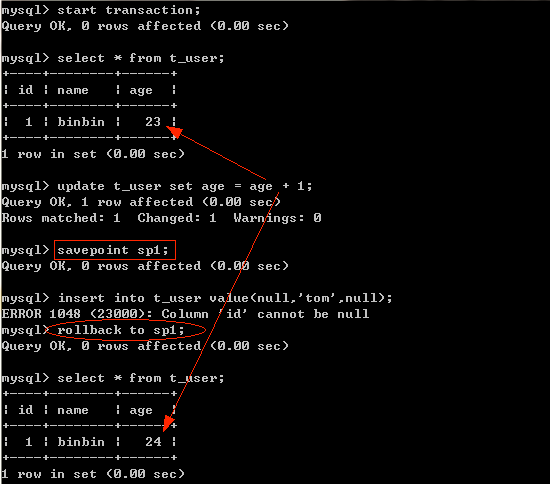
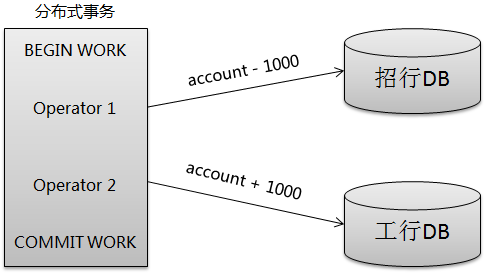

##### [原文](https://blog.csdn.net/u013235478/article/details/50625602)

# MySQL事务

事务（Transaction）是数据库区别于文件系统的重要特性之一，
事务会把数据库从一种一致性状态转换为另一种一致性状态。在数据库提交时，可以确保要么所有修改都已保存，要么所有修改都不保存。

## 事务的ACID特性
事务必须同时满足ACID的特性：

- 原子性（Atomicity）。事务中的所有操作要么全部执行成功，要么全部取消。
- 一致性（Consistency）。事务开始之前和结束之后，数据库完整性约束没有破坏。
- 隔离性（Isolation）。事务提交之前对其它事务不可见。
- 持久性（Durability）。事务一旦提交，其结果是永久的。

## 事务的分类
从事务理论的角度可以把事务分为以下几种类型：

- 扁平事务（Flat Transactions）
- 带有保存节点的扁平事务（Flat Transactions with Savepoints）
- 链事务（Chained Transactions）
- 嵌套事务（Nested Transactions）
- 分布式事务（Distributed Transactions）
 
### 扁平事务
扁平事务（Flat Transactions）是事务类型中最简单但使用最频繁的事务。在扁平事务中，所有的操作都处于同一层次，
由BEGIN/START TRANSACTION开始事务，由COMMIT/ROLLBACK结束，且都是原子的，要么都执行，要么都回滚。
因此扁平事务是应用程序成为原子操作的基本组成模块。扁平事务一般有三种不同的结果： 

1.事务成功完成。在平常应用中约占所有事务的96%。 

2.应用程序要求停止事务。比如应用程序在捕获到异常时会回滚事务，约占事务的3%。 

3.外界因素强制终止事务。如连接超时或连接断开，约占所有事务的1%。 

扁平事务的主要限制是不能提交或者回滚事务的某一部分。如果某一事务中有多个操作，
在一个操作有异常时并不希望之的操作全部回滚，而是保存前面操作的更改。
扁平事务并不能支持这样的事例，因此就出现了带有保存节点的扁平事务。

### 带有保存节点的扁平事务
带有保存节点的扁平事务（Flat Transactions with Savepoints）允许事务在执行过程中回滚到较早的一个状态，
而不是回滚所有的操作。保存点（Savepoint）用来通知系统应该记住事务当前的状态，
以便当之后发生错误时，事务能回到保存点当时的状态。

对于扁平事务来说，在事务开始时隐式地设置了一个保存点，回滚时只能回滚到事务开始时的状态。下图是回滚到某个保存节点的实例： 

### 链事务
链事务（Chained Transaction）是指一个事务由多个子事务链式组成。
前一个子事务的提交操作和下一个子事务的开始操作合并成一个原子操作，这意味着下一个事务将看到上一个事务的结果，
就好像在一个事务中进行的一样。这样，在提交子事务时就可以释放不需要的数据对象，而不必等到整个事务完成后才释放。其工作方式如下： 
 
链事务与带保存节点的扁平事务不同的是，链事务中的回滚仅限于当前事务，相当于只能恢复到最近的一个保存节点，
而带保存节点的扁平事务能回滚到任意正确的保存点。但是，带有保存节点的扁平事务中的保存点是易失的，
当发生系统崩溃时，所有的保存点都将消失，这意味着当进行恢复时，事务需要从开始处重新执行。

### 嵌套事务
嵌套事务（Nested Transaction）是一个层次结构框架。由一个顶层事务（top-level transaction）控制着各个层次的事务。
顶层事务之下嵌套的事务成为子事务（subtransaction）,其控制着每一个局部的操作，子事务本身也可以是嵌套事务。
因此，嵌套事务的层次结构可以看成是一颗树，其结构如下图所示。 

### 分布式事务
分布式事务（Distributed Transactions）通常是一个在分布式环境下运行的扁平事务，因此需要根据数据所在位置访问网络中不同节点的数据库资源。 
例如一个银行用户从招商银行的账户向工商银行的账户转账1000元，这里需要用到分布式事务，因为不能仅调用某一家银行的数据库就完成任务。 

