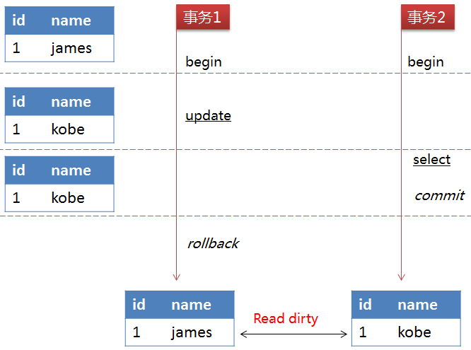
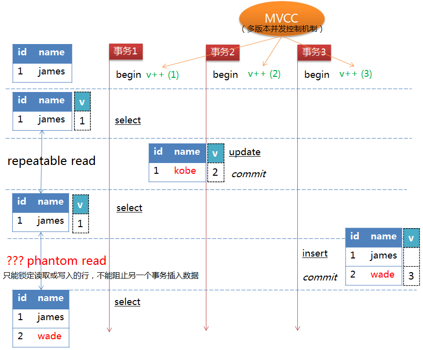

##### [原文1](https://www.cnblogs.com/zhoujinyi/p/3437475.html)

##### [关于幻读，可重复读的真实用例是什么？](https://www.zhihu.com/question/47007926)

# MySQL 四种事务隔离级的说明

> MySQL的InnoDB存储引擎在该隔离级别下，采用了`Next-Key Locking`锁机制避免了幻读问题.
>
> 间隙锁和行锁合称next-key lock，每个next-key lock是前开后闭区间

> 间隙锁是在可重复读隔离级别下才会生效的

## 简介

按照SQL:1992 事务隔离级别，InnoDB默认是可重复读的（REPEATABLE READ）。
MySQL/InnoDB 提供SQL标准所描述的所有四个事务隔离级别。
你可以在命令行用--transaction-isolation选项，或在选项文件里，为所有连接设置默认隔离级别。


## 事务的四种隔离级别

隔离级别         |  脏读（Dirty Read）|  不可重复读（NonRepeatable Read）  |    幻读（Phantom Read）
|---|---|---|--- 
未提交读（Read uncommitted）|  可能   |  可能  |    可能
已提交读（Read committed）  |  不可能 | 可能   |    可能
可重复读（Repeatable read） |  不可能 | 不可能  |  可能
可串行化（Serializable ）   |  不可能 | 不可能  |  不可能

- 未提交读(Read Uncommitted)：允许脏读，也就是`可能读取到其他会话`中`未提交事务修改的数据`

- 提交读(Read Committed)：只能读取到已经提交的数据。Oracle等多数数据库默认都是该级别 (不重复读)

- 可重复读(Repeated Read)：可重复读。在同一个事务内的查询都是事务开始时刻一致的，InnoDB默认级别。在SQL标准中，该隔离级别消除了不可重复读，但是还`存在幻读`

- 串行读(Serializable)：完全串行化的读，每次读都需要获得`表级共享锁`，读写相互都会阻塞


> Read Uncommitted这种级别，数据库一般都不会用，而且任何操作都不会加锁，这里就不讨论了。

`可重复读` 隔离级别下 mysql 并不会`自动的给 SELECT 操作添加行锁`/next-key lock锁，所以会`存在幻读的问题`，
如果你 select ... for update 对记录`手动加上行锁`，自然不会幻读， 
而 `serializable` 隔级别对 select 操作也会`隐式的加锁`，故资源始终被当前事务锁定，别的事物无法干扰。


## 幻读

幻读，`并不是说两次读取获取的结果集不同`，幻读侧重的`方面是某一次的 select 操作`得到的结果所表征的数据状态无法支撑后续的业务操作。
> 更为具体一些：select 某记录是否存在，不存在，准备`插入此记录`，但执行 insert 时发现此记录`已存在`，无法插入，此时就发生了幻读。

这里给出 mysql 幻读的比较形象的场景：
```
users： id 主键

1、T1：select * from users where id = 1;

2、T2：insert into `users`(`id`, `name`) values (1, 'big cat');

3、T1：insert into `users`(`id`, `name`) values (1, 'big cat');
```
- T1 ：主事务，检测表中是否有 id 为 1 的记录，没有则插入，这是我们期望的正常业务逻辑。
- T2 ：干扰事务，目的在于扰乱 T1 的正常的事务执行。

在 RR 隔离级别下，1、2 是会正常执行的，`3 则会报错主键冲突`，对于 T1 的业务来说是执行失败的，
这里 `T1 就是发生了幻读`，因为T1读取的数据状态并不能支持他的下一步的业务，见鬼了一样。

## MYSQL 配置隔离级别

例如，你可以在my.inf文件的[mysqld]节里类似如下设置该选项：
```mysql
transaction-isolation = {READ-UNCOMMITTED | READ-COMMITTED | REPEATABLE-READ | SERIALIZABLE}
```
用户可以用SET TRANSACTION语句改变单个会话或者所有新进连接的隔离级别。它的语法如下：

```mysql
SET [SESSION | GLOBAL] TRANSACTION ISOLATION LEVEL {READ UNCOMMITTED | READ COMMITTED | REPEATABLE READ | SERIALIZABLE}
```
注意：默认的行为（不带session和global）是为下一个（未开始）事务设置隔离级别。
如果你使用GLOBAL关键字，语句在全局对从那点开始创建的所有新连接（除了不存在的连接）设置默认事务级别。
你需要SUPER权限来做这个。使用SESSION 关键字为将来在当前连接上执行的事务设置默认事务级别。 
任何客户端都能自由改变会话隔离级别（甚至在事务的中间），或者为下一个事务设置隔离级别。 

你可以用下列语句查询全局和会话事务隔离级别：

```mysql
SELECT @@global.tx_isolation;
SELECT @@session.tx_isolation;
SELECT @@tx_isolation;
```

## 用例子说明各个级别的情况：

### READ UNCOMMITTED
> （可以读取未提交的数据（脏读）

读取未提交内容。在该隔离级别下，所有事务都可以看到其它未提交事务的执行结果。如下图所示： 
 
 
事务2查询到的数据是事务1中修改但未提交的数据，但因为事务1回滚了数据，
所以事务2查询的数据是不正确的，因此出现了脏读的问题。

### READ COMMITTED
> （读取提交的数据。但是，可能多次读取的数据结果不一致（不可重复读，幻读）

读取提交内容。在该隔离级别下，一个事务从开始到提交之前对数据所做的改变对其它事务是不可见的，
这样就解决在READ-UNCOMMITTED级别下的脏读问题。

但如果一个事务在执行过程中，
其它事务的提交对该事物中的数据发生改变，那么该事务中的一个查询语句在两次执行过程中会返回不一样的结果。
如下图所示： 

 
事务2执行update语句但未提交前，事务1的前两个select操作返回结果是相同的。
但事务2执行commit操作后，事务1的第三个select操作就读取到事务2对数据的改变，
导致与前两次select操作返回不同的数据，因此出现了不可重复读的问题。

### REPEATABLE READ

可重复读。这是`MySQL的默认事务隔离级别`，能确保事务在并发读取数据时会看到同样的数据行，解决了READ-COMMITTED隔离级别下的不可重复读问题。

MySQL的InnoDB存储引擎通过`多版本并发控制（Multi_Version Concurrency Control, MVCC）机制`来解决该问题。
在该机制下，事务每开启一个实例，都会分配一个版本号给它，
如果读取的数据行正在被其它事务执行DELETE或UPDATE操作（即该行上有排他锁），
这时该事物的读取操作不会等待行上的锁释放，而是根据版本号去读取行的快照数据（记录在undo log中），
这样，事务中的查询操作返回的都是同一版本下的数据，解决了不可重复读问题。其原理如下图所示： 


虽然该隔离级别下解决了不可重复读问题，但`理论上会导致`另一个问题：`幻读`（Phantom Read）。
正如上面所讲，一个事务在执行过程中，另一个事物对已有数据行的更改，
MVCC机制可保障该事物读取到的原有数据行的内容相同，但并`不能阻止另一个事务插入新的数据行`，
这就会导致该事物中凭空多出数据行，像出现了幻读一样，这便是幻读问题。如下图所示： 


事务2对id=1的行内容进行了修改并且执行了commit操作，
事务1中的第二个select操作在MVCC机制的作用下返回的仍是v=1的数据。
但事务3执行了insert操作，事务1第三次执行select操作时便返回了id=2的数据行，
与前`两次的select操作返回的值不一样`。

需要说明的是，REPEATABLE-READ隔离级别下的幻读问题是SQL标准定义下理论上会导致的问题，
**MySQL的InnoDB存储引擎在该隔离级别下，采用了`Next-Key Locking锁机制`避免了`幻读问题`**。

## 不可重复读和幻读的区别
很多人容易搞混不可重复读和幻读，确实这两者有些相似。但`不可重复读`重点在于`update和delete`，而`幻读`的重点在于`insert`

> 不可重复读和幻读最大的区别，就在于如何`通过锁机制`来解决他们产生的问题

## 总结:

四个级别逐渐增强，每个级别解决一个问题。事务级别越高,性能越差,大多数环境read committed 可以用.
记住4个隔离级别的特点(上面的例子);