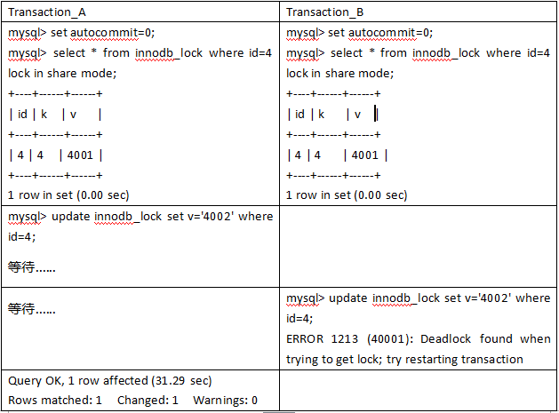
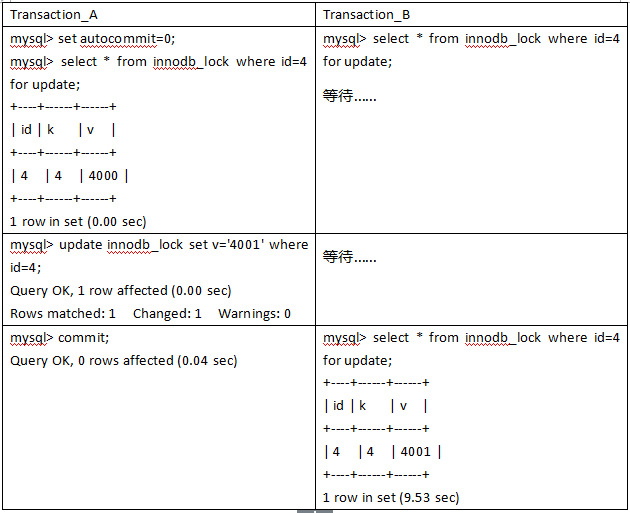

## [原文](https://juejin.im/post/5b82e0196fb9a019f47d1823)

# 锁相关概念

MySQL/InnoDB的加锁，一直是一个常见的话题。例如，数据库如果有高并发请求，如何保证数据完整性？
产生死锁问题如何排查并解决？下面是不同锁等级的区别

- 表级锁：开销小，加

- 锁快；不会出现死锁；锁定粒度大，发生锁冲突的概率最高 ，并发度最低。

- 页面锁：开销和加锁时间界于表锁和行锁之间；会出现死锁；锁定粒度界于表锁和行锁之间，并发度一般。

- 行级锁：开销大，加锁慢；会出现死锁；锁定粒度最小，发生锁冲突的概率最低，并发度也最高。

查看数据库拥有的存储引擎类型
```mysql
SHOW ENGINES
```

## 1、乐观锁
用数据版本（Version）记录机制实现，这是乐观锁最常用的一种实现方式。何谓数据版本？
即为数据增加一个版本标识，一般是通过为数据库表增加一个数字类型的 “version” 字段来实现。当读取数据时，
将version字段的值一同读出，数据每更新一次，对此version值加1。
当我们提交更新的时候，判断数据库表对应记录的当前版本信息与第一次取出来的version值进行比对，
如果数据库表当前版本号与第一次取出来的version值相等，则予以更新，否则认为是过期数据。

举例：    
1、数据库表三个字段，分别是id、value、version
```mysql
select id,value,version from TABLE where id = #{id}
```
2、每次更新表中的value字段时，为了防止发生冲突，需要这样操作
```mysql
update TABLE
set value=2,version=version+1
where id=#{id} and version=#{version}
```
## 2、悲观锁
与乐观锁相对应的就是悲观锁了。悲观锁就是在操作数据时，认为此操作会出现数据冲突，
所以在进行每次操作时都要通过获取锁才能进行对相同数据的操作，这点跟java中的synchronized很相似，所以悲观锁需要耗费较多的时间。
另外与乐观锁相对应的，悲观锁是由数据库自己实现了的，要用的时候，我们直接调用数据库的相关语句就可以了。

说到这里，由悲观锁涉及到的另外两个锁概念就出来了，它们就是共享锁与排它锁。
共享锁和排它锁是悲观锁的不同的实现，它俩都属于悲观锁的范畴。

### 2.1、共享锁
共享锁又称读锁 (read lock)，是读取操作创建的锁。
其他用户可以并发读取数据，但任何事务都不能对数据进行修改（获取数据上的排他锁），直到已释放所有共享锁。
当如果事务对读锁进行修改操作，很可能会造成死锁。如下图所示。



如果事务T对数据A加上共享锁后，则其他事务只能对A再加共享锁，不能加排他锁。获得共享锁的事务只能读数据，不能修改数据

打开第一个查询窗口
```mysql
begin;/begin work;/start transaction;  (三者选一就可以)
#(lock in share mode 共享锁)
SELECT * from TABLE where id = 1  lock in share mode;
```
然后在另一个查询窗口中，对id为1的数据进行更新
```mysql
update TABLE set name="www.souyunku.com" where id =1;
```
此时，操作界面进入了卡顿状态，过了很久超时，提示错误信息
如果在超时前，第一个窗口执行commit，此更新语句就会成功。
```mysql
[SQL]update test_one set name="www.souyunku.com" where id =1;
[Err] 1205 - Lock wait timeout exceeded; try restarting transaction
```
加上共享锁后，也提示错误信息
```mysql
update test_one set name="www.souyunku.com" where id =1 lock in share mode;
[SQL]update  test_one set name="www.souyunku.com" where id =1 lock in share mode;
[Err] 1064 - You have an error in your SQL syntax; check the manual that corresponds to your MySQL server version for the right syntax to use near 'lock in share mode' at line 1
```
在查询语句后面增加 LOCK IN SHARE MODE ，Mysql会对查询结果中的每行都加共享锁，当没有其他线程对查询结果集中的任何一行使用排他锁时，
可以成功申请共享锁，否则会被阻塞。 其他线程也可以读取使用了共享锁的表，而且这些线程读取的是同一个版本的数据。
加上共享锁后，对于update，insert，delete语句会自动加排它锁。

### 2.2 排它锁
排他锁 exclusive lock（也叫writer lock）又称写锁。 

名词解释：若某个事物对某一行加上了排他锁，只能这个事务对其进行读写，在此事务结束之前，
其他事务不能对其进行加任何锁，其他进程可以读取,不能进行写操作，需等待其释放。
排它锁是悲观锁的一种实现，在上面悲观锁也介绍过。

若事务 1 对数据对象A加上X锁，事务 1 可以读A也可以修改A，其他事务不能再对A加任何锁，直到事物 1 释放A上的锁。
这保证了其他事务在事物 1 释放A上的锁之前不能再读取和修改A。排它锁会阻塞所有的排它锁和共享锁

读取为什么要加读锁呢？防止数据在被读取的时候被别的线程加上写锁。
排他锁使用方式：在需要执行的语句后面加上for update就可以了
```mysql
select status from TABLE where id=1 for update;
```
排他锁，也称写锁，独占锁，当前写操作没有完成前，它会阻断其他写锁和读锁。



#### 排它锁-举例：
要使用排他锁，我们必须关闭mysql数据库的自动提交属性，因为MySQL默认使用autocommit模式，
也就是说，当你执行一个更新操作后，MySQL会立刻将结果进行提交。
我们可以使用命令设置MySQL为非autocommit模式：
```mysql
set autocommit=0;
# 设置完autocommit后，我们就可以执行我们的正常业务了。具体如下：
# 1. 开始事务
begin;/begin work;/start transaction; (三者选一就可以)
# 2. 查询表信息（for update加锁）
select status from TABLE where id=1 for update;
# 3. 插入一条数据
insert into TABLE (id,value) values (2,2);
# 4. 修改数据为
update TABLE set value=2 where id=1;
# 5. 提交事务
commit;/commit work
```
## 行锁
总结：多个事务操作同一行数据时，后来的事务处于阻塞等待状态。这样可以避免了脏读等数据一致性的问题。
后来的事务可以操作其他行数据，解决了表锁高并发性能低的问题。
```mysql
# Transaction-A
mysql> set autocommit = 0;
mysql> update innodb_lock set v='1001' where id=1;
mysql> commit;

```

```mysql
# Transaction-B
mysql> update innodb_lock set v='2001' where id=2;
Query OK, 1 row affected (0.37 sec)
mysql> update innodb_lock set v='1002' where id=1;
Query OK, 1 row affected (37.51 sec)

```

现实：当执行批量修改数据脚本的时候，行锁升级为表锁。其他对订单的操作都处于等待中，，，

原因：nnoDB只有在通过索引条件检索数据时使用行级锁，否则使用表锁！ 而模拟操作正是通过id去作为检索条件，
而id又是MySQL自动创建的唯一索引，所以才忽略了行锁变表锁的情况

总结：InnoDB的行锁是针对索引加的锁，不是针对记录加的锁。并且该索引不能失效，否则都会从行锁升级为表锁。

- 行锁的劣势：开销大；加锁慢；会出现死锁

- 行锁的优势：锁的粒度小，发生锁冲突的概率低；处理并发的能力强

- 加锁的方式：自动加锁。对于UPDATE、DELETE和INSERT语句，InnoDB会自动给涉及数据集加排他锁；
对于普通SELECT语句，InnoDB不会加任何锁；当然我们也可以显示的加锁：

从上面的案例看出，行锁变表锁似乎是一个坑，可MySQL没有这么无聊给你挖坑。这是因为MySQL有自己的执行计划。

当你需要更新一张较大表的大部分甚至全表的数据时。而你又傻乎乎地用索引作为检索条件。一不小心开启了行锁(没毛病啊！保证数据的一致性！)。
可MySQL却认为大量对一张表使用行锁，会导致事务执行效率低，从而可能造成其他事务长时间锁等待和更多的锁冲突问题，性能严重下降。
所以MySQL会将行锁升级为表锁，即实际上并没有使用索引。

我们仔细想想也能理解，既然整张表的大部分数据都要更新数据，在一行一行地加锁效率则更低。其实我们可以通过explain命令查看MySQL的执行计划，
你会发现key为null。表明MySQL实际上并没有使用索引，行锁升级为表锁也和上面的结论一致。

> 注意：行级锁都是基于索引的，如果一条SQL语句用不到索引是不会使用行级锁的，会使用表级锁。

### 间隙锁
当我们用范围条件而不是相等条件检索数据，并请求共享或排他锁时，InnoDB会给符合条件的已有数据记录的索引项加锁；
对于键值在条件范围内但并不存在的记录，叫做“间隙（GAP)”，InnoDB也会对这个“间隙”加锁，这种锁机制就是所谓的间隙锁（Next-Key锁）。

举例来说，假如emp表中只有101条记录，其empid的值分别是 1,2,...,100,101，下面的SQL：
```mysql
Select * from  emp where empid > 100 for update;
```
是一个范围条件的检索，InnoDB不仅会对符合条件的empid值为101的记录加锁，也会对empid大于101（这些记录并不存在）的“间隙”加锁。

InnoDB使用间隙锁的目的，一方面是为了防止幻读，以满足相关隔离级别的要求，对于上面的例子，要是不使用间隙锁，
如果其他事务插入了empid大于100的任何记录，那么本事务如果再次执行上述语句，就会发生幻读；另外一方面，是为了满足其恢复和复制的需要。
有关其恢复和复制对锁机制的影响，以及不同隔离级别下InnoDB使用间隙锁的情况，在后续的章节中会做进一步介绍。

很显然，在使用范围条件检索并锁定记录时，InnoDB这种加锁机制会阻塞符合条件范围内键值的并发插入，这往往会造成严重的锁等待。
因此，在实际应用开发中，尤其是并发插入比较多的应用，我们要尽量优化业务逻辑，尽量使用相等条件来访问更新数据，避免使用范围条件。

还要特别说明的是，InnoDB除了通过范围条件加锁时使用间隙锁外，如果使用相等条件请求给一个不存在的记录加锁，InnoDB也会使用间隙锁！
例子：假如emp表中只有101条记录，其empid的值分别是1,2,......,100,101。
InnoDB存储引擎的间隙锁阻塞例子

> 事务隔离级别 REPEATABLE-READ

session_1	| session_2
|---|---
| mysql> set autocommit = 0; | mysql> set autocommit = 0;
| 当前session对不存在的记录加for update的锁：|
| mysql> select * from emp where empid = 102 for update; | 
| | 这时，如果其他session插入empid为201的记录（注意：这条记录并不存在），也会出现锁等待：
| | mysql>insert into emp(empid,...) values(201,...);
| | 阻塞等待
| Session_1 执行rollback：|
| mysql> rollback;| 
| | 由于其他session_1回退后释放了Next-Key锁，当前session可以获得锁并成功插入记录：
| | mysql>insert into emp(empid,...) values(201,...);

> 危害(坑)：若执行的条件是范围过大，则InnoDB会将整个范围内所有的索引键值全部锁定，很容易对性能造成影响。

## 表锁
如何加表锁？
innodb 的行锁是在有索引的情况下，没有索引的表是锁定全表的。

### Innodb中的行锁与表锁
前面提到过，在Innodb引擎中既支持行锁也支持表锁，那么什么时候会锁住整张表，什么时候只锁住一行呢？   
只有通过索引条件检索数据，InnoDB才使用行级锁，否则，InnoDB将使用表锁！   
在实际应用中，要特别注意InnoDB行锁的这一特性，不然的话，可能导致大量的锁冲突，从而影响并发性能。

行级锁都是基于索引的，如果一条SQL语句用不到索引是不会使用行级锁的，会使用表级锁。行级锁的缺点是：由于需要请求大量的锁资源，所以速度慢，内存消耗大。

## 死锁
死锁（Deadlock）   
所谓死锁：是指两个或两个以上的进程在执行过程中，因争夺资源而造成的一种互相等待的现象，若无外力作用，
它们都将无法推进下去。此时称系统处于死锁状态或系统产生了死锁，这些永远在互相等待的进程称为死锁进程。
由于资源占用是互斥的，当某个进程提出申请资源后，使得有关进程在无外力协助下，永远分配不到必需的资源而无法继续运行，这就产生了一种特殊现象死锁。
解除正在死锁的状态有两种方法：

### 第一种：

查询是否锁表
```mysql
show OPEN TABLES where In_use > 0;

```
查询进程（如果您有SUPER权限，您可以看到所有线程。否则，您只能看到您自己的线程）
```mysql
show processlist
    
```
杀死进程id（就是上面命令的id列）
> kill id

### 第二种：

查看当前的事务

```mysql
SELECT * FROM INFORMATION_SCHEMA.INNODB_TRX;

```
查看当前锁定的事务
```mysql
SELECT * FROM INFORMATION_SCHEMA.INNODB_LOCKS;

```

查看当前等锁的事务
```mysql
SELECT * FROM INFORMATION_SCHEMA.INNODB_LOCK_WAITS;

```
杀死进程

> kill 进程ID

如果系统资源充足，进程的资源请求都能够得到满足，死锁出现的可能性就很低，否则就会因争夺有限的资源而陷入死锁。
其次，进程运行推进顺序与速度不同，也可能产生死锁。

产生死锁的四个必要条件：

- 互斥条件：一个资源每次只能被一个进程使用。
- 请求与保持条件：一个进程因请求资源而阻塞时，对已获得的资源保持不放。
- 不剥夺条件:进程已获得的资源，在末使用完之前，不能强行剥夺。
- 循环等待条件:若干进程之间形成一种头尾相接的循环等待资源关系。

虽然不能完全避免死锁，但可以使死锁的数量减至最少。将死锁减至最少可以增加事务的吞吐量并减少系统开销，
因为只有很少的事务回滚，而回滚会取消事务执行的所有工作。由于死锁时回滚的操作由应用程序重新提交。

下列方法有助于最大限度地降低死锁：

- 按同一顺序访问对象。
- 避免事务中的用户交互。
- 保持事务简短并在一个批处理中。
- 使用低隔离级别。
- 使用绑定连接。


##  MyISAM存储引擎
InnoDB和MyISAM的最大不同点有两个：

- InnoDB支持事务(transaction)；MyISAM不支持事务
- Innodb 默认采用行锁， MyISAM 是默认采用表锁。加锁可以保证事务的一致性，可谓是有人(锁)的地方，就有江湖(事务)
- MyISAM不适合高并发
 