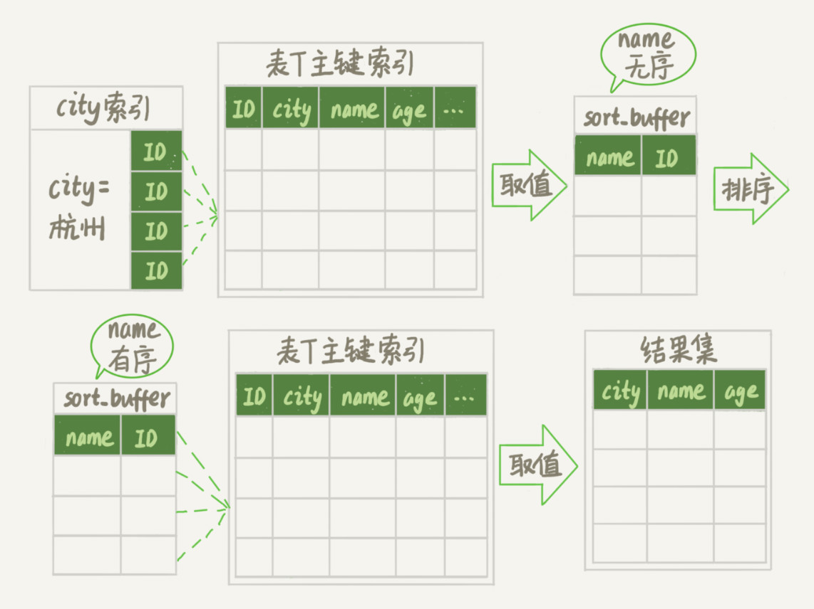
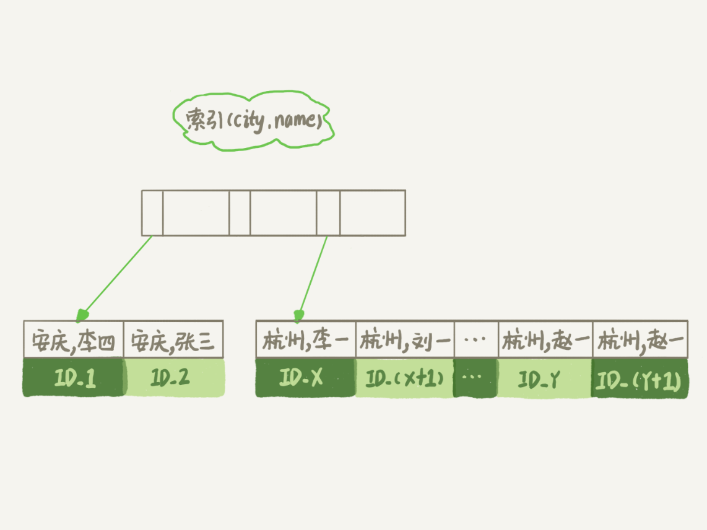

# order by”是怎么工作的

表的部分定义是这样的：

```mysql
CREATE TABLE `t` (
  `id` int(11) NOT NULL,
  `city` varchar(16) NOT NULL,
  `name` varchar(16) NOT NULL,
  `age` int(11) NOT NULL,
  `addr` varchar(128) DEFAULT NULL,
  PRIMARY KEY (`id`),
  KEY `city` (`city`)
) ENGINE=InnoDB;
```

这时，你的SQL语句可以这么写：

```mysql
select city,name,age from t where city='杭州' order by name limit 1000  ;
```
这个语句看上去逻辑很清晰，但是你了解它的执行流程吗？今天，我就和你聊聊这个语句是怎么执行的，以及有什么参数会影响执行的行为。

## 全字段排序
前面我们介绍过索引，所以你现在就很清楚了，为避免全表扫描，我们需要在city字段加上索引。

在city字段上创建索引之后，我们用explain命令来看看这个语句的执行情况。

> 插入4000 条数据

```mysql
mysql> explain select city,name,age from t where city='杭州' order by name limit 1000  ;
+----+-------------+-------+------------+------+---------------+------+---------+-------+------+----------+---------------------------------------+
| id | select_type | table | partitions | type | possible_keys | key  | key_len | ref   | rows | filtered | Extra                                 |
+----+-------------+-------+------------+------+---------------+------+---------+-------+------+----------+---------------------------------------+
|  1 | SIMPLE      | t     | NULL       | ref  | city          | city | 66      | const | 4000 |   100.00 | Using index condition; Using filesort |
+----+-------------+-------+------------+------+---------------+------+---------+-------+------+----------+---------------------------------------+
1 row in set, 1 warning (0.01 sec)
```
使用explain命令查看语句的执行情况


为了说明这个SQL查询语句的执行过程，我们先来看一下city这个索引的示意图。


从图中可以看到，满足city='杭州’条件的行，是从ID_X到ID_(X+N)的这些记录。

通常情况下，这个语句执行流程如下所示 ：

1. 初始化sort_buffer，确定放入name、city、age这三个字段；

2. 从索引city找到第一个满足city='杭州’条件的主键id，也就是图中的ID_X；
 
3. 到主键id索引取出整行，取name、city、age三个字段的值，存入sort_buffer中；
 
4. 从索引city取下一个记录的主键id；
 
5. 重复步骤3、4直到city的值不满足查询条件为止，对应的主键id也就是图中的ID_Y；
 
6. 对sort_buffer中的数据按照字段name做快速排序；
 
7. 按照排序结果取前1000行返回给客户端。

我们暂且把这个排序过程，称为全字段排序，执行流程的示意图如下所示，下一篇文章中我们还会用到这个排序。


图中“按name排序”这个动作，可能在内存中完成，也可能需要使用外部排序，这取决于排序所需的内存和参数sort_buffer_size。

sort_buffer_size，就是MySQL为排序开辟的内存（sort_buffer）的大小。
如果要排序的数据量小于sort_buffer_size，排序就在内存中完成。但如果排序数据量太大，内存放不下，则不得不利用磁盘临时文件辅助排序。

你可以用下面介绍的方法，来确定一个排序语句是否使用了临时文件。

```mysql
/* 打开optimizer_trace，只对本线程有效 */
SET optimizer_trace='enabled=on'; 

/* @a保存Innodb_rows_read的初始值 */
select VARIABLE_VALUE into @a from  performance_schema.session_status where variable_name = 'Innodb_rows_read';

/* 执行语句 */
select city, name,age from t where city='杭州' order by name limit 1000; 

/* 查看 OPTIMIZER_TRACE 输出 */
SELECT * FROM `information_schema`.`OPTIMIZER_TRACE`\G

/* @b保存Innodb_rows_read的当前值 */
select VARIABLE_VALUE into @b from performance_schema.session_status where variable_name = 'Innodb_rows_read';

/* 计算Innodb_rows_read差值 */
select @b-@a;
```
这个方法是通过查看 OPTIMIZER_TRACE 的结果来确认的，你可以从 number_of_tmp_files中看到是否使用了临时文件。


图3 全字段排序

number_of_tmp_files表示的是，排序过程中使用的临时文件数。你一定奇怪，为什么需要12个文件？内存放不下时，就需要使用外部排序，
外部排序一般使用归并排序算法。可以这么简单理解，MySQL将需要排序的数据分成12份，每一份单独排序后存在这些临时文件中。
然后把这12个有序文件再合并成一个有序的大文件。

如果sort_buffer_size超过了需要排序的数据量的大小，number_of_tmp_files就是0，表示排序可以直接在内存中完成。

否则就需要放在临时文件中排序。sort_buffer_size越小，需要分成的份数越多，number_of_tmp_files的值就越大。

接下来，我再和你解释一下图4中其他两个值的意思。

我们的示例表中有4000条满足city='杭州’的记录，所以你可以看到 examined_rows=4000，表示参与排序的行数是4000行。

sort_mode 里面的packed_additional_fields的意思是，排序过程对字符串做了“紧凑”处理。即使name字段的定义是varchar(16)，
在排序过程中还是要按照实际长度来分配空间的。

同时，最后一个查询语句select @b-@a 的返回结果是4000，表示整个执行过程只扫描了4000行。

这里需要注意的是，为了避免对结论造成干扰，我把internal_tmp_disk_storage_engine设置成MyISAM。否则，select @b-@a的结果会显示为4001。

这是因为查询OPTIMIZER_TRACE这个表时，需要用到临时表，而internal_tmp_disk_storage_engine的默认值是InnoDB。
如果使用的是InnoDB引擎的话，把数据从临时表取出来的时候，会让Innodb_rows_read的值加1。

## rowid 排序
在上面这个算法过程里面，只对原表的数据读了一遍，剩下的操作都是在sort_buffer和临时文件中执行的。
但这个算法有一个问题，就是如果查询要返回的字段很多的话，那么sort_buffer里面要放的字段数太多，
这样内存里能够同时放下的行数很少，要分成很多个临时文件，排序的性能会很差。

所以如果单行很大，这个方法效率不够好。

那么，如果MySQL认为排序的单行长度太大会怎么做呢？

接下来，我来修改一个参数，让MySQL采用另外一种算法。
```mysql
SET max_length_for_sort_data = 16;
```
max_length_for_sort_data，是MySQL中专门控制用于排序的行数据的长度的一个参数。
它的意思是，如果单行的长度超过这个值，MySQL就认为单行太大，要换一个算法。

city、name、age 这三个字段的定义总长度是36，我把max_length_for_sort_data设置为16，我们再来看看计算过程有什么改变。

新的算法放入sort_buffer的字段，只有要排序的列（即name字段）和主键id。

但这时，排序的结果就因为少了city和age字段的值，不能直接返回了，整个执行流程就变成如下所示的样子：

1. 初始化sort_buffer，确定放入两个字段，即name和id；

2. 从索引city找到第一个满足city='杭州’条件的主键id，也就是图中的ID_X；

3. 到主键id索引取出整行，取name、id这两个字段，存入sort_buffer中；

4. 从索引city取下一个记录的主键id；

5. 重复步骤3、4直到不满足city='杭州’条件为止，也就是图中的ID_Y；

6. 对sort_buffer中的数据按照字段name进行排序；

7. 遍历排序结果，取前1000行，并按照id的值回到原表中取出city、name和age三个字段返回给客户端。

这个执行流程的示意图如下，我把它称为rowid排序。


图5 rowid排序

对比图3的全字段排序流程图你会发现，rowid排序多访问了一次表t的主键索引，就是步骤7。

需要说明的是，最后的“结果集”是一个逻辑概念，实际上MySQL服务端从排序后的sort_buffer中依次取出id，
然后到原表查到city、name和age这三个字段的结果，不需要在服务端再耗费内存存储结果，是直接返回给客户端的。

根据这个说明过程和图示，你可以想一下，这个时候执行select @b-@a，结果会是多少呢？

现在，我们就来看看结果有什么不同。

首先，图中的examined_rows的值还是4000，表示用于排序的数据是4000行。但是select @b-@a这个语句的值变成5000了。

因为这时候除了排序过程外，在排序完成后，还要根据id去原表取值。由于语句是limit 1000，因此会多读1000行。


图6 rowid排序的OPTIMIZER_TRACE部分输出

从OPTIMIZER_TRACE的结果中，你还能看到另外两个信息也变了。

sort_mode变成了<sort_key, rowid>，表示参与排序的只有name和id这两个字段。
number_of_tmp_files变成10了，是因为这时候参与排序的行数虽然仍然是4000行，但是每一行都变小了，
因此需要排序的总数据量就变小了，需要的临时文件也相应地变少了。

## 全字段排序 VS rowid排序
我们来分析一下，从这两个执行流程里，还能得出什么结论。

如果MySQL实在是担心排序内存太小，会影响排序效率，才会采用rowid排序算法，这样排序过程中一次可以排序更多行，但是需要再回到原表去取数据。

如果MySQL认为内存足够大，会优先选择全字段排序，把需要的字段都放到sort_buffer中，这样排序后就会直接从内存里面返回查询结果了，不用再回到原表去取数据。

这也就体现了MySQL的一个设计思想：如果内存够，就要多利用内存，尽量减少磁盘访问。

对于InnoDB表来说，rowid排序会要求回表多造成磁盘读，因此不会被优先选择。

这个结论看上去有点废话的感觉，但是你要记住它，下一篇文章我们就会用到。

看到这里，你就了解了，MySQL做排序是一个成本比较高的操作。
那么你会问，是不是所有的order by都需要排序操作呢？  
如果不排序就能得到正确的结果，那对系统的消耗会小很多，语句的执行时间也会变得更短。

其实，并不是所有的order by语句，都需要排序操作的。
从上面分析的执行过程，我们可以看到，MySQL之所以需要生成临时表，并且在临时表上做排序操作，其原因是原来的数据都是无序的。

你可以设想下，**如果能够保证从city这个索引上取出来的行，天然就是按照name递增排序的话，是不是就可以不用再排序了呢**？

确实是这样的。

所以，我们可以在这个市民表上创建一个city和name的联合索引，对应的SQL语句是：
```mysql
alter table t add index city_user(city, name);

```
作为与city索引的对比，我们来看看这个索引的示意图。



图7 city和name联合索引示意图

在这个索引里面，我们依然可以用树搜索的方式定位到第一个满足city='杭州’的记录，并且额外确保了，
接下来按顺序取“下一条记录”的遍历过程中，只要city的值是杭州，name的值就一定是有序的。

这样整个查询过程的流程就变成了：

1.从索引(city,name)找到第一个满足city='杭州’条件的主键id；

2.到主键id索引取出整行，取name、city、age三个字段的值，作为结果集的一部分直接返回；

3. 从索引(city,name)取下一个记录主键id；

4. 重复步骤2、3，直到查到第1000条记录，或者是不满足city='杭州’条件时循环结束。


图8 引入(city,name)联合索引后，查询语句的执行计划

可以看到，这个查询过程不需要临时表，也不需要排序。接下来，我们用explain的结果来印证一下。


图9 引入(city,name)联合索引后，查询语句的执行计划

从图中可以看到，Extra字段中没有Using filesort了，也就是不需要排序了。
而且由于(city,name)这个联合索引本身有序，所以这个查询也不用把4000行全都读一遍，
只要找到满足条件的前1000条记录就可以退出了。也就是说，在我们这个例子里，只需要扫描1000次。

既然说到这里了，我们再往前讨论，这个语句的执行流程有没有可能进一步简化呢？   
不知道你还记不记得，我在第5篇文章《 深入浅出索引（下）》中，和你介绍的覆盖索引。

这里我们可以再稍微复习一下。**覆盖索引是指，索引上的信息足够满足查询请求，不需要再回到主键索引上去取数据。**

按照覆盖索引的概念，我们可以再优化一下这个查询语句的执行流程。

针对这个查询，我们可以创建一个city、name和age的联合索引，对应的SQL语句就是：
```mysql
alter table t add index city_user_age(city, name, age);
```
这时，对于city字段的值相同的行来说，还是按照name字段的值递增排序的，此时的查询语句也就不再需要排序了。
这样整个查询语句的执行流程就变成了：

从索引(city,name,age)找到第一个满足city='杭州’条件的记录，取出其中的city、name和age这三个字段的值，
作为结果集的一部分直接返回；

从索引(city,name,age)取下一个记录，同样取出这三个字段的值，作为结果集的一部分直接返回；

重复执行步骤2，直到查到第1000条记录，或者是不满足city='杭州’条件时循环结束。


图10 引入(city,name,age)联合索引后，查询语句的执行流程
然后，我们再来看看explain的结果。


图11 引入(city,name,age)联合索引后，查询语句的执行计划

可以看到，Extra字段里面多了“Using index”，表示的就是使用了覆盖索引，性能上会快很多。

当然，这里并不是说要为了每个查询能用上覆盖索引，就要把语句中涉及的字段都建上联合索引，
毕竟索引还是有维护代价的。这是一个需要权衡的决定。


