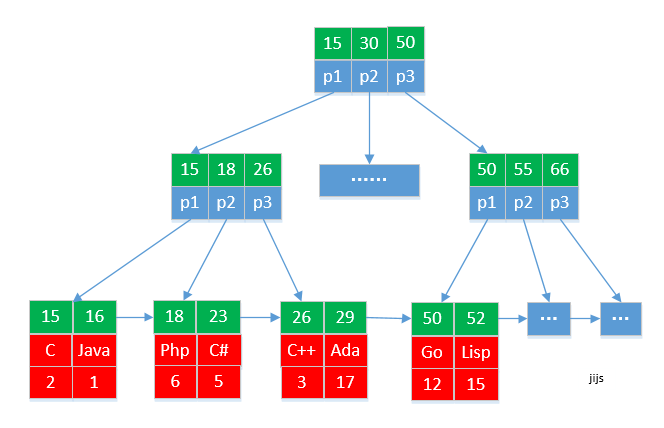
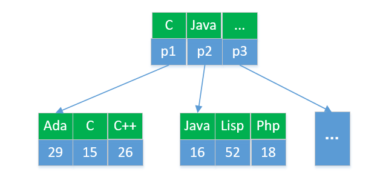

## [原文](https://www.jianshu.com/p/23524cc57ca4)

# 聚簇索引和二级索引

## 聚簇索引
索引和数据存储在一块（ 都存储在同一个B*tree 中）。
一般主键索引都是聚餐索引

> Mysql中InnoDB引擎的主键索引为聚簇索引，MyISAM存储引擎采用非聚集索引

## 非聚簇索引

索引数据和存储数据是分离的。

## 二级索引（辅助索引）  
二级索引存储的是记录的主键，而不是数据存储的地址。

以Mysql的InnoDB为例  
主键是聚集索引   
唯一索引、普通索引、前缀索引等都是二级索引（辅助索引）

## 示例
下面我们通过一个具体的示例进行演示聚集索引和二级索引   

pl_ranking（编程语言排行榜表）
```
该表包含3个字段，如下：
id:主键
plname：编程语言名称
ranking：排名

```


id | plname | ranking
|---|---|---
15  | C    | 2
16  | Java | 1
18  | Php  | 6
23  | C#   | 5
26  | C++  | 3
... | ...  | ...


```
id: 设置主键
plname: 普通索引

聚簇索引(主键索引)
```

## 聚集索引



从图中我们可以看到，索引数据和存储数据都是在一颗树上，存在一起的。通过定位索引就直接可以查找到数据。

这棵树是根据主键进行创建的。   
如果查找id=16的编程语言，   
```mysql

select id, plname, ranking from pl_ranking where id=16;

```
则只需要读取3个磁盘块，就可以获取到数据。

## 二级索引（辅助索引）




从上图中我们发现，该B*tree根据plname列进行构建的，只存储索引数据，plname 和 id 的映射。   
比如查找 编程语言为“Java”的数据。
```mysql

select id, plname, ranking from pl_ranking where plname='Java';

```
首先通过二级索引树中找到 Java 对应的主键id 为 “16”（读取2个磁盘块）。   
然后在去主键索引中查找id为“16” 的数据。（读取3个磁盘块）

## 结论

```mysql
select id, plname, ranking from pl_ranking where id=16;

```
根据主键查找只需要查找3个磁盘块

```mysql
select id, plname, ranking from pl_ranking where plname='Java';

```
根据编程语言名称查询需要读取5个磁盘块

## 结论一
通过上面的主键索引和非主键索引的例子我们可以得出：
主键索引（聚餐索引）查询效率比非主键索引查询效率更高。如果能使用主键查找的，就尽量使用主键索引进行查找。

## 结论二
从上面图中我们还可以分析得出以下结论：
主键定义的长度越小，二级索引的大小就越小，这样每个磁盘块存储的索引数据越多，查询效率就越高。
 