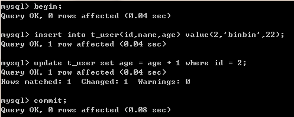
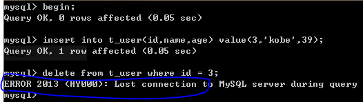
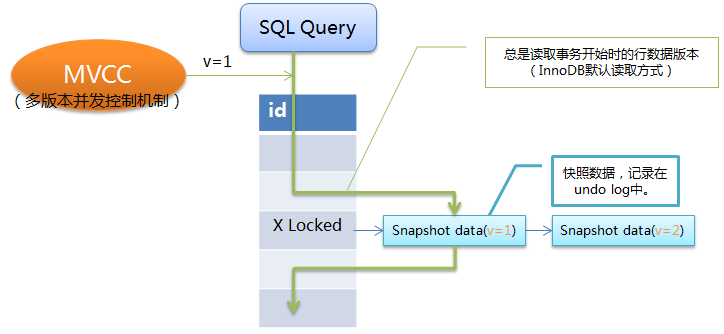

## [原文](https://blog.csdn.net/u013235478/article/details/50625602)

# MySQL事务

事务（Transaction）是数据库区别于文件系统的重要特性之一，
事务会把数据库从一种一致性状态转换为另一种一致性状态。在数据库提交时，可以确保要么所有修改都已保存，要么所有修改都不保存。

## 事务的ACID特性
事务必须同时满足ACID的特性：

- 原子性（Atomicity）。事务中的所有操作要么全部执行成功，要么全部取消。
- 一致性（Consistency）。事务开始之前和结束之后，数据库完整性约束没有破坏。
- 隔离性（Isolation）。事务提交之前对其它事务不可见。
- 持久性（Durability）。事务一旦提交，其结果是永久的。

## 事务的分类
从事务理论的角度可以把事务分为以下几种类型：

- 扁平事务（Flat Transactions）
- 带有保存节点的扁平事务（Flat Transactions with Savepoints）
- 链事务（Chained Transactions）
- 嵌套事务（Nested Transactions）
- 分布式事务（Distributed Transactions）
 
 

### 扁平事务
扁平事务（Flat Transactions）是事务类型中最简单但使用最频繁的事务。在扁平事务中，所有的操作都处于同一层次，
由BEGIN/START TRANSACTION开始事务，由COMMIT/ROLLBACK结束，且都是原子的，要么都执行，要么都回滚。
因此扁平事务是应用程序成为原子操作的基本组成模块。扁平事务一般有三种不同的结果： 

1.事务成功完成。在平常应用中约占所有事务的96%。 

2.应用程序要求停止事务。比如应用程序在捕获到异常时会回滚事务，约占事务的3%。 

3.外界因素强制终止事务。如连接超时或连接断开，约占所有事务的1%。 

扁平事务的主要限制是不能提交或者回滚事务的某一部分。如果某一事务中有多个操作，
在一个操作有异常时并不希望之的操作全部回滚，而是保存前面操作的更改。
扁平事务并不能支持这样的事例，因此就出现了带有保存节点的扁平事务。

### 带有保存节点的扁平事务
带有保存节点的扁平事务（Flat Transactions with Savepoints）允许事务在执行过程中回滚到较早的一个状态，
而不是回滚所有的操作。保存点（Savepoint）用来通知系统应该记住事务当前的状态，
以便当之后发生错误时，事务能回到保存点当时的状态。

对于扁平事务来说，在事务开始时隐式地设置了一个保存点，回滚时只能回滚到事务开始时的状态。下图是回滚到某个保存节点的实例： 

### 链事务
链事务（Chained Transaction）是指一个事务由多个子事务链式组成。
前一个子事务的提交操作和下一个子事务的开始操作合并成一个原子操作，这意味着下一个事务将看到上一个事务的结果，
就好像在一个事务中进行的一样。这样，在提交子事务时就可以释放不需要的数据对象，而不必等到整个事务完成后才释放。其工作方式如下： 
 
链事务与带保存节点的扁平事务不同的是，链事务中的回滚仅限于当前事务，相当于只能恢复到最近的一个保存节点，
而带保存节点的扁平事务能回滚到任意正确的保存点。但是，带有保存节点的扁平事务中的保存点是易失的，
当发生系统崩溃是，所有的保存点都将消失，这意味着当进行恢复时，事务需要从开始处重新执行。

### 嵌套事务
嵌套事务（Nested Transaction）是一个层次结构框架。由一个顶层事务（top-level transaction）控制着各个层次的事务。
顶层事务之下嵌套的事务成为子事务（subtransaction）,其控制着每一个局部的操作，子事务本身也可以是嵌套事务。
因此，嵌套事务的层次结构可以看成是一颗树，其结构如下图所示。 

### 分布式事务
分布式事务（Distributed Transactions）通常是一个在分布式环境下运行的扁平事务，因此需要根据数据所在位置访问网络中不同节点的数据库资源。 
例如一个银行用户从招商银行的账户向工商银行的账户转账1000元，这里需要用到分布式事务，因为不能仅调用某一家银行的数据库就完成任务。 

## 事务的隔离级别
SQL标准定义的四个隔离级别：

- READ UNCOMMITTED
- READ COMMITTED
- REPEATABLE READ
- SERIALIZABLE

这些隔离级别定义了事务中哪些数据的改变对其它事务可见，
哪些数据的改变对其它事务不可见，事务的隔离级别可以使用以下语句进行设置。 

### READ UNCOMMITTED
读取未提交内容。在该隔离级别下，所有事务都可以看到其它未提交事务的执行结果。如下图所示： 
 
 
事务2查询到的数据是事务1中修改但未提交的数据，但因为事务1回滚了数据，
所以事务2查询的数据是不正确的，因此出现了脏读的问题。

### READ COMMITTED
读取提交内容。在该隔离级别下，一个事务从开始到提交之前对数据所做的改变对其它事务是不可见的，
这样就解决在READ-UNCOMMITTED级别下的脏读问题。但如果一个事务在执行过程中，
其它事务的提交对该事物中的数据发生改变，那么该事务中的一个查询语句在两次执行过程中会返回不一样的结果。
如下图所示： 

 
事务2执行update语句但未提交前，事务1的前两个select操作返回结果是相同的。
但事务2执行commit操作后，事务1的第三个select操作就读取到事务2对数据的改变，
导致与前两次select操作返回不同的数据，因此出现了不可重复读的问题。

### REPEATABLE READ
可重复读。这是MySQL的默认事务隔离级别，能确保事务在并发读取数据时会看到同样的数据行，
解决了READ-COMMITTED隔离级别下的不可重复读问题。
MySQL的InnoDB存储引擎通过多版本并发控制（Multi_Version Concurrency Control, MVCC）机制来解决该问题。
在该机制下，事务每开启一个实例，都会分配一个版本号给它，
如果读取的数据行正在被其它事务执行DELETE或UPDATE操作（即该行上有排他锁），
这时该事物的读取操作不会等待行上的锁释放，而是根据版本号去读取行的快照数据（记录在undo log中），
这样，事务中的查询操作返回的都是同一版本下的数据，解决了不可重复读问题。其原理如下图所示： 

虽然该隔离级别下解决了不可重复读问题，但理论上会导致另一个问题：幻读（Phantom Read）。
正如上面所讲，一个事务在执行过程中，另一个事物对已有数据行的更改，
MVCC机制可保障该事物读取到的原有数据行的内容相同，但并不能阻止另一个事务插入新的数据行，
这就会导致该事物中凭空多出数据行，像出现了幻读一样，这便是幻读问题。如下图所示： 

事务2对id=1的行内容进行了修改并且执行了commit操作，
事务1中的第二个select操作在MVCC机制的作用下返回的仍是v=1的数据。
但事务3执行了insert操作，事务1第三次执行select操作时便返回了id=2的数据行，
与前两次的select操作返回的值不一样。

需要说明的是，REPEATABLE-READ隔离级别下的幻读问题是SQL标准定义下理论上会导致的问题，
MySQL的InnoDB存储引擎在该隔离级别下，采用了Next-Key Locking锁机制避免了幻读问题。
Next-Key Locking锁机制将在后面的锁章节中讲到。

### SERIALIZABLE
可串行化。这是事务的最高隔离级别，通过强制事务排序，使之不可能相互冲突，
就是在每个读的数据行加上共享锁来实现。在该隔离级别下，可以解决前面出现的脏读、不可重复读和幻读问题，
但也会导致大量的超时和锁竞争现象，一般不推荐使用。
