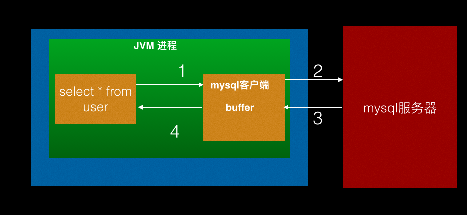

## [原文](https://www.jianshu.com/p/eedc9350f700)

# MySQL中流式查询使用

## 一、前言

MySQL 是目前使用比较广泛的关系型数据库，而从数据库里面根据条件查询数据到内存的情况想必大家在日常项目实践中都有使用。

当指定条件的数据量特别大时候一般是通过分页的方式在前端页面通过 Tag 标签一页页的加载数据到内存；
但是有些情况下却不需要用户切换 Tag 标签的方式一页页的加载数据，这时候如果一下子全部把数据加载内存，
就有可能会导致 OOM，虽然这时候可以通过程序控制分页查询，
但是每次查询时候数据库都需要把所有符合条件的数据查询出来然后根据当前页的返回来返回指定的页，这无疑加重了 MySQL 服务器不必要的开销。

其实在 MySQL 中提供了流式查询，这允许把符合条件的数据一部分一部分的加载到内存，
本 Chat 就来具体讲解如何在 MySQL中使用流式查询：

使用流式查询前，我们是如何在 MySQL 中进行查询数据的，整个过程发生了什么？
如何使用 JDBC 编程方式在 MySQL 中使用流式查询？

## 二、普通查询



当我们在JVM进程里面的某一个线程里面执行数据库查询时候，其实这个请求首先会调用mysql驱动程序。
mysql驱动接受到请求后会向MySQL服务器发起TCP请求，服务器端根据条件查询出匹配的数据，然后通过TCP链接发送到MySQL驱动
MySQL驱动内则会把符合条件的数据缓存到驱动内，等服务器返回了所有符合条件的数据后，在一下子把缓存里面的数据返回给调用sql的应用程序。
所以如果查询的数据量特别大，那么mysql驱动内缓存就可能把内存撑爆造成OOM。

## 三、JDBC编程中MySQL流式查询
mysql客户端流式查询不会一下子把服务器端所有数据缓存起来，而是一部分一部分的把服务器端返回的数据返回给应用程序层，所以可以有效避免OOM。

JDBC编程中MYSQL流式查询例子：

```sql

public void selectData(String sqlCmd,) throws SQLException {

    validate(sqlCmd);

    Connection conn = null;
    PreparedStatement stmt = null;
    ResultSet rs = null;

    try {

        conn = petadataSource.getConnection();
        
        stmt = conn.prepareStatement(sqlCmd, ResultSet.TYPE_FORWARD_ONLY, ResultSet.CONCUR_READ_ONLY);
            stmt.setFetchSize(Integer.MIN_VALUE);
            
        rs = stmt.executeQuery();

        try {
            while(rs.next()){
                try {
                    System.out.println("one:" + rs.getString(1) + "two:" + rs.getString(2) + "thrid:" + rs.getString(3));
                } catch (SQLException e) {
                    // TODO Auto-generated catch block
                    e.printStackTrace();
                }
            }
        } catch (SQLException e) {
            // TODO Auto-generated catch block
            e.printStackTrace();
        }

        } finally {
            close(stmt, rs, conn);

        }
}
```
可知只是prepareStatement时候改变了参数为ResultSet.TYPE_FORWARD_ONLY, 
ResultSet.CONCUR_READ_ONLY，
并且设置了PreparedStatement的fetchsize为Integer.MIN_VALUE。

## 四、最后
上面我们讲解了JDBC中流式查询使用，那么如下在Mybatis中使用那？

- 如何在 Mybatis 中使用 MyBatisCursorItemReader 进行流式查询？

- 如何在 Mybatis 中使用 ResultHandler 进行流式查询？

- 什么是客户端流式查询和服务器端流式查询？

- 更多流式查询请单击 单击我

 