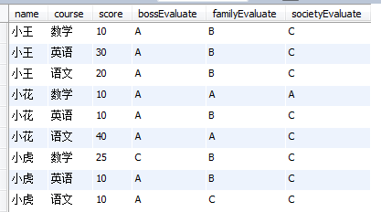

## [原文](https://blog.csdn.net/rainyspring4540/article/details/51328877)

# mysql多行变多列


## 表结构：

```mysql
create table student (
  name varchar(20) not null, -- 姓名
  course varchar(20) not null,-- 科目
  score int ,-- 成绩
  bossEvaluate varchar(20),-- 校长评估
  familyEvaluate varchar(20),-- 家族评估
  societyEvaluate varchar(20), -- 社会评估
  primary key(name,course)
);
insert into student values('小王','数学','10','A','B','C');
insert into student values('小王','语文','20','A','B','C');
insert into student values('小王','英语','30','A','B','C');
insert into student values('小花','数学','10','A','A','A');
insert into student values('小花','语文','40','A','A','C');
insert into student values('小花','英语','10','A','B','C');
insert into student values('小虎','数学','25','C','B','C');
insert into student values('小虎','语文','10','A','C','C');
insert into student values('小虎','英语','10','A','B','C');

```
形如：



下面的是一般的生成展现和sql，贴出来就不赘述了：

```mysql
SELECT name ,
       max(if(course='数学',score,0)) as '数学' ,
       max(if(course='语文',score,0)) as '语文' ,
       max(if(course='英语',score,0)) as '英语' 
FROM ds_wjytest2.student group by name;

```
我这里用的是if不是case when，其实效果都差不多；


下面是更复杂点的衍生展现和sql：


```mysql
SELECT name ,
       max(if(course='数学',score,0)) as '数学' ,
       max(if(course='数学',bossEvaluate,null)) as '校长评估' ,
       max(if(course='数学',familyEvaluate,null)) as '家族评估' ,
       max(if(course='数学',societyEvaluate,null)) as '社会评估',
       max(if(course='语文',score,0)) as '语文' ,
       max(if(course='语文',bossEvaluate,null)) as '校长评估' ,
       max(if(course='语文',familyEvaluate,null)) as '家族评估' ,
       max(if(course='语文',societyEvaluate,null)) as '社会评估',
       max(if(course='英语',score,0)) as '英语' ,
       max(if(course='英语',bossEvaluate,null)) as '校长评估',
       max(if(course='英语',familyEvaluate,null)) as '家族评估' ,
       max(if(course='英语',societyEvaluate,null)) as '社会评估'
FROM ds_wjytest2.student group by name;

```
是不是感觉if函数很好用。。。有些领导就喜欢这种冗长的报表，顺便说下：如果是大数据导出这样结构的数据，最好不要使用这个语句，
如果数据量太大（10w），或者类似这样的伴随分类字段（这里科目是分类字段）的延伸字段（家长评价、社会评价、小校长评价）太多会是性能极速下降；
我测试解决大数据导出这样结构采用分页导出（带排序字段），并且每次分页读取时先缓存一部分基本表的信息，
由于是带排序的，所有缓存的命中率很高；已经命中的清除缓存，未命中的库里读取这个记录，
并在此读入一部分信息到缓存（细节以后单写篇文章。。。）
 