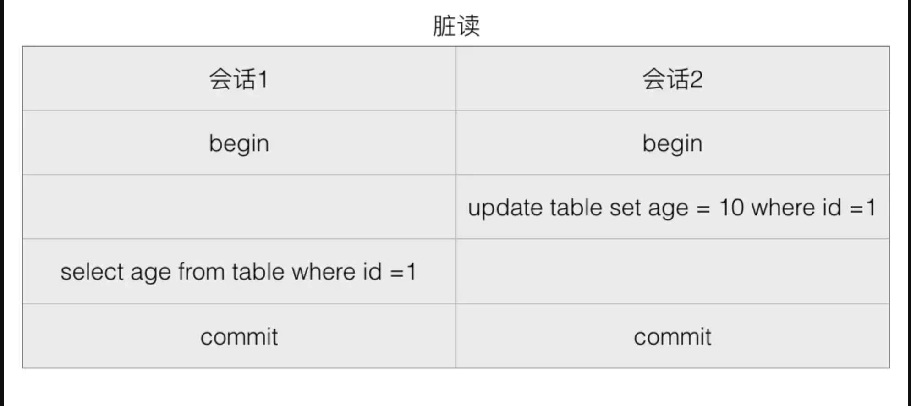
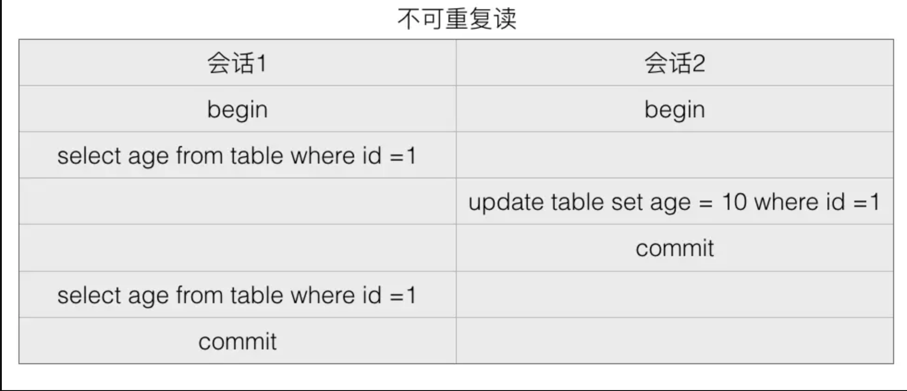
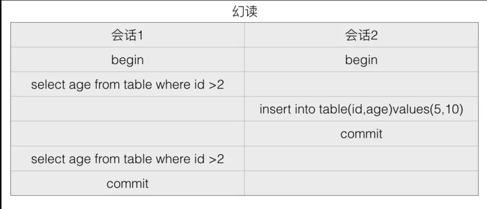

## [原文](https://www.jianshu.com/p/f7ac1b22e899)

# 何为脏读、不可重复读、幻读

## 2.0、前言
事务的隔离性是指多个事务并发执行的时候相互之间不受到彼此的干扰的特性，隔离性是事务ACID特性中的I，根据隔离程度从低到高分为Read Uncommitted（读未提交），Read Committed（读已提交），Repeatable Read（可重复读），Serializable（串行化）四种隔离级别。在具体介绍事务隔离性前先介绍几个名词，以便说明数据库在并发操作时候可能存在的问题，以便展开来探讨这四种隔离级别对应存在哪些问题，哪些隔离级别解决了哪些问题。

## 2.1 何为脏读、不可重复读、幻读

### 脏读
所谓脏读是指一个事务中访问到了另外一个事务未提交的数据，如下图：
 
 
如上图开启两个会话来模拟两个线程同时去访问数据库表table中id=1的记录，
假设两个会话开启前数据库中table表中id=1的记录行里面的列age值为5。
会话1和2一开始都开启了显示的事务（只有执行commit命令才会提交数据的修改），
会话2首先更新了table中id=1的记录行的age列的值为10（更新前值为5），
在会话2执行commit提交前，会话1通过select语句查询id=1的记录行中age列的值，
这时候如果存在脏读，则会话1读取到的age的值是10而不是5了，虽然会话2的更新还没有提交。
那么脏读存在什么问题那?如果会话2最后提交了，
那么会话1虽然在会话2还没提交就读取到了修改的值，但是也没什么影响；
但是如果会话1读取到会话2没有提交的数据后，会话2执行了rollback，
也就是没有把修改刷新到数据库，但是会话1已经使用了修改的数据，这就出现了错误。

### 不可重复读
所谓不可重复读是指在一个事务内根据同一个条件对行记录进行多次查询，但是搜出来的结果却不一致。
发生不可重复读的原因是在多次搜索期间查询条件覆盖的数据被其他事务修改了，
下面借助图表来解析下不可重复读。

如上图假设数据库表table里面id=1的记录行中age列一开始值为5，
然后会话1和会话2分别开启了一个事务，会话1首先查询id=1的记录中age字段值为5，
然后会话2修改id=1的记录中age的值为10然后提交了事务，然后会话1再次搜出id=1的记录中age的值，
如果出现了不可重复读，则这时候搜出来的age的值为10而不是5。
需要注意的是会话1两次查询是在同一个事务内进行的，期间事务并没有提交。
不可重复读的存在显得不是那么不可容忍，毕竟读取的是已经提交了的数据。

### 幻读
所谓幻读是指同一个事务内多次查询返回的结果集不一样（比如增加了或者减少了行记录）。
比如同一个事务A内第一次查询时候有n条记录，但是第二次同等条件下查询却又n+1条记录，
这就好像产生了幻觉，为啥两次结果不一样那。
其实和不可重复读一样，发生幻读的原因也是另外一个事务新增或者删除或者修改了第一个事务结果集里面的数据。
不同在于不可重复读是同一个记录的数据内容被修改了，幻读是数据行记录变多了或者少了：

如上图假设表table里面一开始有一个id=3的记录，会话1首先开启了一个事务，然后查找id>2的记录，
会发现结果只有一个记录，然后会话2开启事务插入了id=5的一个记录，然后提交。
这时候会话1再次查找id>2的记录，如果存在幻读，则这时候会话1会看到两条记录。

注：脏读是指一个事务读取到了其他事务没有提交的数据，
不可重复读是指一个事务内多次根据同一个查询条件查询出来的同一行记录的值不一样，
幻读是指一个事务内多次根据同个条件查出来的记录行数不一样。
为了解决事务并发带来的问题，才有了事务规范中的四个事务隔离级别，
不同隔离级别对上面问题部分或者全部做了避免。

 